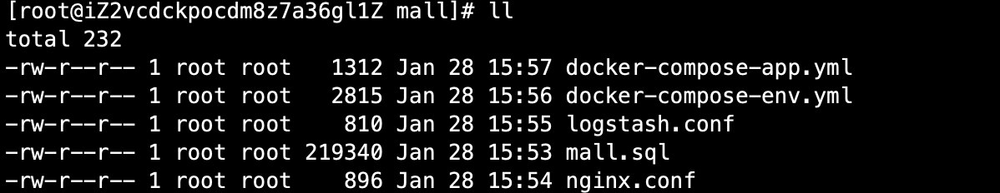

# 02-开源项目mall环境搭建


开源项目地址：https://github.com/macrozheng/mall

mall项目致力于打造一个完整的电商系统，采用现阶段流行技术！


由于mall项目依赖很多应用，因此我们采样docker-compose进行部署！

参考文档 ：http://www.macrozheng.com/#/deploy/mall_deploy_docker_compose


先讲准备文件上传至linux服务器：




相关文件在官方文档上有说明：


## 部署准备

1、打包并上传mall应用的镜像

参考文章：http://www.macrozheng.com/#/../reference/docker_maven

首先进行Docker Registry 2.0搭建：

```
docker run -d -p 5000:5000 --restart=always --name registry2 registry:2
```

docker 开启远程api

```
vi /usr/lib/systemd/system/docker.service

找到：
ExecStart=/usr/bin/dockerd -H fd:// --containerd=/run/containerd/containerd.sock
修改成如下内容：
ExecStart=/usr/bin/dockerd -H tcp://0.0.0.0:2375 -H unix://var/run/docker.sock
```

让docker支持http上传镜像

```
echo '{ "insecure-registries":["47.108.156.7:5000"] }' > /etc/docker/daemon.json
```

 改配置后需要使用如下命令使配置生效

```
systemctl daemon-reload
```

重新启动Docker服务

```
systemctl stop docker
systemctl start docker
```

开启防火墙的Docker构建端口

```
firewall-cmd --zone=public --add-port=2375/tcp --permanent
firewall-cmd --reload
```


## 使用Maven构建docker镜像


构建完成之后，可以再服务器上看到镜像：


部署成功如下：


搭建成功，访问接口文档页面如下：


这里需要注意修改application.yml中的环境为prod。几个项目都需要修改！


## 搭建前端项目


1、将项目clone到本地

```
git clone https://github.com/macrozheng/mall-admin-web.git
```

2、使用IDEA进行打开，修改文件


修改为mall-admin后台部署对应到地址


3、使用npm install 安装相关依赖，项目导入IDEA后，会弹出npm install的提示，直接运行即可！


用户名和登录密码：

```
用户名：admin
登录密码：macro123
```


访问地址，出现以下结果！：

