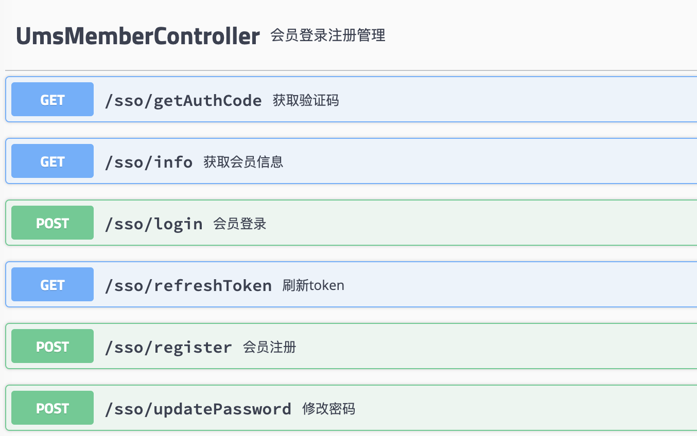
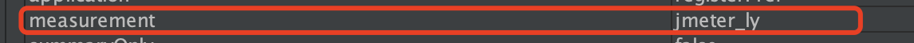
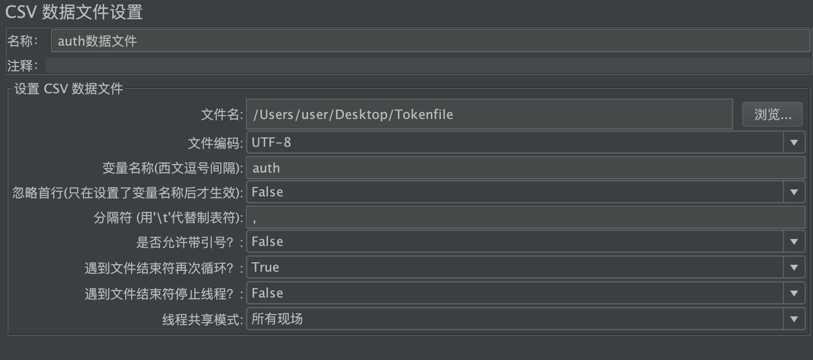

# 03-mall电商系统压测实战


- 需求分析与测试设计（性能需求目标+业务模型拆解）
- 环境设计与搭建
- 测试数据准备（基于模型的数据准备）
- 性能指标预期（性能需求目标）
- 发压工具配置及脚本编写（压力策略）
- 测试过程（预计的前置准备过程，和压测时间点规划）
- 结果分析与测试报告


基准测试：（新系统上线、系统重构、性能优化需求）


**需求分析与测试设计**

1、根据具体的性能测试需求，确定测试类型以及压测的模块（web/mysql/redis）
2、前期要与相关人员充分沟通，初步确定压测方案及具体性能指标
3、QA完成性能测试设计以后，需产出测试方案文档发送邮件到项目组，并且再次与相关人员沟通（或组织性能测试评审），确认是否满足需求！

uv和pv的概念，可以转化获取成性能指标：

UV（独立访客）：即Unique Visitor，访问您网站的一台电脑客户端为一个访客。
PV(page view)，即页面浏览量，或点击量；用户每1次对网站中的每个网页访问均被记录1次。用户对同一页面的多次访问，访问量累计。

所以uv可以转化成系统在线用户数（并发用户），pv相当于QPS！有多少请求？


**测试数据准备和构造**

1、接口请求参数：自己构造/日志获取/上下关联
2、数据表的数据填充
3、如果是多接口，则需结合业务场景设计请求比例


**性能指标预期**

1、每秒请求数
2、请求响应时间（最小、最大、平均）
3、错误率
4、机器性能：cpu idle 30%，memory无剧烈抖动或飙升
5、压测过程中接口功能是否正常

**发压工具准备**

1、Jmeter工具介绍
    集成包，解压即可使用。windows、linux通用，依赖JAVA环境！
    jmx脚本为xml文件，win、linux环境均可执行
    多线程并发
    运行脚本会生成jtl日志，可在界面工具中查看统计

2、脚本的编写
    http请求
    其他

3、命令：启压 ./jmeter -n -t hb.jmx -l hb.jtl


**压测过程说明、共识**

1、测试前环境检查：记录机器参数
2、起压：根据被压的情况，调节并发量到适合的情况
3、查看记录各项性能指标
    nginx 日志查看每秒请求数
    查看nginx错误请求
    查看机器参数：cpu、mem等
    查看db、cache等数据是否写入正常
    访问接口，查看功能是否正常

**结果分析和测试报告**

1、根据测试过程中记录的各项参数，结合压测工具产生的日志，对测试结果进行分析，并产出测试报告
2、测试完成后，及时与相关人员沟通，确认是否满足需求
3、发送测试报告邮件


性能按目标场景分类：

- 新上线系统性能测试：
  - 要求容量测试，获取系统最大容量
- 系统升级性能测试类：
  - 和基线版本对比，性能不下降
- 新系统优化类：
  - 伴随调优目标的性能测试
 
本次电商实战我们定义为新上线系统的性能测试，获取系统最大容量。测试场景：基准场景（单交易容量场景）容量场景（递增场景、最大TPS、最快响应时间场景）


## 实战压测


### 电商系统拉新注册

会员登录注册管理：



```
1、获取验证码接口：/sso/getAuthCode  参数：telephone   GET （使用redis功能，会将验证码存储在redis中）
2、会员注册接口：/sso/register       参数：username、password、telephone、authCode  POST
3、登录：/sso/login    参数：username、password    POST
```

运用jmeter配置功能点：

- HTTP Default Header， Header信息获取和设置
- HTTP Default 做IP/HOST统一，便于替换
- CSV参数化，用户密码做参数化驱动
- 参数传递，后置处理器使用传递验证码到注册接口
- 使用前置处理器自动生成规范内测试手机号
- Cookie验证结果保存做数据构造


1、首先添加验证码接口请求


因为手机号我们是随机生成，所以需要添加前置处理器进行代码生成：

```
import java.util.Random;
String phonePerfix = "171";
String timeStamp = System.currentTimeMillis().toString();
Random random = new Random();
int rand1 = random.nextInt(10);
int rand2 = random.nextInt(10);
String phoneEnds = rand1.toString() + timeStamp.substring(7) + rand2.toString();
vars.put("phoneNumber", phonePerfix + phoneEnds);
```

使用JSR223 预处理程序，groovy进行实现，网上说这种方式性能高，不建议使用Beanshell。

同时还可以添加调试处理器（取样器下），来观察代码生成的变量的值是否正确。


**这里遇到一个问题，服务器响应内容是中文，jmeter中显示返回是乱码。这里有如下2个解决方案：**


第一种：增加后置处理器（Bean shell），增加如下代码，再次请求发现乱码解决

```
prev.setDataEncoding("utf-8");
```

第二种，配置文件进行修改，重启jmeter.

```
1、进入jmeter.properties配置文件
2、修改sampleresult.default.encoding=UTF-8，#默认是ISO-8859-1
3、重启
```

接下来我们看下验证码获取的接口返回结果如下：


2、注册接口配置：/sso/register（会员注册接口）


authCode从上一接口获取，使用后置处理器：


由于注册用户名和密码需要自己填写，这里使用Counter计数器和用户自定义变量进行自定义用户名和密码：


用户自定义变量定义用户名和密码开头


计数器用于并发时，用户名编号增加保证用户名不重复！

最后还需要加入响应断言：确保接口响应正确！


3、用户登录 (/sso/login)

登录接口使用注册接口的用户名和参数，如下：


登录接口登录成功之后，会返回token，用于后面的接口使用，因此需要提取出来。

使用后置处理器，提取token：


同时也可以将token信息存入文件，方便后续压测直接读取使用，我们采用后置处理器中的jsr223程序，如下：


将token写入文件：

```
def out = new File("/Users/user/desktop/Tokenfile").append("Bearer " + "${token}\n")
```


这样拉新注册登录的整个环节就完成了。我们可以设置线程数来使用命令模式压测一下：


保存脚本，使用命令行进行启动，如下：

```
jmeter -n -t mall_test.jmx -l mall_result.jtl
```

查看控制台数据如下：

```
aiting for possible Shutdown/StopTestNow/HeapDump/ThreadDump message on port 4445
summary +     54 in 00:00:03 =   19.3/s Avg:    78 Min:    16 Max:   307 Err:    10 (18.52%) Active: 3 Started: 3 Finished: 0
summary +    917 in 00:00:30 =   30.6/s Avg:   297 Min:    12 Max:  1011 Err:     0 (0.00%) Active: 10 Started: 10 Finished: 0
summary =    971 in 00:00:33 =   29.6/s Avg:   285 Min:    12 Max:  1011 Err:    10 (1.03%)
summary +    979 in 00:00:30 =   32.6/s Avg:   304 Min:    15 Max:   661 Err:     2 (0.20%) Active: 10 Started: 10 Finished: 0
summary =   1950 in 00:01:03 =   31.1/s Avg:   294 Min:    12 Max:  1011 Err:    12 (0.62%)
summary +   1039 in 00:00:30 =   34.6/s Avg:   267 Min:    14 Max:   823 Err:     0 (0.00%) Active: 3 Started: 10 Finished: 7
summary =   2989 in 00:01:33 =   32.2/s Avg:   285 Min:    12 Max:  1011 Err:    12 (0.40%)
summary +     11 in 00:00:01 =   17.4/s Avg:    95 Min:    14 Max:   182 Err:     0 (0.00%) Active: 0 Started: 10 Finished: 10
summary =   3000 in 00:01:33 =   32.1/s Avg:   284 Min:    12 Max:  1011 Err:    12 (0.40%)
Tidying up ...    @ Tue Mar 02 18:00:00 CST 2021 (1614679200687)
... end of run

```


接下来添加数据监控传送至influxdb数据库，使用granfafa进行数据展示：（搭建好influxdb和granfafa环境）

在influxdb创建数据库，可以使用如下命令：

```
1、进入容器influxdb
 docker exec -it 50e1a0dd7e14 /bin/bash
 2、使用influx命令
 Connected to http://localhost:8086 version 1.8.4
 3、create database jmeter; 
```

1、首先添加后端监听器（监听器下面）


配置granfa，首先使用用户名和密码进行登录（admin，admin）


进入后，添加数据库：


点击add data source按钮：


搜索选择influxdb进行添加：

输入influxdb地址：


设置数据库名称：


然后保存并连接测试，如下绿色代表成功！


配置展示模版：

下载地址：https://grafana.com/grafana/dashboards


下载json文件：


准备导入：


选择文件进行导入：


然后图表数据就大功告成：


接下来我们进行设置：


然后找到Variables，如下：


点击对应的application，进行设置：如下，这里的名称需要和jmeter脚本中的名字保持一致。




然后进行修改：transaction


修改成jmeter_ly


接下来可以看见看板上出现相关测试选项了：


接下来实际看下测试结果：


### 电商首页查看


先添加个事务控制器：将进入首页相关的内容都放入该控制器中

1、添加首页接口请求：

/home/content (首页内容页信息展示)

注意这里使用信息浏览需要用户登录的认证，于是我们需要添加header管理器


这里是读取配置文件中写入的token（也就是注册时写入文件的token）

添加csv配置数据文件如下：



接下来就可以添加首页的请求了：


2、接下来添加首页商品分类的请求

我们需要配置请求的比例是上一个请求的2倍，所以我们需要添加循环控制器，设置循环次数为2


然后再循环控制器下添加请求如下：


这里需要配置parent_id的数据，我们用参数化的形式获取csv数据，这个是根据数据库查询的数据，然后保存至csv数据文件中


3、接下来添加分页获取推荐商品接口请求


4、最后添加根据分类获取专题请求，这里需要设置比例，我们采用if控制器


条件语法：

```
${__jexl3(${__counter(true,)}%2==1)}
```

然后在控制器下添加接口请求：


所有首页浏览请求添加完毕，整体流量配比是2:4:2:1


最后我们添加后端监听器，将结果写入influxdb，用granfa进行数据结果展示：

