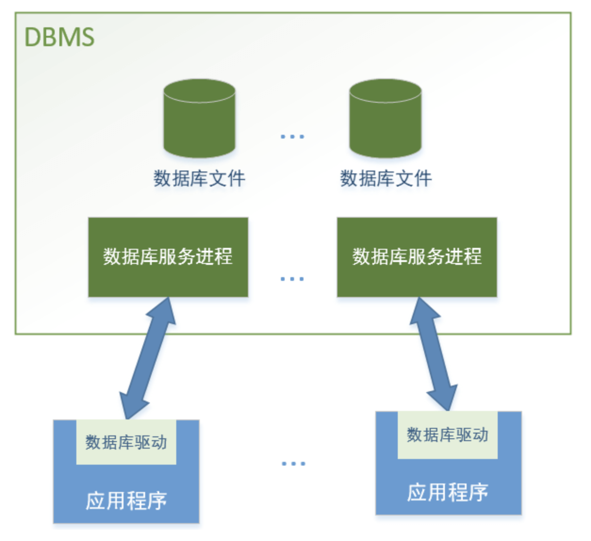

# 01-mysql简介

## 什么是数据库

数据库（DataBase）是按照数据结构来组织、存储和管理数据的仓库。每个数据库都有一个或多个不同的API用于创建、访问，管理，搜索和复制所保存的数据。

我们也可以将数据存储在文件中，但是文件中读写数据速度相对较慢，所以现在我们使用关系型数据库管理系统（RDBMS）来存储和管理大数据量。所谓关系型数据库，是建立在关系模型基础上的数据库，借助于集合代数等数学概念和方法来处理数据库中的数据。

## 什么是数据库管理系统DBMS

数据库系统（全称是：数据库管理系统DBMS），是计算机上的一个软件系统。数据库系统控制着数据的存储和操作。数据库系统使数据管理变得容易。比如，淘宝上大量的客户、商家、货品、订单等等，这些数据在阿里的服务器上，都是通过数据库系统进行存储、读取、修改的。

数据库管理系统根据数据组织的方式，可以分为很多种，我们这里可以大体分为关系型数据库系统（Relational DBMS）和非关系型数据库系统。关系型数据库中的数据都是用包含行和列的一张张表，来存储数据信息的。

目前使用最广泛的还是关系型数据库系统，我们常见的MySQL、Oracle、SQLServer等等，都是关系型数据库系统。

**关系数据库管理系统的特点：**

- 数据以表格的形式出现
- 每行为各种记录名称
- 每列为记录名称所对应的数据域
- 许多的行和列组成一张表单
- 若干的表单组成database

RDBMS术语：

- 数据库： 数据库是一些关联表的集合
- 数据表：表是数据的矩阵。在一个数据库中的表看起来像一个简单的电子表格。
- 列： 一列（数据元素）包含了相同类型的数据，例如邮政编码的数据
- 行： 一行（=元组，或记录）是一组相关的数据，例如一条学生信息数据
- 冗余： 存储两倍数据，冗余降低了性能，但提高了数据的安全性
- 主键： 主键是唯一的。一个数据表中只能包含一个主键。你可以使用主键来查询数据
- 外键： 外键用于关联两个表
- 复合键： 复合键（组合键）将多个列作为一个索引键，一般用于复合索引。
- 索引： 使用索引可以快速访问数据库表中的特定信息。索引是对数据库表中一列或多列的值进行排序的一种结构。类似于书籍的目录。
- 参照完整性： 参照的完整性要求关系中不允许引用不存在的实体。与实体完整性是关系模型必须满足的完整性约束条件，目的是保证数据的一致性。

## 什么是SQL

SQL（全称：结构化查询语言 Structured Query language）是什么？

它是一种语言，数据库的使用者和DBMS系统交流，就得使用这种语言。你想读取数据、添加数据、删除数据、修改数据，都得通过DBMS，DBMS只听得懂SQL，你就得使用SQL语言。

## MySQL

MySQL是非常流行的开源的、关系型数据库关联系统。目前在企业中使用非常广泛，不管你做软件开发还是测试，都非常有必要了解一下它。

MySQL数据库系统，大体可以分为数据库服务和数据文件，我们程序访问MySQL系统的时候，原理图如下所示：

我们应用程序要访问数据库，其实是访问一个数据服务进程，通常是通过网络和数据库服务进程进行交流，这个数据服务进程再去读写磁盘上的数据文件。

不同的DBMS，和应用程序之间的通讯方式不一样。

应用程序访问DBMS 可以 调用 数据库驱动模块 进行数据的读写。这个驱动模块其实就是一个库，负责和数据库服务底层通讯的连接和数据传输。通常由数据库厂商或者第三方开发者提供。比如python中的pymysql，mysqlclient。

