# 02-linux上安装mysql


MySQL最新版本是2018年4月发布的8.0，比较新，还没有大规模使用。所以我们建议大家目前还是先使用5.6 和 5.7版本。 这两个版本广泛使用，是非常可靠的。

MySQL 可以安装在很多操作系统上， Windows，Linux，Unix等等。因为企业里基本都是安装在Linux上面的，所以我们这里介绍如何安装MySQL在Linux上。

大家知道，Linux 有很多发行版， 常用的有 CentOS，Redhat，Ubuntu，Debian 等，我们这里介绍如何安装MySQL5.7 在CentOS7上。首先，确保以 root 账号登录CentOS系统。注意，我们后面的操作都是以root用户进行的。


## 配置yum仓库源

在CentOS7上 如果直接执行 yum 命令 安装 mysql， 实际上安装的是 MariaDB。我们需要先配置 yum 源使用 MySQL，这样yum工具才能从正确的 MySQL yum 仓库 下载安装MySQL。

首先，根据你的CentOS的版本 和 mysql版本下载对应 yum 仓库源安装包。

注意，如果你的CentOS上面还没有wget，执行命令 yum install wget 先安装wget {: .notice–warning}

怎么检查 CentOS版本？ 执行下面的命令即可

```
[root@iZ2vcdckpocdm8z7a36gl1Z ~]# cat /etc/centos-release
CentOS Linux release 7.6.1810 (Core) 
```
上面的例子就显示了 CentOS版本是 7.6。

既然CentOS大版本号是7，执行如下命令下载对应的yum 仓库源安装包

```
wget http://repo.mysql.com/mysql57-community-release-el7.rpm
```

执行完成结果如下：

```
--2020-12-02 21:14:13--  http://repo.mysql.com/mysql57-community-release-el7.rpm
Resolving repo.mysql.com (repo.mysql.com)... 23.211.71.226
Connecting to repo.mysql.com (repo.mysql.com)|23.211.71.226|:80... connected.
HTTP request sent, awaiting response... 200 OK
Length: 25680 (25K) [application/x-redhat-package-manager]
Saving to: ‘mysql57-community-release-el7.rpm’

100%[===================================================================================================>] 25,680       109KB/s   in 0.2s   

2020-12-02 21:14:14 (109 KB/s) - ‘mysql57-community-release-el7.rpm’ saved [25680/25680]
```

接下来，我们执行下面的命令，安装下载好的rpm
```
rpm -ivh mysql57-community-release-el7.rpm 
```

显示结果如下：

```
warning: mysql57-community-release-el7.rpm: Header V3 DSA/SHA1 Signature, key ID 5072e1f5: NOKEY
Preparing...                          ################################# [100%]
Updating / installing...
   1:mysql57-community-release-el7-11 ################################# [100%]
```

这样就配置好mysql的yum源了。


## 安装MySQL服务

既然MySQL 的 yum源已经配置好了，安装MySQL服务非常简单，执行下面命令即可

```
yum install mysql-server
```

随后，在如下界面需要你确认下载安装，

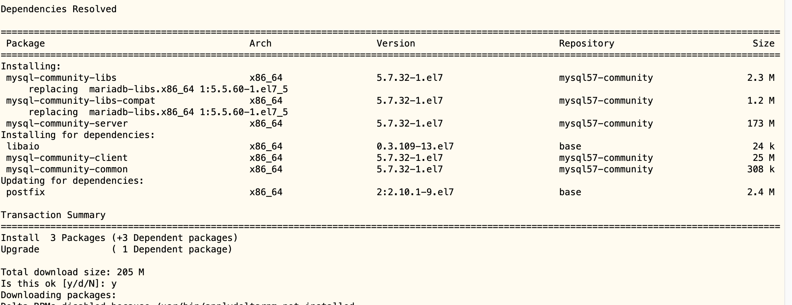


这时，你需要输入y并回车，继续安装即可，最后显示如下界面，表示安装成功。

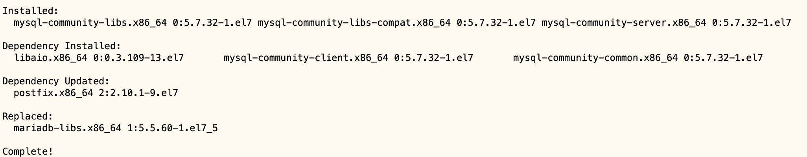


## 启动MySQL服务


执行下面的命令，启动MySQL服务

```
systemctl start mysqld
```

执行如下命令查看是否启动成功：

```
 systemctl status mysqld
```
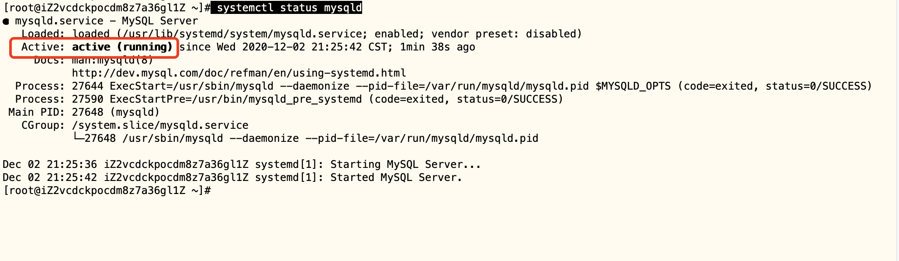


表示启动成功了。


安装好mysql5.7后，系统会自动产生一个mysql中的root用户，和初始密码。注意这不是linux中的root用户。要获取mysql root用户的初始密码，执行如下命令：

```
 grep 'temporary password' /var/log/mysqld.log
```
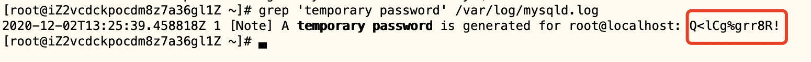

记录下这个初始密码Q<lCg%grr8R!, 下面我们更新密码时，需要使用这个初始密码。


## 初始化设置


执行下面的命令进行初始化设置：

```
mysql_secure_installation
```

显示如下：
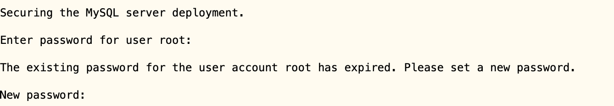

这时，需要输入当前的密码，输入刚才得到的初始密码，并回车

系统显示如下内容


输入y并回车，显示如下信息，要求你输入新密码


这时，输入一个安全性比较高的新密码，然后，回车，这时系统显示如下信息要求你重新输入刚才的密码进行确认，
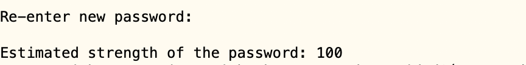


这时系统显示如下信息

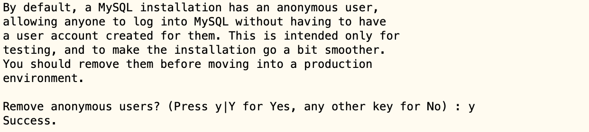

MySQL安装后有个缺省的匿名用户 anonymous， 方便测试用的， 通常会带来安全隐患，这时，我们可以选择删除该用户。

输入y并回车，即可删除anonymous用户。

这时系统显示如下信息

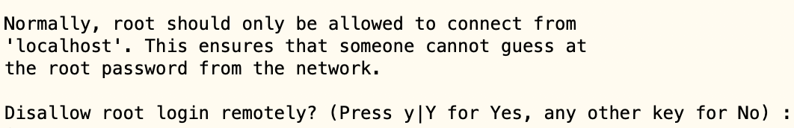


这是询问你是否禁止 mysql的root用户远程登录系统，如果是生产环境，通常应该禁止，输入y并回车，即可禁止。


这时系统显示如下信息

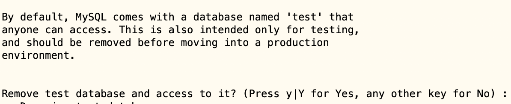

这是询问你是否删除 test 数据库。

MySQL安装好会缺省创建一个名为test的数据库，方便测试。如你不需要，可以删除，输入y并回车，即可删除。


这时系统显示如下消息：

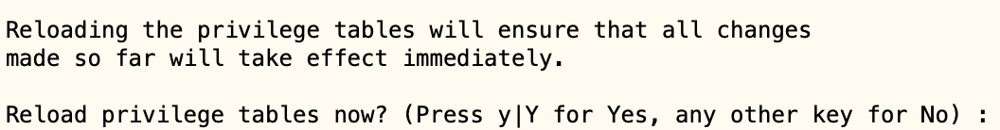


表示前面的配置是否立即生效，当然是输入y并回车，让我们的配置立即生效了。

最后显示如下信息，即表示所有前面的设置成功。


## 添加数据库用户


MySQL有自己的用户管理，大家不要和Linux系统里面的用户混淆起来，它们是两套不同的用户系统。

安装好MySQL后，缺省就有 root 用户。MySQL的root用户是超级管理员用户，拥有操作数据库系统的所有权限。

但是我们的客户端程序，最好不要使用root用户来访问数据库，那样会使我们的系统存在安全性危险。就像我们日常操作不用超级管理员登录一样。通常，我们创建自己指定的mysql用户，来访问我们自己的数据库。

root用户，主要是用来管理数据库的。最常见的操作就是用root用户创建其他用户，并赋予他们指定的权限。

如何创建mysql数据库用户呢？

执行 命令 mysql -uroot -p ，使用root用户进入mysql命令行客户端。界面显示如下，要求我们提供root用户密码：

```
[root@iZ2vcdckpocdm8z7a36gl1Z ~]# mysql -uroot -p
Enter password: 
```

输入刚才你设置的root用户密码即可。这时，系统显示如下：

```
Type 'help;' or '\h' for help. Type '\c' to clear the current input statement.

mysql> 
```

我们就可以输入sql命令了。

输入如下两条命令添加MySQL用户，注意命令末尾有分号：

```
create user 'ly_user1'@'localhost' identified by 'LoYu123!';
create user 'ly_user1'@'%' identified by 'LoYu123!';
```

执行结果如下：

```
mysql> create user 'ly_user1'@'localhost' identified by 'LoYu123!';
Query OK, 0 rows affected (0.00 sec)

mysql> create user 'ly_user1'@'%' identified by 'LoYu123!';
Query OK, 0 rows affected (0.01 sec)
```

注意，这是创建用户 ly_user1，密码为 LoYu123!。 根据你的需求使用不同的用户名密码。为什么创建一个用户要用两条命令？


- @符号后面的 ‘localhost’ 表示该用户可以从localhost或者127.0.0.1地址连接访问数据库，也就是从本机访问数据库
- @符号后面的 ‘%’ 表示该用户可以从其它IP地址连接访问数据库。


随后输入如下命令，赋予user1用户所有权限，就是可以 该DBMS系统上 访问所有数据库里面所有的表
```
GRANT ALL ON *.* TO 'ly_user1'@'localhost';
GRANT ALL ON *.* TO 'ly_user1'@'%';
```

执行结果如下：

```
mysql> GRANT ALL ON *.* TO 'ly_user1'@'localhost';
Query OK, 0 rows affected (0.00 sec)

mysql> GRANT ALL ON *.* TO 'ly_user1'@'%';
Query OK, 0 rows affected (0.00 sec)
```

如果你只想赋予 ly_user1用户，只能读取数据库mydb的表table1 的权限，就可以这样写

```
GRANT SELECT  ON mydb.table1 TO 'ly_user1'@'localhost';
GRANT SELECT  ON mydb.table1 TO 'ly_user1'@'%';
```

关于用户权限赋予，更多说明参考 [官方文档](https://dev.mysql.com/doc/refman/5.7/en/grant.html)

最后，输入 quit 并回车，退出mysql命令行客户端。


如果以后你想修改该用户的 密码，可以执行下面的 命令

```
SET PASSWORD FOR 'ly_user1'@'localhost' = PASSWORD('otherpassword');   
SET PASSWORD FOR 'ly_user1'@'%' = PASSWORD('otherpassword'); 
```

## 设置开机自动运行MySQL服务

数据库服务 通常应该 设置为 开机就自行启动的。 这样，即使服务器宕机了，重启后，也不需要我们手工启动数据库服务。

怎么设置 开机自动运行MySQL服务 呢？

如果你使用的是 centos 7 版本， 执行命令 
```
systemctl enable mysqld
```


## 打开防火墙3306端口

我们的程序有时候是通过网络远程访问 MySQL数据库服务的。这时，需要让防火墙打开3306端口，以便外部程序可以通过网络访问。

如果你是CentOS7的系统，执行如下两条命令，分别是 打开 mysql服务3306端口，并且使规则立即生效

```
firewall-cmd --zone=public --add-service=mysql --permanent
firewall-cmd  --reload
```

结果出现如下情况：

```
[root@iZ2vcdckpocdm8z7a36gl1Z ~]# firewall-cmd --zone=public --add-service=mysql --permanent
FirewallD is not running
```

表示防火墙未开启，出于安装考虑还是把防火墙开上吧。

通过systemctl status firewalld查看firewalld状态，发现当前是dead状态，即防火墙未开启。

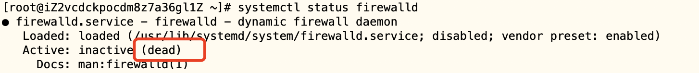


通过systemctl start firewalld开启防火墙，没有任何提示即开启成功。
```
systemctl start firewalld
```

再次通过systemctl status firewalld查看firewalld状态，显示running即已开启了。
```
systemctl status firewalld
```

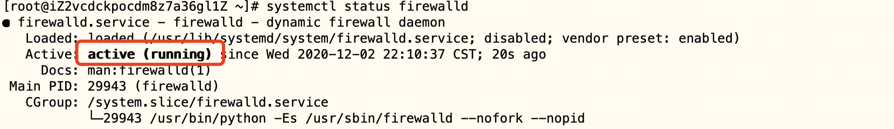


如果要关闭防火墙设置，可能通过systemctl stop firewalld这条指令来关闭该功能。

```
systemctl stop firewalld
```

再次执行如下命令即开启成功：

```
firewall-cmd --zone=public --add-service=mysql --permanent
firewall-cmd  --reload
```

如下图所示：


## 阿里云防火墙

如果你的CentOS是安装在阿里云ECS上，注意打开阿里云的防火墙，如下图所示


然后在安全组，手动添加规则，如下：


保存即大功告成。源0.0.0.0/0代表所有地址可以访问。


## 数据库管理工具


接下来我们来使用数据库管理工具客户端，连接云服务器上是否能连接成功。

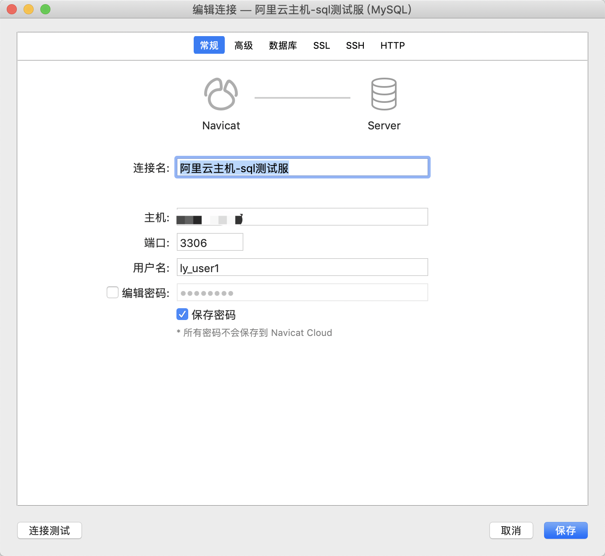


连接成功如下：

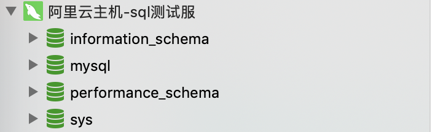