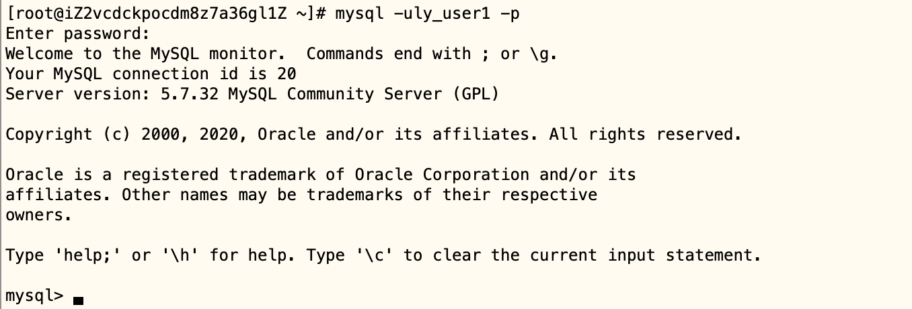
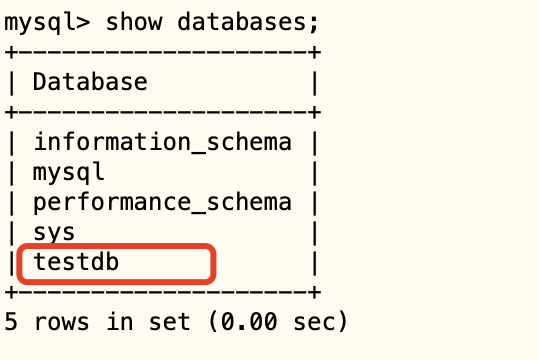

# 03-数据库操作


MySQL是一个数据管理系统DBMS。一个DNBMS上可以有多个数据库。我们可以通过mysql的命令客户端，使用SQL语句对DBMS数据库进行管理，执行命令

```
mysql -uly_user1 -p
```
 要求进入mysql命令客户端，然后输入正确对密码，进入sql命令控制台，就可以输入sql语句的命令了。




## 列出数据库


我们可以使用如下SQL语句，来查看系统中目前有哪些数据库。

```
show databases;
```

可以看到结果如下：

```
mysql> show databases;
+--------------------+
| Database           |
+--------------------+
| information_schema |
| mysql              |
| performance_schema |
| sys                |
+--------------------+
4 rows in set (0.00 sec)
```

注意：

- SQL语句最后有一个分号
- SQL语句的关键字是大小写不敏感的，你也可以这样写：SHOW DADABASES；

上面的结果显示系统中目前有4个数据库，注意这些数据库是安装好MySQL系统后，MySQL自行创建的，维护整个数据库系统用的信息数据库。我们要创建自己的数据库，需要我们执行SQL语句来创建。


## 创建删除数据库


我们可以执行如下SQL语句来创建名为testdb的数据库

```
 create database testdb;
```
执行结果如下：

```
mysql> create database testdb;
Query OK, 1 row affected (0.00 sec)
```

可以再次查看数据库的情况，如下就多了一个创建之后的数据库：




数据库里面会存储字符串数据，字符串就涉及到采用何种编码的问题。如果只是简单的输入：create database testdb 这样的命令，字符编码通常默认是latin编码，通常不适合中文。

通常我们应该指定utf8的编码，需要这样写：

```
create database testdb character set utf8mb4  collate utf8mb4_unicode_520_ci;
```


**删除数据库：**


如果你确定要删除一个数据库，使用命令DROP database

```
drop database testdb;
```

执行结果如下：

```
mysql> drop database testdb;
Query OK, 0 rows affected (0.00 sec)
```

然后查看数据库是否删除：

```
mysql> show databases;
+--------------------+
| Database           |
+--------------------+
| information_schema |
| mysql              |
| performance_schema |
| sys                |
+--------------------+
4 rows in set (0.00 sec)
```

可以看见已经删除成功了。


## 数据库导入导出 


### 导出

执行下面的命令可以把testdb数据库里面所有的数据导出为sql数据文件

```
mysqldump -u username -p --databases dbname >data.sql
```

执行后，需要输入用户对应的密码。


我们先创建一张库来测试下导出操作。

```
mysql> create database testdb character set utf8mb4 collate utf8mb4_unicode_520_ci;
Query OK, 1 row affected (0.00 sec)

[root@iZ2vcdckpocdm8z7a36gl1Z ~]# mysqldump -u ly_user1 -p --databases testdb > data.sql
Enter password: 
[root@iZ2vcdckpocdm8z7a36gl1Z ~]# ls
data.sql
```

这样就把文件导出成功了。


### 导入

执行下面的命令可以把导出为sql数据文件的数据，导入到对应的db中

mysql -u username -p < data.sql

执行后需要输入用户对应的密码。

