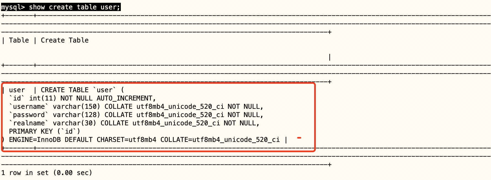
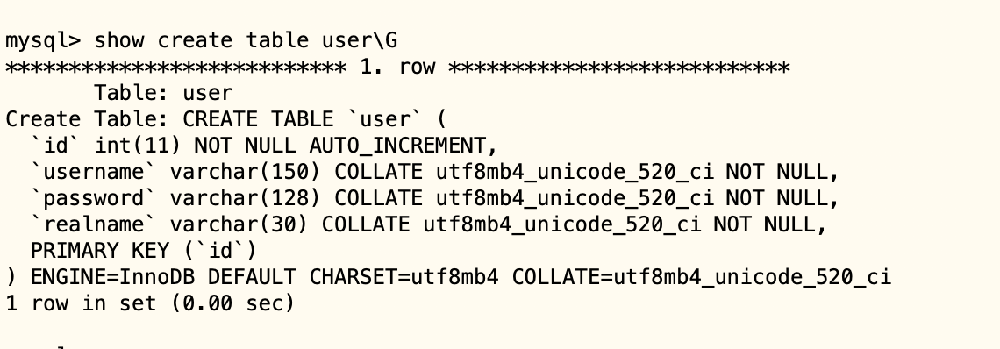
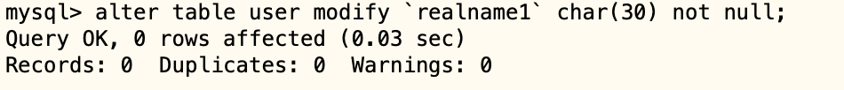

# 04-表的操作


MySQL数据库的信息基本都是存在表里面的。我们可以通过mysql命令行客户端对数据库表进行操作。执行命令mysql -uly_user1 -p ,输入密码后，进入mysql命令行客户端。

要对表操作，首先要指明操作的是哪个数据库。应该使用use，如下所示：

```
mysql> use testdb;
Database changed
```
use testdb; 表示我们要操作的数据库名称是testdb。


## 列出当前数据库中所有表

我们可以使用show tables； 来查看当前数据库李有哪些表。

```
mysql> show tables;
Empty set (0.00 sec)
```

上面的结果显示testdb数据库中没有表，因为我们前面只是创建的一个空的数据库。


## 创建表

要创建表，最主要的是要指明表中的各个字段，我们可以执行如下SQL语句来创建名为user的表：

```
 create table user(
    id int not null auto_increment,
    username varchar(150) not null,
   `password` varchar(128) not null,
    realname varchar(30) not null,
    primary key (id)
    )engine=Innodb;
```

执行结果如下：

```
Query OK, 0 rows affected (0.01 sec)
```

create table 就是创建表的SQL语句，后面跟表的名字，这里就是user作为表名。接下来括号里面的是表中各列的数据类型、特性的描述。

前面4行指定了该表中有4列，每列的名字分别为id、username、password、realname。其中id是整数类型，其他的都是字符串类型。由于password正好是MySQL的一个关键字，我们的字段名如果和关键字重名，应该用反引号把字段包起来，表示这不是关键字。


其中：

- not null 表示这列的数据不能为空。就是每条记录，这一列里面一定要有数据内容。
- auto_increment 表示该列中的字段内容是自动递增的，也就是从1开始，添加一条id记录字段的值就自动加1。
- primary key（id）这行指定了id这列作为主键。主键的概念，我们后面会学习。
- engine=Innodb。指定了该表使用Innodb作为该表的存储引擎（storage engine）。MySQL有两种存储引擎 MyISAM和InnoDB。不同存储引擎使用不同的方法来对表数据存储和读取。表数据不同的使用方式，不同的存储引擎效率不一样。

大部分情况下，我们应该使用InnoDB。在MySQL 5.5.5以后，缺省的存储引擎就是InnoDB，所以也可以不指定存储引擎，就是InnoDB。


上面的例子中，包括了2种类型的列：int 和 varchar。MySQL支持很多种列数据类型，具体可以参考[MySQL官方网站](https://dev.mysql.com/doc/refman/8.0/en/data-types.html)

不同的数据类型存储不同的数据。比如年龄适合用SMALLINT，而名字适合用CHAR 或者VARCHAR，出生日期适合用DATEDTIME。


## 查看表结构


执行了上面命令后，我们可以通过命令行 来查看创建表的语句，从而查看表的结构：

```
mysql> show create table user;
```

执行结果如下：




加上\G显示结果如下：

```
show create table user\G
```




从上面结果中可以看出，字符内型的字段都自动被设置成了utf8类型，是因为我们给这个testdb数据库设置了字符为utf8编码。


## 删除表


如果你确定要删除一张表，使用命令DROP TABLE

```
mysql> drop table user;
Query OK, 0 rows affected (0.00 sec)
```


## 更改表名字


更改表的名字，可以使用命令 RENAME TABLE ，可以一次修改多个表的名字。

```
rename table user to by_user,medicine to by_medicine;
```


## 修改表结构


修改表结构包括很多种处理：添加、删除、重命名列，添加、删除、修改索引、主键等等。具体可参考MySQL官方网站


这里列出几个比较常见的操作。


### 添加列

如果要在user表中添加两列 description 和 qq

```
mysql> alter table user add `descreption` varchar(850) not null, add `qq` varchar(20) not null;
Query OK, 0 rows affected (0.02 sec)
Records: 0  Duplicates: 0  Warnings: 0
```


### 删除列

如果要在user表中删除两列 descreption 和 qq

```
mysql> alter table user drop `qq`,drop `descreption`;
Query OK, 0 rows affected (0.02 sec)
Records: 0  Duplicates: 0  Warnings: 0
```

### 修改列

如果要在user表中修改列realname 名字为realname1

```
mysql> alter table user change `realname` `realname1` varchar(30) not null;
Query OK, 0 rows affected (0.00 sec)
Records: 0  Duplicates: 0  Warnings: 0
```

如果要在user表中只修改字段 realname1，类型 为 char(30)，使用modify。

```
 alter table user modify `realname1` char(30) not null;
```

运行结果如下：

