# 05-表记录操作


前面我们学习了创建数据库和表，主要就是为了能够操作表中的记录。所谓操作表记录，就是对记录对添加、查询、修改、删除。当然这些都是通过SQL语句进行的。


## 插入记录


前面我们使用如下SQL语句创建了名为user的表

```
CREATE TABLE user (
  `id` int NOT NULL AUTO_INCREMENT,
  `username` varchar(150)  NOT NULL,
  `password` varchar(128)  NOT NULL,
  `realname` varchar(30)  NOT NULL,
  PRIMARY KEY (id)
) ENGINE=InnoDB;
```

这还是一张空表，要添加一条记录，使用INSERT INTO 语句，

比如：

```
insert into user(username,`password`,realname) values('ly1','password1','test_ly1');
```

这样就可以添加一条记录到表user中了。注意，我们不需要为id这个字段填上对应到值，因为它是auto_increment的，MySQL系统会自动为这个字段填值。


### 字符编码


因为MySQL缺省的字符编码是latin1（拉丁字符编码），这种字符编码是不支持存储中文的。

要存储中文，推荐使用utf8字符编码。我们可以：

- 指定MySQL 整个系统 的缺省字符编码
- 也可以指定 某个数据库 的缺省字符编码
- 也可以指定 某张表 的缺省字符编码
- 也可以指定 表中某列 的字符编码

比如，我们在创建user表的时候，就可以指定字符编码方式，如下所示

```
CREATE TABLE user (
  `id` int NOT NULL AUTO_INCREMENT,
  `username` varchar(150)  NOT NULL,
  `password` varchar(128)  NOT NULL,
  `realname` varchar(30)  NOT NULL,
  PRIMARY KEY (id)
) 
CHARACTER SET utf8mb4
COLLATE utf8mb4_unicode_520_ci;
```

我们更加推荐，在创建数据库的时候，就指定缺省字符编码。这样就不需要创建每张表都去指定字符编码方式。这样指定：

```
CREATE DATABASE testdb CHARACTER SET utf8mb4  COLLATE utf8mb4_unicode_520_ci;
```
然后，我们再创建user表，就不需要指定utf8编码了。


### 添加多条记录

如果要添加多条记录，非常简单，如下所示：

```
INSERT INTO user (username,`password`,realname) VALUES 
    ('ly2','password2','test_ly2'),
    ('ly3','password3','test_ly3'),
    ('ly4','password4','test_ly4'),
    ('ly5','password5','test_ly5');
```


### 日期时间数据


我们创建一张订单表如下：

```
CREATE TABLE `order` (
    id INT AUTO_INCREMENT,
    title VARCHAR(255) NOT NULL,
    place_time DATETIME,
    due_date DATE,
    PRIMARY KEY (id)
) ;
```

这张订单表有两个字段：

- place_time 表示下订单的时间点，是DATETIME类型
- due_date 表示订单失效有效期截止日，是DATE类型

DATETIME 类型，我们插入的数据格式是这样的 2019-12-20 10:01:00 。甚至可以精确到微秒，像这样 2019-12-20 10:01:00.999999 ，如果要精确到微秒，该字段的定义要指定长度为6 ，像这样 place_time DATETIME(6)

DATE 类型，我们插入的数据格式是这样的 2019-12-20 。


对上面对表我们可以插入一条记录：

```
 insert into `order` (title,place_time,due_date) values ('测试订单1','2020-12-02 10:00:33','2020-12-05') ;
```

执行结果如下：

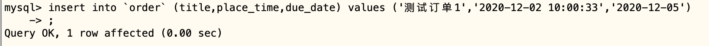


## 查询表记录


前面我们已经在user表中插入了一批数据，要查询该表中所有对记录，使用SQL语句select进行查询。如下所示：

```
 select * from user;
```

结果如下：

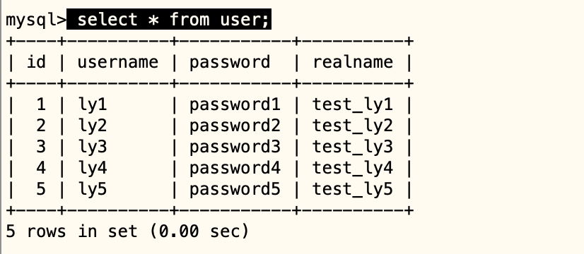


这样可以查看user表中对所有记录对所有列的值。上面，select语句中的*表示查看所有列。有时候表中列很多，我们只想查看固定的列，这时候我们可以指定要查看的列。

比如：这个user表，我们只想查看id和username这两列的信息，就可以这样写：

```
select id,username from user;
```

执行结果如下：

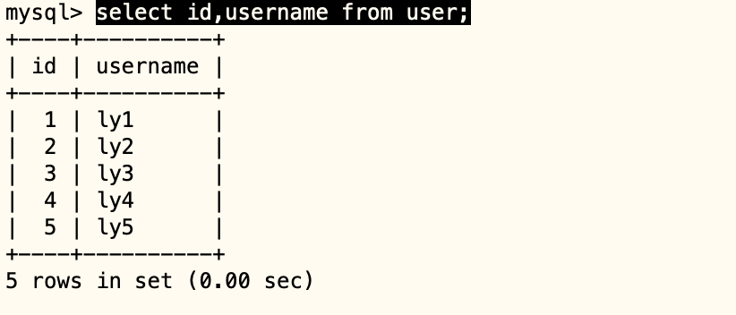


### 查询过滤


有的时候，一张数据表里面可能有海量的记录，比如上百万条，甚至上亿条记录（想象一下淘宝的用户表有多少）。我们有时候只需要查询其中符合某些条件的部分信息，这就叫过滤查询。根据过滤条件查询，我们使用**where从句**。


#### 过滤条件


比如，上面的user表，我们只需要查询用户名为test_ly1的那个用户信息就可以这样：

```
 select * from user where realname = 'test_ly1';
```

结果如下：

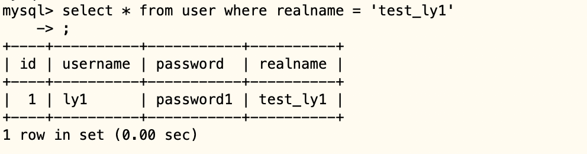


其中 realname='test_ly1' 里面的等号就是一个过滤条件的 操作符 ，表示过滤条件是查找记录的realname字段值等于test_ly1。


如果我们只需要查询id为2的那个用户信息，可以这样：

```
 select * from user where id=2;
```

结果如下：

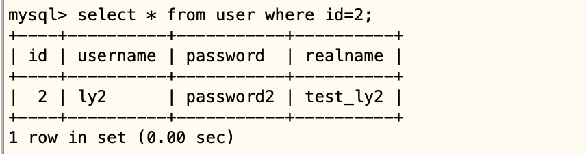


除了等于条件（使用=），还有，

- 不等于（使用<> 或者 =）

```
mysql> select * from user where id<>1;
+----+----------+-----------+----------+
| id | username | password  | realname |
+----+----------+-----------+----------+
|  2 | ly2      | password2 | test_ly2 |
|  3 | ly3      | password3 | test_ly3 |
|  4 | ly4      | password4 | test_ly4 |
|  5 | ly5      | password5 | test_ly5 |
+----+----------+-----------+----------+
4 rows in set (0.00 sec)

mysql> select * from user where id !=1;
+----+----------+-----------+----------+
| id | username | password  | realname |
+----+----------+-----------+----------+
|  2 | ly2      | password2 | test_ly2 |
|  3 | ly3      | password3 | test_ly3 |
|  4 | ly4      | password4 | test_ly4 |
|  5 | ly5      | password5 | test_ly5 |
+----+----------+-----------+----------+
4 rows in set (0.00 sec)
```

- 大于（使用>）

```
select * from user where id>3;
```

- 小于（使用<）

```
select *  from user where id<3;
```

- 大于等于（>=）

```
select * from user where id>=3;
```

- 小于等于（使用<=）

```
select *  from user where id<=3;
```

- 包含字符（使用like和%）

```
# 以test开头
select * from user where realname like 'test%';

# 以ly3结尾
 select * from user where realname like '%ly3';

# id在指定集合里面

 select * from user where id in(1,2,3);

```


## 并且关系


如果你要查询的记录过滤条件是多个，并且要同时满足，就使用and关键字连接多个过滤条件。比如，我们使用下面的语句创建 customer1，并且插入一些数据

```
CREATE TABLE customer1 (
  `id` int NOT NULL AUTO_INCREMENT,
  `username` varchar(150)  NOT NULL,
  `level` int NOT NULL,
  `coin` int NOT NULL,
  PRIMARY KEY (id)
) ;

INSERT INTO customer1 (username,level,coin) VALUES 
    ('cus01',15, 5),
    ('cus02',5,  315),
    ('cus03',3,  215),
    ('cus04',11, 6615),
    ('cus05',22, 115),
    ('cus06',6,  4415),
    ('cus07',7,  315),
    ('cus08',4,  15),
    ('cus09',9,  315),
    ('cus10',44, 45),
    ('cus11',2,  215),
    ('cus12',1,  815),
    ('cus13',15, 13),
    ('cus14',25, 1566),
    ('cus15',12, 125),
    ('cus16',8,  75);
```


我们要查询id>10 并且等级level值小于15的用户。就可以这样

```
 select * from customer1 where id>10 and level <15;
```

得到的结果是：

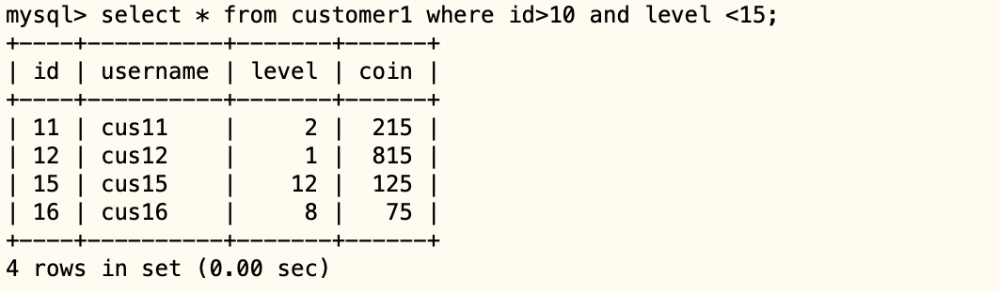


如果你有更多的过滤条件，就继续在后面加and。


## 或者关系


如果你要查询的记录过滤条件是多个，只要满足其中一个条件即可，就使用or关键字连接多个过滤条件

比如我们id>10 或等级level值<15的用户。就可以这样：

```
select * from customer1 where id>10 or level <15;
```

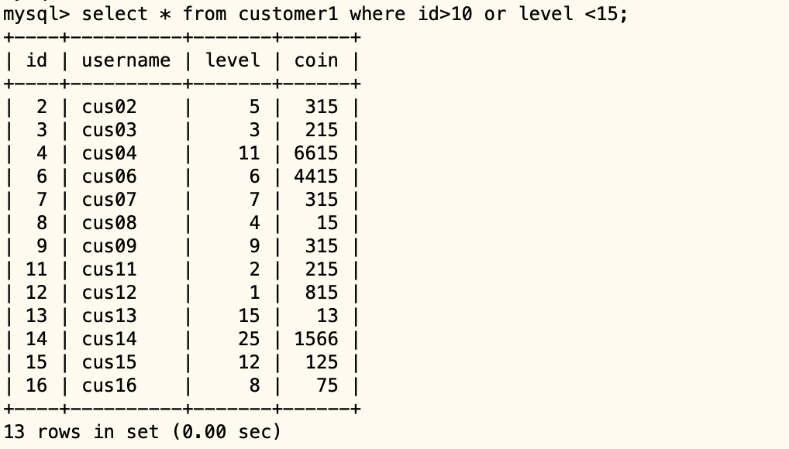


如果我们要查询id>8 或者等级level值<15的用户， 但是同时还要满足条件coin=315的。满足条件的只有下面这3条记录。

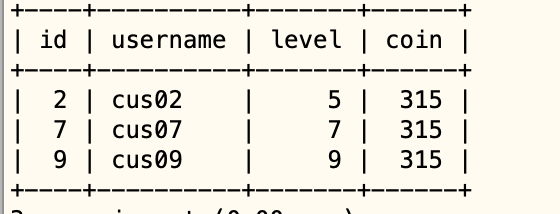


如果你这样写：

```
 select * from customer1 where id>8 or level <15 and coin=315;
```

运行一下，结果却发现，如下：

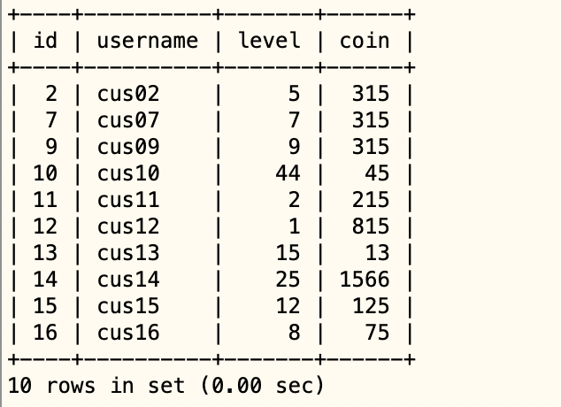


原来or 和 and 同时出现的时候，and 优先级高，所以会先计算 level<15 and coin=315 结果再和前面id>8进行or运算。


怎么办？ 可以使用括号让or先运算，如下所示：

```
 select * from customer1 where (id>8 or level <15) and coin = 315;
```


## 子查询


已知有如下两张数据表，表名：学生表

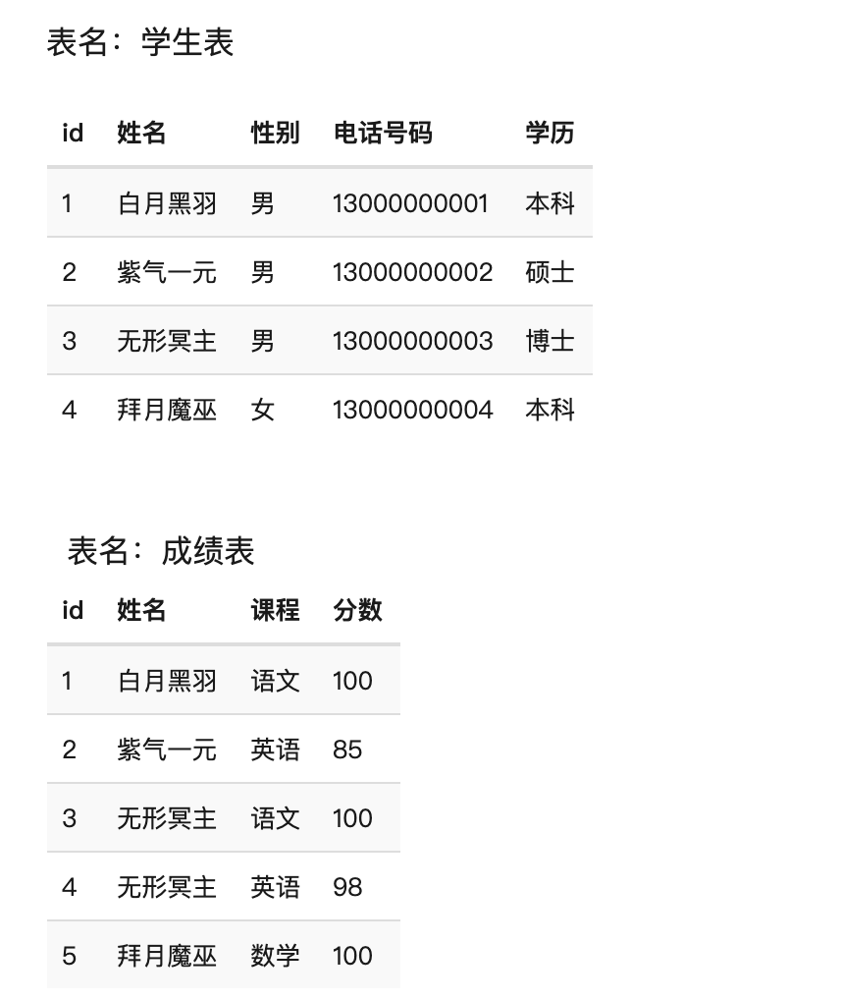


要查询考试成绩有100分学生的电话号码，可以使用如下SQL语句：

```
SELECT 电话号码 FROM 学生表
WHERE 姓名 IN (
  SELECT 姓名 FROM 成绩表 WHERE 分数=100
);
```

过滤条件是姓名在一个集合中，但是这个集合不是预先就知道的，而是另外一个select查询的结果。另外一个select术语叫子查询（subquery）。

MySQL执行语句时，会先执行子查询，获取分数为100分的学生姓名，放入集合中，然后再执行外层查询。

接下来我们创建表验证下：

```
 select 电话号码 from 学生表 where 姓名 in(select 姓名 from 成绩表 where 分数=100);
```

执行结果如下：

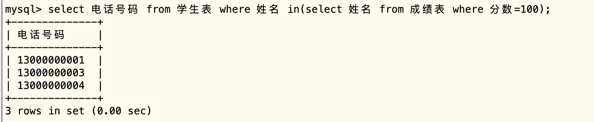


## 多表连接查询


其实在真正的应用中经常需要从多个表中读取数据。接下来我们学习如何使用MySQL的join来在两个或多个表中查询数据。join按照功能大致分为如下三类：


- INNER JOIN (内连接，或等值连接)：获取两个表中字段匹配关系的记录。
- LEFT JOIN（左连接）：获取左表所有记录，即使右表没有对应匹配的记录。
- RIGHT JOIN（右连接）：与LEFT JOIN相反，用于获取右表所有记录，即使左表没有对应匹配的记录。


### 内链接


使用上面的例子，我们使用内链接的方式来写

```
select 电话号码 from 学生表 inner join 成绩表 where 成绩表.姓名=学生表.姓名 and 成绩表.分数=100;
```

执行结果如下：

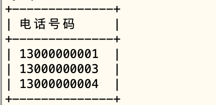


也可以在查询结果中，加入关联表里面的列的值，如下：

```
 select 学生表.电话号码,成绩表.课程 from 学生表 inner join 成绩表 where 成绩表.姓名=学生表.姓名 and 成绩表.分数=100;
```

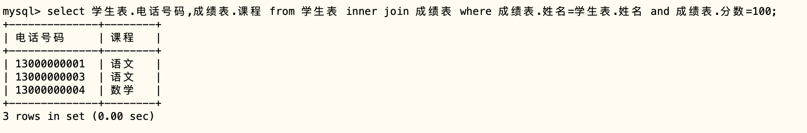


Inner JOIN 关系如下图所示：


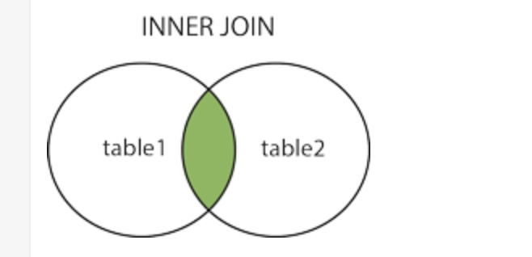


### 左连接

MySQL left join 与 join 有所不同。 MySQL LEFT JOIN 会读取左边数据表的全部数据，即便右边表无对应数据。


```
 select a.姓名,a.电话号码,b.课程 from 学生表 a left join 成绩表 b on a.姓名=b.姓名 and b.分数=100;
```

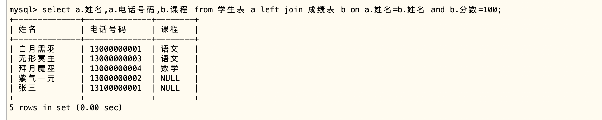


我们来对比一下join和left join查询出来的差别

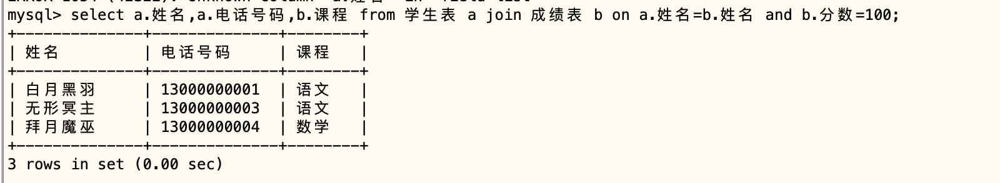


发现，left join 获取左表所有记录，即使右边没有记录。如果关联的表数据不存在，字段展示NULL。


### 右连接


MySQL RIGHT JOIN 会读取右边数据表的全部数据，即便左边边表无对应数据。

我们现在成绩表插入2条学生表不存在对应姓名的数据：

```
insert into 成绩表(姓名,课程,分数) values('李四','python',200), ('王五','java',105);
```

然后使用right join 来查询查看结果：

```
 select a.姓名,a.电话号码,b.课程 from 学生表 a right join 成绩表 b on a.姓名=b.姓名 and b.分数=100;
```

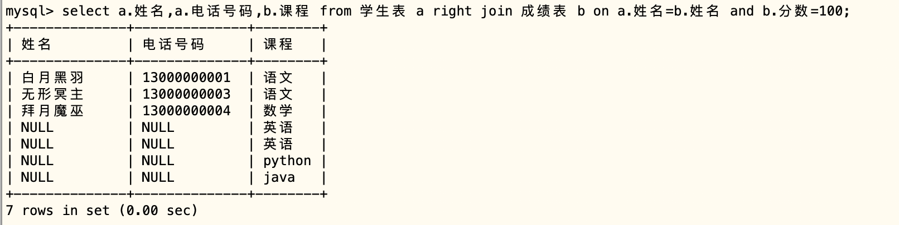

从结果发现，右边的表数据全部查询出来了。即使左边表记录不存在，不存在则NULL展示。


## 查询结果去重 distinct


前面示例中，我们创建了这样的一张成绩表：

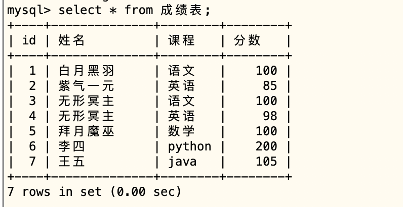


如果我们想查看 有哪些学科学生考试得过满分，可以这样写SQL语句，如下：

```
select * from 成绩表 where 分数=100;
```

结果如下：

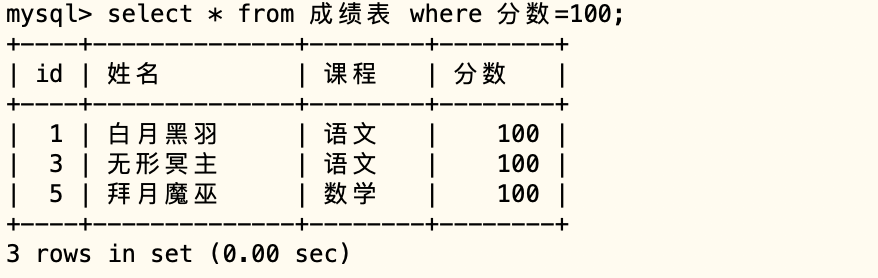


可以发现，语文重复了2次，因为有两条记录语文考试成绩为100分。但是我们现在的目的是：只要看有哪些学科，当然不希望重复。这时可以使用distinct.如下：


```
 select distinct 课程 from 成绩表 where 分数=100;
```

结果如下：

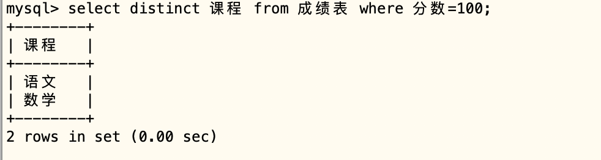


## 查询结果排序

我们经常需要，查询一个结果，并且按某个字段的值进行排序。比如下面的查询：

```
select * from customer1 where id>10;
```

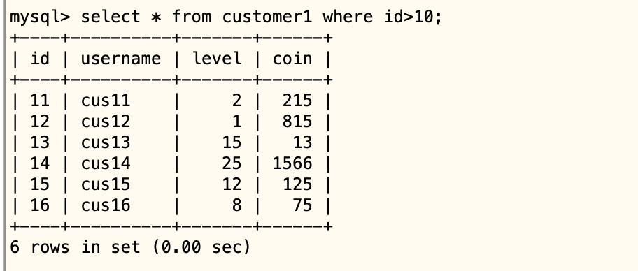


结果需要按coin的值由小到大排序，怎么办？ 我们可以使用order by 。


```
select * from customer1 where id>10 order by coin;
```

结果如下：

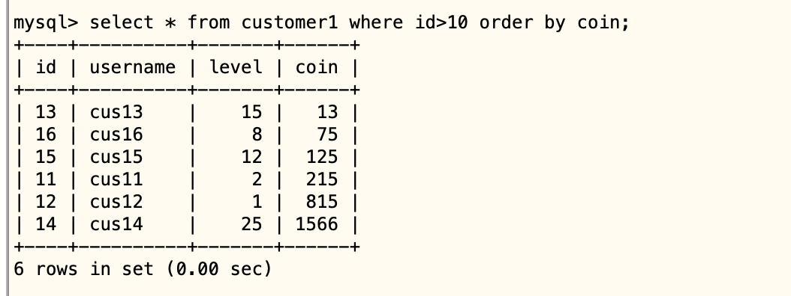


表示查询结果记录 根据 coin 字段的值 升序（ASC） 排列。 所谓升序，就是从小到大。缺省就是按照升序排列，当然你也可以指定是升序。

```
select * from customer1 where id>10 order by coin asc;
```

如果像按降序排列，则使用desc即可，如下：

```
 select * from customer1 where id>10 order by coin desc;
```
结果如下：

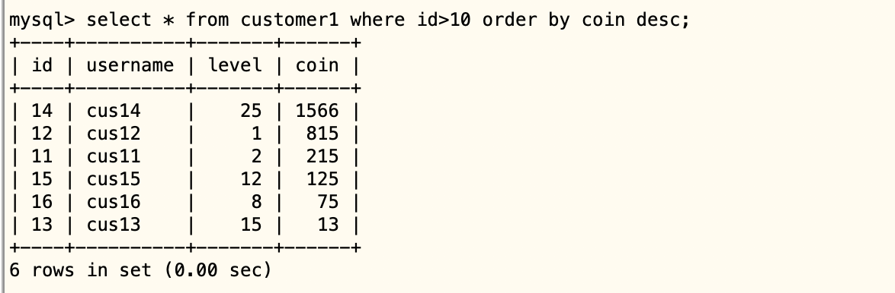


有时候，你希望显示记录先根据coin排列，coin相同的再根据level进行排序，就可以这样写：

```
 select * from customer1 where id>10 order by coin,level desc ;
```

## 查询结果分页


有时候，SQL语句查询的结果可能有成千上万条记录（想象一下淘宝搜索 手机）。如果一下子全部返回，会耗费大量的CPU和内容，也是不需要的。这时候我们的SQL语句可以指定分页，每次只返回一页数据。

我们执行下面的SQL语句再插入一些数据到学生表中：

```
INSERT INTO 学生表 (姓名,性别,电话号码,学历) VALUES 
    ('白月黑羽101','男', '13100000101', '本科'),
    ('白月黑羽102','男', '13100000102', '本科'),
    ('白月黑羽103','男', '13100000103', '本科'),
    ('白月黑羽104','男', '13100000104', '本科'),
    ('白月黑羽105','男', '13100000105', '本科'),
    ('白月黑羽106','男', '13100000106', '本科'),
    ('白月黑羽107','男', '13100000107', '本科'),
    ('白月黑羽108','男', '13100000108', '本科'),
    ('白月黑羽109','男', '13100000109', '本科'),
    ('白月黑羽110','男', '13100000110', '本科'),
    ('白月黑羽111','男', '13100000111', '本科'),
    ('白月黑羽112','男', '13100000112', '本科'),
    ('白月黑羽113','男', '13100000113', '本科'),
    ('白月黑羽114','男', '13100000114', '本科'),
    ('白月黑羽115','男', '13100000115', '本科'),
    ('白月黑羽116','男', '13100000116', '本科'),
    ('白月黑羽117','男', '13100000117', '本科'),
    ('白月黑羽118','男', '13100000118', '本科'),
    ('白月黑羽119','男', '13100000119', '本科'),
    ('白月黑羽120','男', '13100000120', '本科'),
    ('白月黑羽121','男', '13100000121', '本科'),
    ('白月黑羽122','男', '13100000122', '本科');

```

然后，如果我们设置每页最多5条记录，返回指定的一页，比如第二页，怎么做呢？有2种方法：


### LIMIT + OFFSET


- mysql的LIMIT指定最多获取多少条记录。
- mysql的OFFSET指定从结果集中，从第几条记录开始获取结果。

```
 select * from 学生表 order by id limit 5;
```

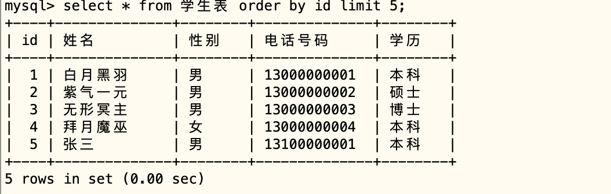


```
select * from 学生表 order by id limit 5 offset 5;
```

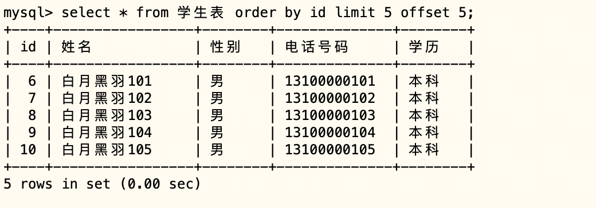


- limit 5 指定最多获取5条记录
- offset 5 指定从结果集中，第6条记录开始。因为第1条记录offset为0.

offset 和页码对应关系为： offset = （PAGE-1）* LIMIT 

如果limit是5， offset第一页取值是0，第二页就是5，第3页就是10，第4页就是15。。。


### LIMIT + ID方法


上面第LIMTIT + OFFSET 方法有个重大缺陷，当offset取值很大时（比如100000），查询好使巨大。具体原因参考[这篇文章](https://www.eversql.com/faster-pagination-in-mysql-why-order-by-with-limit-and-offset-is-slow/) 和[这篇reddit文章](https://www.reddit.com/r/django/comments/4dn0mo/how_to_optimize_pagination_for_large_queryset/)。

可以使用LIMIT+标志列的方法解决。


标志列就是每行取值唯一的列，最典型的就是自增型的ID。每次分页都指定ID的范围即可。比如取出第1页：

```
select * from 学生表
where id>0 and 其他查询条件
ORDER BY id
limit 5 
```

应用程序记录下最后一行的id，如果是58，再取出下1页的时候，就是

```
select * from 学生表
where id>58
ORDER BY id
limit 5 
```

这种方法的缺陷是，不方便随意跳转到其中一页。需要先通过offset的方法 获取前一页的 最后一条记录的ID比如，要跳转到第20页，根据公式

```
OFFSET = (PAGE-1) * LIMIT
       = (20-1) * 5
       = 95
```

第20页 开始的 offset 是 95，第19页的最后一条记录的offset 就是 94那么先执行 如下 SQL语句

```
select id from 学生表
ORDER BY id
limit 1 offset 94;
```


得到 19页的最后一条记录的ID，假如是 95643， 然后再执行

```
select * from 学生表
where id>95643
ORDER BY id
limit 5 
```


## 记录数量、平均值、最大值、最小值

有的时候，我们要获取符合某种条件的记录 有多少条。比如 ，我们想知道 学生表中 姓名以 白月黑羽 开头的 有多少条记录。可以使用 SQL函数 count ，如下所示

```
select count(*) from 学生表 where 姓名 like "白月黑羽%";
```

count是 SQL 函数，用来返回记录数量。常用的SQL函数，还有

- sum
计算某列数字的总和

```
select sum(分数) from 成绩表;
```

- avg
计算某列数字的平均，比如

```
select avg(分数) from 成绩表;
```

- max
得到某列数字的最大值，比如

```
select max(分数) from 成绩表;
```

- min
得到某列数字的最小值，比如

```
select min(分数) from 成绩表;
```


## 修改表记录

我们经常需要更新表记录信息，比如一个用户更新了他的头像，消费后余额更新等等。MySQL更新记录使用的是 update 语句。

前面我们曾经创建过customer1 表，如果我们要更新其中用户名为 cus16 这条记录，把coin值设置为 100，就可以这样写


```
 update customer1 set coin=100 where username='cus16';
```

注意， 这里也用到了 where 从句，限制了更新的 只是 username为cus16的这些记录。

否则，如果没有where 从句，像这样

```
update customer1 set coin=100;
```
就会更新该表中所有的记录，把所有的记录的coin 全部设置为 100where 从句也是用来，过滤要更新的记录的， 用法和select里面where 从句的用法是一样的。


如果我们要更新多个列里面的内容，比如要把username为cus16的记录，把coin值设置为 100，level值设置为 30，就可以这样写

```
update customer1 set coin=100,level=30 where username='cus16';
```

另外SQL语句中间是可以换行的，像下面这样，也是可以的

```
update customer1 
set 
  coin=100,
  level=30 
where username='cus16';
```


## 删除表记录


我们有时也需要删除表记录。MySQL删除记录使用的是 delete from 语句。前面我们曾经创建过customer1 表，如果我们要删除其中cus16这条记录，可以这样写

```
delete from customer1 where username='cus16';
```

注意， 这里也用到了where 从句，限制了 删除的 只是 username为cus16的这些记录。否则，如果没有where 从句，像这样

```
delete from customer1;
```

就会删除该表中所有的记录。删除表中所有的记录，但是表还在，这个和删除表 drop table 是不同的。where 从句也是用来过滤要删除的记录的， 用法和select里面where 从句的用法是一样的。


## 同时修改记录


如果有多个客户端同时修改一个记录，会不会导致覆盖问题呢？

Mysql有锁机制，会保证当一个修改正在进行时，另外的修改会等待前面的操作完成。所以不必担心这种情况，客户端程序也无需写任何检测是否有修改正在进行的代码。


