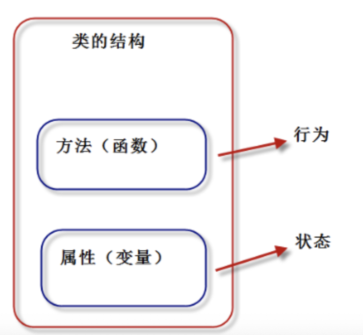
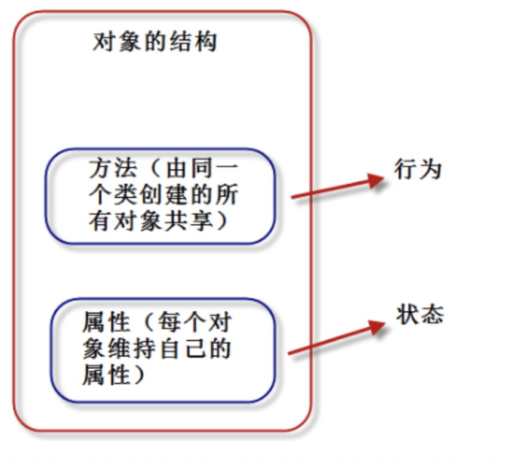

# 02-类的定义

我们把对象比作一个“饼干”，类就是制造这个饼干的“模具”。


我们通过类定义数据类型的属性（数据）和方法（行为），也就是说类将行为和状态打包在一起。


类的结构：



对象是类的具体实体，一般称为类的实例。类看做饼干模具，对象就是根据这个模具制造出的饼干。

从一个类创建对象时，每个对象会共享这个类的行为（类中定义的方法），但会有自己的属性值（不共享状态）。更具体一点：方法代码是共享的，属性数据不共享。





Python中，一切皆对象。类也称为“类对象”，类的实例也称为“实例对象”。

定义类的语法格式如下：

clss 类名：
    类体

**要点如下：**

- 类名必须符合“标识符”的规则，一般规定，首字母大写，多个单词使用“驼峰原则”。
- 类体中我们可以定义属性和方法
- 属性用来描述数据，方法（即函数）用来描述这些数据相关的操作。


案例：  一个典型的类的定义

```
class Student:
    company = "HCB"  # 类属性
    count = 0

    def __init__(self, name, score):
        self.name = name  # 实例属性
        self.score = score
        Student.count = Student.count + 1

    def say_score(self):  # 实例方法
        print("我的公司是：", Student.company)
        print(self.name, '的分数是：', self.score)


s1 = Student("Ly", 99)
s1.say_score()

```

输出结果如下：
```
我的公司是： HCB
Ly 的分数是： 99
```


