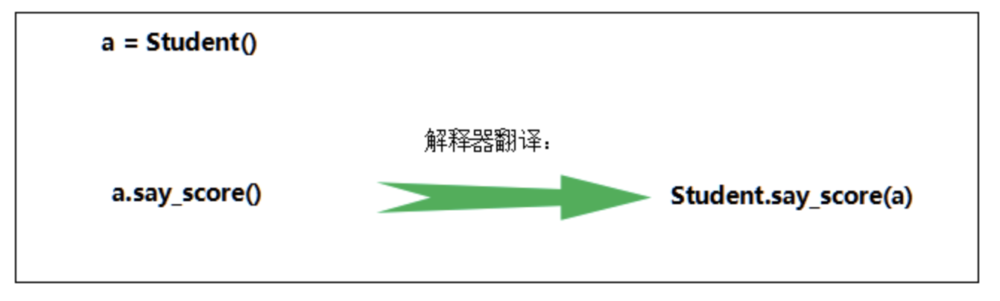

# 04-实例属性和实例方法

## 实例属性

实例属性是从属于实例对象的属性，也称为“实例变量”。他的使用有如下几个要点：

- 实例属性一般在__init__()方法中通过如下代码定义：
   - self.实例属性名 = 初始值
- 在本来的其它实例方法中，也是通过self进行访问：
   - self.实例属性名
- 创建实例对象后，通过实例对象访问：
  - obj01 = 类名() # 创建对象，调用__init__()初始化属性
  - obj01.实例属性名 = 值 # 可以给自己已有属性赋值，也可以新加属性

## 实例方法

实例方法是从属于实例对象的方法。实例方法的定义格式如下：

def 方法名(self [,行参列表])：
    函数体

**方法的调用格式如下：**

对象.方法名([实参列表])

**要点：**

- 定义实例方法时，第一个参数必须为self。和前面一样，self指当前实例对象。
- 调用实例方法时，不需要也不能给self传参。self由解释器自动传参。

**函数和方法的区别**

- 都是用来完成一个功能的语句块，本质一样
- 方法调用时，通过对象来调用。方法从属于特定实例对象，普通函数没有这个特点。
- 直观上看，方法定义时需要传递self，函数不需要。

**实例方法调用的本质**

其它操作：

- dir(obj)可以获得对象的所有属性、方法
- obj.__dict__对象属性的字典
- pass语句
- isinstance(对象，类型)判断“对象”是不是指定类型

