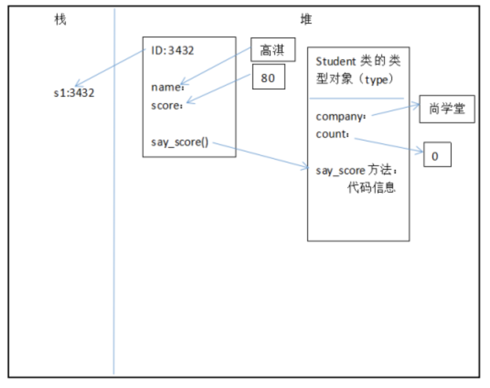

# 06-类方法、静态方法


## 类方法

类方法是从属于“类对象”的方法。类方法通过装饰器@classmethod来定义，格式如下：

@classmethod
def 类方法名(cls[,形参列表])：
    函数体


**要点如下：**

- classmethod必须位于方法上面一行
- 第一个cls必须有；cls指的就是类对象本身
- 调用类方法格式：类名.类方法名(参数列表)。参数列表中，不需要也不能给cls传值。
- 类方法中访问实例属性和实例方法会导致错误
- 子类继承父类方法时，传入cls是子类对象，而非父类对象


案例：类方法使用测试
```
class Student:
    company = "HCB"

    @classmethod
    def print_company(cls):
        print(cls.company)


Student.print_company()
```

执行结果：
```
HCB
```

## 静态方法

Python中允许定义与类对象无关的方法，称为静态方法。

静态方法和在模块中定义普通函数没有区别，只不过静态方法放到了类的名字空间里面，需要通过类调用。

静态方法通过装饰器@staticmethod来定义，格式如下：

@staticmethod
def 静态方法名([形参列表])：
    函数体

**要点如下：**

- @staticmethod必须位于方法上面一行
- 调用静态方法格式：类名.静态方法名(参数列表)
- 静态方法中访问实例属性和实例方法会导致错误

案例：静态方法使用测试

```
class Student:
    company = "SXT"  # 类属性

    @staticmethod
    def add(a, b):  # 静态方法
        print("{0}+{1}={2}".format(a, b, (a + b)))
        return a+b


Student.add(3, 90)
```


## 内存分析实例对象和类对象创建过程

我们以下面代码为例，分析整个创建过程，可以对面向对象概念更加深刻：

```
 class Student:            
                company = "尚学堂"     #类属性
                count = 0           #类属性
                 
                def __init__(self,name,score):
                    self.name = name         #实例属性
                    self.score = score
                    Student.count = Student.count+1
              
                def say_score(self):           #实例方法
                    print("我的公司是：",Student.company)
                    print(self.name,'的分数是：',self.score)
              
            s1 = Student('高淇',80)       #s1是实例对象，自动调用__init__()方法
            s1.say_score()
            print('一共创建{0}个Student对象'.format(Student.count))
```

