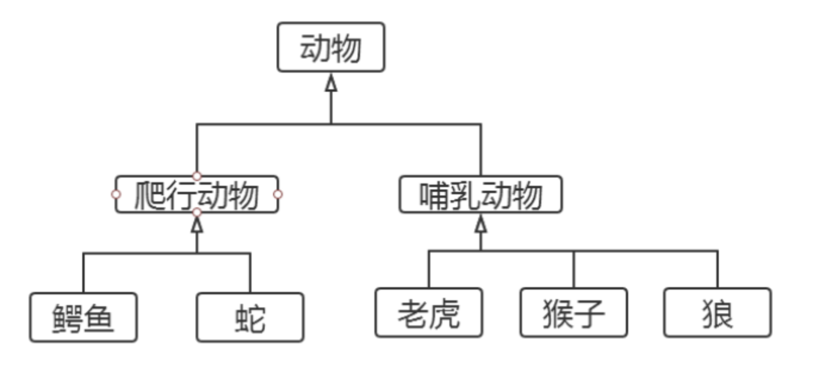
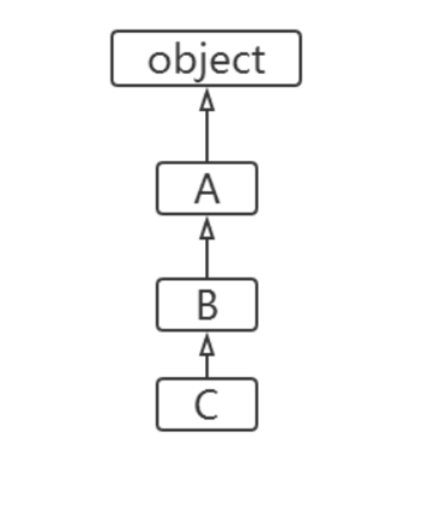
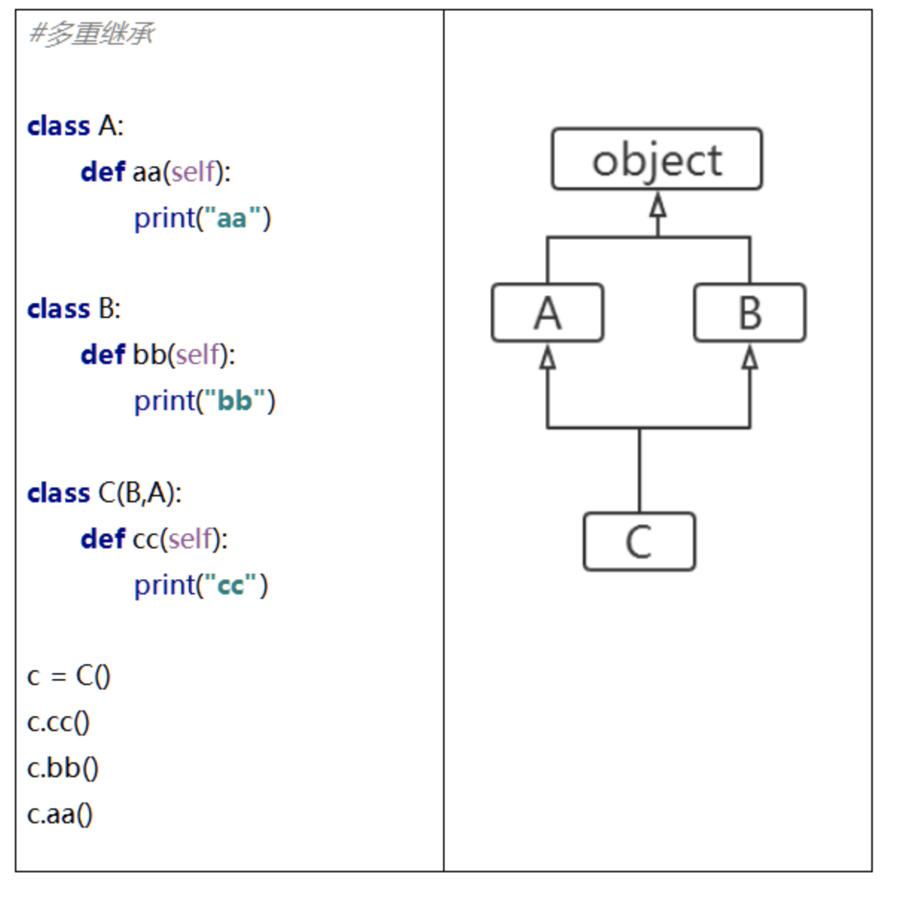

# 12-继承

继承是面向对象程序设计的重要特征，也是实现代码复用的重要手段。

如果一个新类继承自一个设计好的类，就直接具备了已有类的特征，就大大降低了工作难度。已有的类，我们称为“父类或基类”，新的类我们称为“子类或者派生类”。




## 语法格式

Python支持多重继承，一个子类可以继承多个父类。继承的语法格式如下：

**class 子类类名(父类1[,父类2，......]):
    类体**

如果在类定义中没有指定父类，则默认父类是object类。也就是说，object是所有类的父类，里面定义了一些所有类共有的默认实现，比如：__new__().

定义子类时，必须在其构造函数中调用父类的构造函数。调用格式如下：

**父类名.__init__(self,参数列表)**


```
class Person:
    def __init__(self, name, age):
        self.name = name
        self.__age = age

    def say_age(self):
        print(self.name, "的年龄是：", self.__age)


class Student(Person):
    def __init__(self, name, age, score):
        self.score = score
        Person.__init__(self, name, age)  # 构造函数中包含调用父类构造函数。根据需要，\
        # 不是必须。子类并不会自动调用父类的__init__()，我们必须显示的调用它。


s1 = Student("张三", 27, 99)
s1.say_age()
print(dir(s1))

```

执行结果如下：
```
张三 的年龄是： 27
['_Person__age', '__class__', '__delattr__', '__dict__', '__dir__', '__doc__', '__eq__', '__format__', '__ge__', '__getattribute__', '__gt__', '__hash__', '__init__', '__init_subclass__', '__le__', '__lt__', '__module__', '__ne__', '__new__', '__reduce__', '__reduce_ex__', '__repr__', '__setattr__', '__sizeof__', '__str__', '__subclasshook__', '__weakref__', 'name', 'say_age', 'score']
```

## 类成员的继承和重写

- 成员继承：子类继承了父类除构造方法之外的所有成员。
- 方法的重写：子类可以重新定义父类中的方法，这样就会覆盖父类的方法，也称为“重写”。


案例：继承和重写

```
# 测试继承和重写


class Person:
    def __init__(self, name, age):
        self.name = name
        self.age = age

    def say_age(self):
        print(self.name, "的年龄是：", self.age)

    def say_name(self):
        print("我是：", self.name)


class Student(Person):
    def __init__(self, name, age, score):
        self.score = score
        Person.__init__(self, name, age)  # 构造函数中包含调用父类构造函数

    def say_score(self):
        print(self.name, "的分数是：", self.score)

    def say_name(self):  # 重写父类方法
        print("报告老师，我是：", self.name)


s1 = Student("张三", 22, 90)
s1.say_score()
s1.say_age()
s1.say_name()

```

执行结果如下：

张三 的分数是： 90
张三 的年龄是： 22
报告老师，我是： 张三

## 查看类的继承结构

通过类的方法mro()或者类的属性__mro__可以输出这个类的继承层次结构。

案例：查看类的继承结构
```
# 测试查看类的继承结构


class A:
    pass


class B(A):
    pass


class C(B):
    pass


print(C.mro())
```

执行结果如下：
[<class '__main__.C'>, <class '__main__.B'>, <class '__main__.A'>, <class 'object'>]




## object根类

object类是所有类的父类，因此所有的类都是object类的属性和方法。我们显然有必要深入研究下object类的结构。对于我们继续深入学习Pyhon很有好处。


**dir()查看对象属性**

为了深入学习对象，我们先学习内置函数dir()，他可以让我们方便的看到指定对象所有的属性。


案例：查看对象所有属性以及和object进行比对

```
class Person:
    def __init__(self, name, age):
        self.name = name
        self.age = age

    def say_age(self):
        print(self.name, "的年龄是：", self.age)


obj = object()
print(dir(obj))

s2 = Person("张三", 18)
print(dir(s2))

```

执行结果如下：
```
['__class__', '__delattr__', '__dir__', '__doc__', '__eq__', '__format__', '__ge__', '__getattribute__', '__gt__', '__hash__', '__init__', '__init_subclass__', '__le__', '__lt__', '__ne__', '__new__', '__reduce__', '__reduce_ex__', '__repr__', '__setattr__', '__sizeof__', '__str__', '__subclasshook__']
['__class__', '__delattr__', '__dict__', '__dir__', '__doc__', '__eq__', '__format__', '__ge__', '__getattribute__', '__gt__', '__hash__', '__init__', '__init_subclass__', '__le__', '__lt__', '__module__', '__ne__', '__new__', '__reduce__', '__reduce_ex__', '__repr__', '__setattr__', '__sizeof__', '__str__', '__subclasshook__', '__weakref__', 'age', 'name', 'say_age']
```

从上面我们可以发现这样几个要点：

- Person对象增加了六个属性：
    - __dict__ __module__ __weakref__ age name say_age
- object的所有属性，Person类作为object的子类，显然包含了所有的属性
- 我们打印age、name、say_age，发现say_age 虽然是方法，实际上也是属性。只不过，这个属性的类型是method而已。


```
age <class 'int'>
name <class 'str'>
say_age <class 'method'>

```

### 重写__str__()方法

object有一个__str__()方法，用于返回一个对于“对象的描述”，对应于内置函数str()经常用于print()方法，帮助我们查看对象的信息。__str__()可以重写。

```
# 测试 __str__重写


class Person:
    def __init__(self, name, age):
        self.name = name
        self.__age = age

    def __str__(self):
        '''将对象转化成一个字符串，一般用于print方法'''
        return "名字是：{0},年龄是{1}".format(self.name, self.__age)


p = Person("张三", 18)
print(p)

```

执行结果：
```
名字是：张三,年龄是18
```

##  多重继承

Python支持多重继承，一个子类可以有多个“直接父类”。这样，就具备了“多个父类”的特点。但是由于，这样会被“类的整体层次”搞的异常复杂，尽量避免使用。

```
# 多重继承

class A:
    def aa(self):
        print("aa")


class B:
    def bb(self):
        print("bb")


class C(B, A):
    def cc(self):
        print("cc")


c = C()
c.cc()
c.aa()
c.bb()

```

执行结果如下：
cc
aa
bb




## MRO()

Python支持多继承，如果父类中有相同名字的方法，在子类没有指定父类名时，解释器将“从左向右”按顺序搜索。


MRO（method resolution order）：方法解析顺序。我们可以通过mro()方法获得“类的层次结构”，方法解析顺序也是按照这个“类的层次结构”寻找的。


案例：
```
class A:
    def aa(self):
        print("aa")

    def say(self):
        print("say AAA")


class B:
    def bb(self):
        print("bb")

    def say(self):
        print("say BBB")


class C(B, A):
    def cc(self):
        print("cc")


c = C()
print(C.mro())  # 打印类的层次结构
c.say()  # 解释器寻找方法是"从左到右"的方式寻找，此时会执行B类中的say()

```

执行结果如下：
```
[<class '__main__.C'>, <class '__main__.B'>, <class '__main__.A'>, <class 'object'>]
say BBB
```

##  super()获得父类定义

在子类中，如果想要获得父类的方法时，我们可以通过super()来做。

super()代表父类的定义，不是父类对象。

案例：
```
# 测试super()


class A:
    def say(self):
        print("A", self)
        print("say AAA")


class B(A):

    def say(self):
        super().say()
        print("say BBB")


b = B()
b.say()
```

执行结果如下：
A <__main__.B object at 0x1031f3dd0>
say AAA
say BBB

