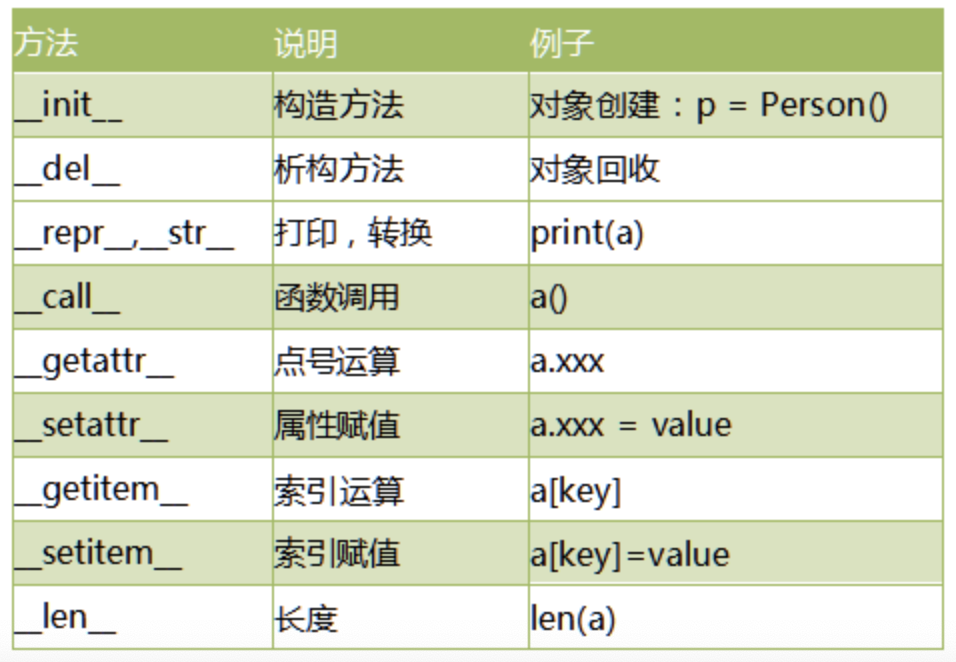
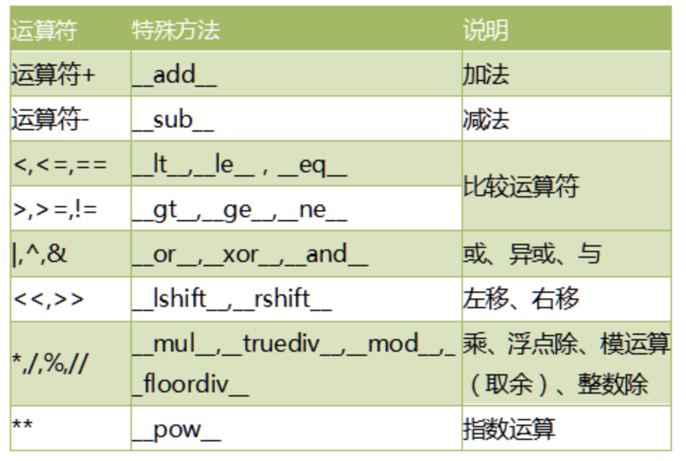

# 13-多态

多态(polymorphism)是指同一个方法调用由于对象不同可能会产生不同的行为。在现实生活中，我们有很多例子。比如：同样是吃饭的方法，中国人用筷子吃饭，英国人用刀吃饭，印度人用手吃饭。


**多态注意点**

- 多态是方法的多态，属性没有多态。
- 多态的存在有2个必要条件：继承、方法重写。

```
# 测试多态


class Animal:
    def shout(self):
        print("动物叫了一声")


class Dog(Animal):
    def shout(self):
        print("小狗，汪汪汪")


class Cat(Animal):
    def shout(self):
        print("小猫，喵喵喵")


def animal_shout(a):
    if isinstance(a, Animal):
        a.shout()  # 传入的对象不同，shout方法对应的实际行为也不同


animal_shout(Dog())
animal_shout(Cat())
```

执行结果：
小狗，汪汪汪
小猫，喵喵喵


## 特殊方法和运算符重载

Python的运算符实际上是通过调用对象的特殊方法实现的。比如：
```
a = 20
b = 30
c = a+b
d = a.__add__(b)
print("c=", c)
print("d=", d)
```
执行结果如下：
c= 50
d= 50


常见的特殊方法如下：



每个运算符实际上都对应了相同都方法，统计如下：


我们可以重写上面的特殊方法，即实现了运算符的重载。

案例：
```
# 测试运算符重载


class Person:
    def __init__(self, name):
        self.name = name

    def __add__(self, other):
        if isinstance(other, Person):
            return "{0}---{1}".format(self.name, other.name)
        else:
            return "不是同对象，不能相加"

    def __mul__(self, other):
        if isinstance(other, int):
            return self.name * other
        else:
            return "不是同类对象，不能相乘"


p1 = Person("张三")
p2 = Person("李四")
x = p1 + p2
print(x)
print(p1 * 3)

```
执行结果如下：
张三---李四
张三张三张三

