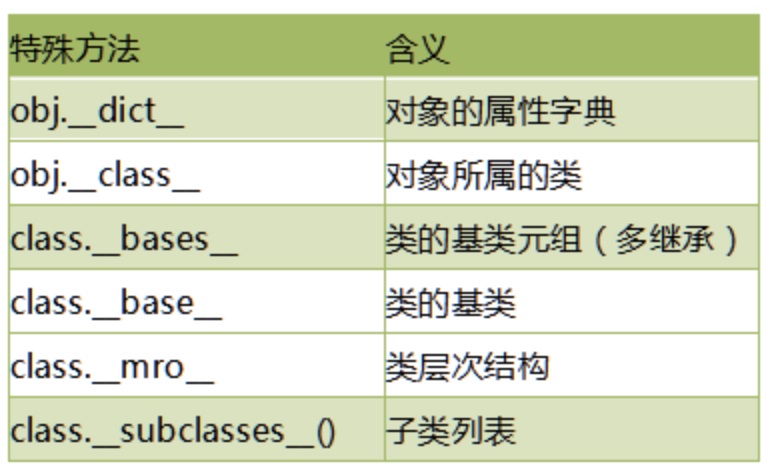

# 14-特殊属性

Python对象中包含了很多双下划线开始和结束的属性，这些是特殊属性，有特殊用法。下面是常见的特殊属性：



案例：测试特殊属性

```
# 测试特殊属性


class A:
    pass


class B:
    pass


class C(B, A):
    def __init__(self, age):
        self.age = age

    def cc(self):
        print("cc")


c = C(18)
print(dir(c))
print(c.__dict__)
print(c.__class__)
print(C.__bases__)
print(C.mro())
print(A.__subclasses__())

```

执行结果如下：
```
['__class__', '__delattr__', '__dict__', '__dir__', '__doc__', '__eq__', '__format__', '__ge__', '__getattribute__', '__gt__', '__hash__', '__init__', '__init_subclass__', '__le__', '__lt__', '__module__', '__ne__', '__new__', '__reduce__', '__reduce_ex__', '__repr__', '__setattr__', '__sizeof__', '__str__', '__subclasshook__', '__weakref__', 'age', 'cc']
{'age': 18}
<class '__main__.C'>
(<class '__main__.B'>, <class '__main__.A'>)
[<class '__main__.C'>, <class '__main__.B'>, <class '__main__.A'>, <class 'object'>]
[<class '__main__.C'>]
```