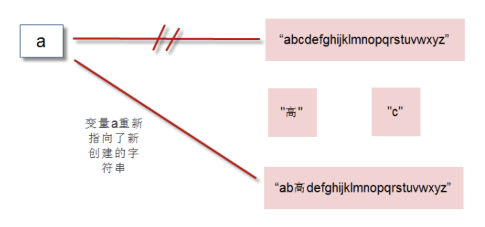

# 03-str()实现数字转字符串


str()可以帮助我们将其它数据类型转换为字符串。

当我们调用print函数时，解释器自动调用了str()将非字符串的对象转变成了字符串。


```
>>> str(5.20)
'5.2'
>>> str(3.14e2)
'314.0'
>>> str(True)
```


## 使用[]提取字符

字符串的本质就是字符序列，我们可以通过在字符串后面添加[]，在[]里面指定偏移量，可以提取该位置的单个字符


- 正向搜索
  - 最左侧第一个字符，偏移量是0，第二个偏移量是1，依次类推，直到len(str)-1为止。
- 反向搜索
  - 最右侧第一个字符，偏移量是-1.倒数第二个偏移量是-2，依次类推，直到-len(str)为止。


示例
```
>>> a = 'abcdefghijklmnopqrstuvwxyz'
>>> a
'abcdefghijklmnopqrstuvwxyz'
>>> len(a)
26
>>> a[0]
'a'
>>> a[1]
'b'
>>> a[25]
'z'
>>> a[26]
Traceback (most recent call last):
  File "<stdin>", line 1, in <module>
IndexError: string index out of range
>>> 
>>> a[-1]
'z'
>>> a[-2]
'y'
>>> a[-26]
'a'
>>> a[-27]
Traceback (most recent call last):
  File "<stdin>", line 1, in <module>
IndexError: string index out of range
```

超出范围，则会报错：IndexError，index out of range


## replace()实现字符串替换

字符串是不可改变的，我们通过[]可以获取字符串指定位置的字符，但是我们不能改变字符串。我们尝试改变字符串中某个字符，发现报错了：

```
>>> a = 'abcdefghijklmnopqrstuvwxyz'
>>> a
'abcdefghijklmnopqrstuvwxyz'
>>> a[3] = '高'
Traceback (most recent call last):
  File "<stdin>", line 1, in <module>
TypeError: 'str' object does not support item assignment
```


字符串不可改变，但我们确实有时候需要替换某些字符。这时，只能通过创建新的字符串来实现。


```
>>> a = 'abcdefghijklmnopqrstuvwxyz'
>>> a
'abcdefghijklmnopqrstuvwxyz'
>>> a = a.replace('c','高')
>>> a
'ab高defghijklmnopqrstuvwxyz'
```

可以发现a变量的值已经发生了改变，实际上是生成了新的字符串，并将a变量指向了新的字符串对象的地址。而不是修改了以前的字符串。

