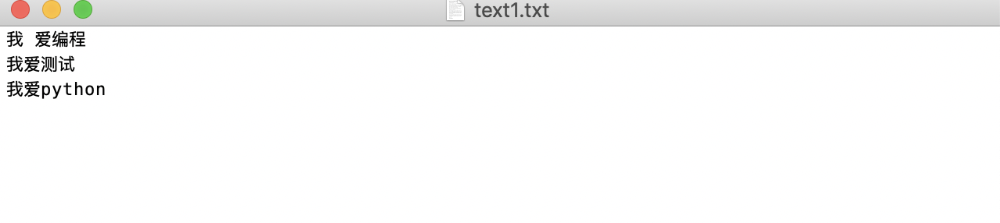
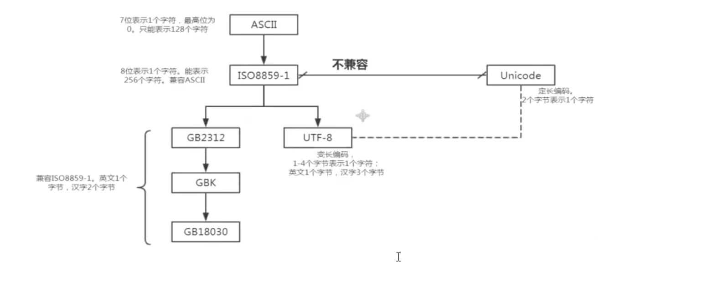

# 01-文件基础知识

一个完整的程序一般都包括数据的存储和读取；我们在前面学习写的程序数据都没有进行实际都存储，因此python解释器执行完数据都消失了。实际开发中，我们经常需要从外部存储介质（硬盘、光盘、U盘等）读取数据，或者将程序产生都数据存储到文件中，实现“持久化”保存。


我们知道，很多软件系统是将数据存储在数据库中；数据库实际也是基于文件形式存储到，本章我们就开始学习文件到相关操作。


## 文本文件和二进制文件


按文件中数据组织形式，我们把文件分为文本文件和二进制文件两大类。


- 文本文件
  - 文本文件存储的是普通字符文本，Python默认为unicode字符集，可以使用记事本程序打开。但是像word软件编辑的文档不是文本文件。

- 二进制文件
  - 二进制文件把数据内容用“字节”进行存储，无法用记事本程序打开。必须使用专用的软件解码。常见的有：视频文件、音频文件、图片、doc文档等等。


**文件操作相关模块概述**

Python标准库中，如下是文件操作相关模块，后续会陆续学习。

| 名称                              | 说明                                     |
| :------------------------------- | :-------------------------------------- |
| Io模块                            | 文件流的输入和输出操作                      |
| os模块                            | 基本操作系统功能，包括文件操作               |
| glob模块                          | 查找符合特点规则的文件路径名                |
| fnmatch模块                       | 使用模式来匹配文件路径名                    |
| fileinput模块                     | 处理多个输入文件                           |
| filecmp模块                       | 用于文件的比较                            |
| cvs模块                           | 用于cvs文件处理                           |
| pickle和cPickle                  | 用于序列化和反序列化                       |
| xml包                             | 用于XML数据处理                           |
| bz2、gzip、zipfile、zlib、tarfile | 用于处理压缩和解压缩文件（分别对应不同的算法） |


## 创建文件对象

open()函数用于创建文件对象，基本语法格式如下：
    open(文件名[,打开方式])
     
如果只是文件名，代表在当前目录下的文件。文件名可以录入全路径，比如：D：\a\b.txt。为了减少“\”的输入，可以使原始字符串：r"D：\a\b.txt". 示例如下：

```
f = open(r"/Users/user/desktop/text1.txt")
```

打开方式有如下几种：

| 模式 | 描述                                                      |
| :-- | :-------------------------------------------------------- |
| r   | 读模式                                                    |
| w   | 写模式。如果文件不存在则创建，如果文件存在，则重写内容           |
| a    | 追加模式，如果文件不存在则创建，如果文件存在，则在文件末尾追加内容 |
| b    | 二进制模式（可与其它模式组合使用）                            |
| +   | 读、写模式（可与其它模式组合使用）                            |


文本文件对象和二进制文件对象的创建：
    如果我们没有增加模式“b”,则默认创建的是文本文件对象，处理的基本单元是字符。如果是二进制模式“b”,则创建的是二进制文件对象，处理的基本单元是“字节”。


## 文本文件的写入


基本的文本文件写入操作，一般就是三个步骤：

- 1、创建文本对象
- 2、写入数据
- 3、关闭文件对象

案例如下：
```
# 测试文本文件写入
f = open(r"/Users/user/desktop/text1.txt",'a')  # 创建文件对象
s = "我 爱编程\n我爱测试\n我爱python"
f.write(s)
f.close()
```

执行结果如下：



## 常用编码知识介绍


在操作文本文件时，经常会操作中文，这时候就经常会碰到乱码问题。为了让大家更好理解中文乱码问题，这里我们学习一下各种编码之间的关系。


常用编码之间的关系如下：



**中文乱码问题**

windows操作系统默认的编码是GBK，linux操作系统默认的编码是UTF-8。当我们用open()时，调用的是操作系统打开的文件，如果是windows，默认的编码是GBK，这时就会出现乱码问题。出现乱码的原因是：编码和解码不一致！

在文件操作时，使用encoding='utf-8'参数时就可以避免这个问题！

```
f = open("/Users/user/desktop/text1.txt", 'a', encoding='utf-8')
```