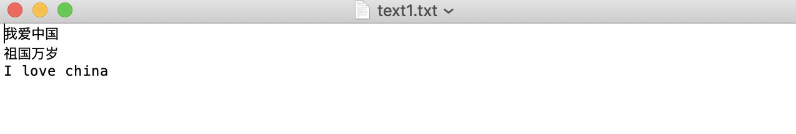

# 02-关闭流要点


## write()/writelines()写入数据

write(a):            把字符串a写入到文件中
writelines(b):     把字符串列表写入文件中，不添加换行符

案例：将字符串列表数据添加至文件中

```
f = open(r"/Users/user/desktop/text1.txt", 'a', encoding='utf-8')  # 创建文件对象
s = ["我爱中国\n", "祖国万岁\n", "I love china"]
f.writelines(s)
f.close()
```

执行结果如下：



## close()关闭文件流

由于文件底层是由操作系统控制，所以我们打开的文件对象必须显示调用close()方法关闭文件对象。当调用close()放大时，首先会把缓冲区数据写入文件（也可以直接调用flush()方法），再关闭文件，释放文件对象。

为了确保打开的文件对象正常关闭，一般结合异常机制的finally或者with关键字实现，无论任何情况都能关闭打开的文件对象。


案例：使用try-finally结构关闭文件流对象

```
# 测试关闭文件对象使用finally异常处理
try:
    f = open("/Users/user/desktop/text1.txt", 'a', encoding='utf-8')  # 创建文件对象
    s = "我 爱编程\n我爱测试\n我爱python"
    f.write(s)
except BaseException as e:
    print(e)
finally:
    f.close()
```


## with语句(上下文管理器)


with关键字(上下文管理器) 可以自动管理上下文资源，不论什么原因跳出with块，都能确保文件正确关闭哦，并且可以在代码块执行完毕后自动还原进入该代码块的现场。


案例：使用with管理文件写入操作

```
# 测试with管理文件写入操作
s = ["爱python", "爱测试", "爱编码"]
with open("test1.txt", 'a', encoding='utf-8') as f:
    f.writelines(s)

```