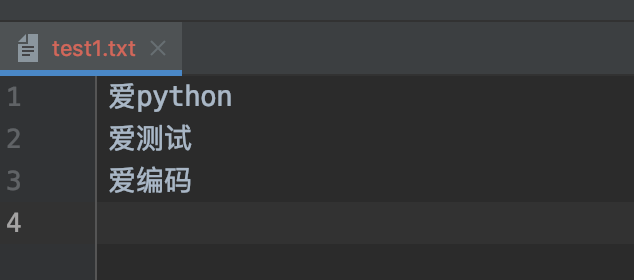
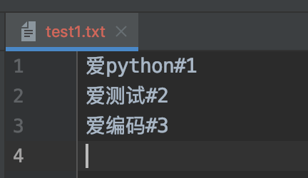

# 03-文本文件的读取


文件的读取一般使用如下三个方法：

- read([size])

从文件中读取size个字符，并作为结果返回。如果没有size参数，则读取整个文件。读取到文件末尾，会返回空字符串。


- readline()

读取一行内容作为结果返回。读取到文件末尾，会返回空字符串。

- readlines()

文本文件中，每一行作为一个字符串存入列表中，返回该列表。


案例：
```
# 测试文件读取所有
with open('test1.txt', 'r') as f:
    s = f.read()
    print(s)
```

执行结果如下：
```
爱python
爱测试
爱编码
爱python爱测试爱编码
```

```
with open('test1.txt', 'r') as f:
    s = f.read(2)
    print(s)

结果如下：
爱p
```


案例：按行读取一个文件2种方式

```
# 测试文件按行读取方式一使用迭代器
with open('test1.txt', 'r') as f:
    for a in f:
        print(a, end='')
```

执行结果如下：
爱python
爱测试
爱编码
爱python爱测试爱编码

```
# 按行读取一个文件
with open('test1.txt', 'r') as f:
    while True:
        flag_ment = f.readline()
        if not flag_ment:
            break
        else:
            print(flag_ment, end='')
```
执行结果如下：
爱python
爱测试
爱编码
爱python爱测试爱编码


案例：将源文件爱python\n爱测试\n爱编码\n 每行内容加上#和对应的行数，写入文件, 使用readilines
```
# 小练习将源文件爱python\n爱测试\n爱编码\n 每行内容加上#和对应的行数，写入文件
with open('test1.txt', 'r') as f:
    lines = f.readlines()
    lines = [line.rstrip() + "#"+str(index+1)+"\n" for index, line in enumerate(lines)]
    print(lines)

with open('test1.txt', 'w') as f:
    f.writelines(lines)
```

源文件样式：



通过案例后文件样式：



**enumerate() 函数用于将一个可遍历的数据对象(如列表、元组或字符串)组合为一个索引序列，同时列出数据和数据下标**


案例：测试enumerate函数
```
# 测试enumerate函数

a = ["爱祖国", "爱Python", "爱编程"]
b = enumerate(a)
print(b)
print(type(b))
print(list(b))
```

执行结果如下：
```
<enumerate object at 0x102b04910>
<class 'enumerate'>
[(0, '爱祖国'), (1, '爱Python'), (2, '爱编程')]
```

