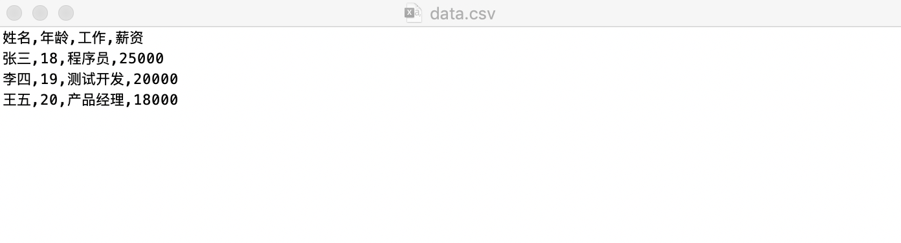
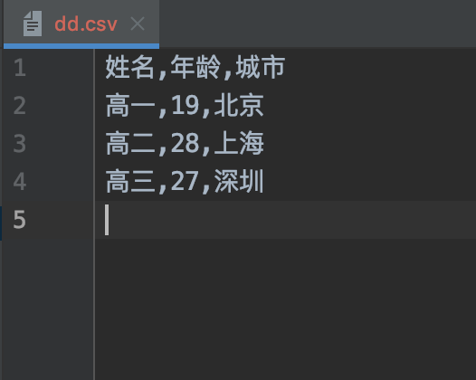

# 07-csv文件读取和写入


## csv文件的操作


csv(Comma Spearated Values)是逗号分隔符文本格式，常用于数据交换、Excel文件和数据库数据的导入和导出。与Excel文件不同，CSV文件中：

- 值没有类型，所有值都是字符串
- 不能指定字体颜色等样式
- 不能指定单元格的宽高，不能合并单元格
- 没有多个工作表
- 不能嵌入图像图表


Python标准库的模块csv提供了读取和写入csv格式文件的对象。我们在excel中建立了一个简单的表格。

| 姓名 | 年龄 | 工作    | 薪资   |
| :-- | :-- | :------ | :---- |
| 张三 | 18  | 程序员   | 25000 |
| 李四 | 19  | 测试开发 | 20000 |
| 王五 | 20  | 产品经理 | 18000 |

另存为csv逗号分割，然后我们用文本编辑软件打开这个文件，csv文件内容如下：



案例：测试csv文件读取

```
# 测试csv文件读取和写入
import csv

with open("data.csv", 'r', encoding='utf-8') as f:
    a_csv = csv.reader(f)
    print(a_csv)
    # print(list(a_csv))
    for i in a_csv:
        print(i)

```

执行结果如下：
```
<_csv.reader object at 0x1033de9d0>
['\ufeff姓名', '年龄', '工作', '薪资']
['张三', '18', '程序员', '25000']
['李四', '19', '测试开发', '20000']
['王五', '20', '产品经理', '18000']
```

可以发现姓名前面出现了个\ufeff，在百度上搜索答案，可以查看此篇文章：https://www.cnblogs.com/yunlongaimeng/p/12530255.html

**要解决此问题只需要将：**
```
encoding='utf-8' 改成 encoding='utf-8-sig'即可
```


案例：测试将内容写入csv文件

```
# 测试将数据写入csv文件中

with open("dd.csv", 'w') as f:
    b_csv = csv.writer(f)
    b_csv.writerow(['姓名', '年龄', '城市'])  # 写入单行数据
    data = [['高一', 19, '北京'], ['高二', 28, '上海'], ['高三', 27, '深圳']]
    b_csv.writerows(data)  # 写入多行数据
```


执行结果完成文件内容如下：
