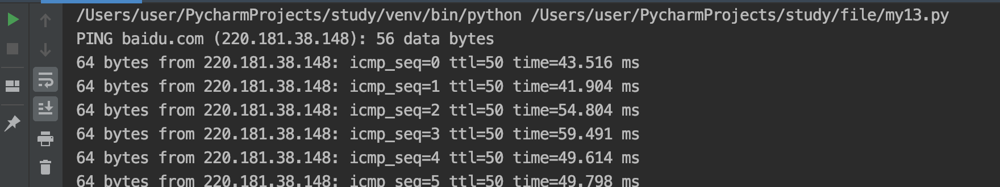

# 08-os模块


os模块可以帮助我们直接对操作系统进行操作。我们可以直接调用操作系统对可执行文件、命令，直接操作文件、目录等等。是系统运维的核心基础。


## os调用操作系统文件和命令


- os.system可以帮助我们直接调用系统的命令


案例：
```
import os

os.system("ping baidu.com") # ping 百度服务器
os.system("appium")       # 执行appium服务启动
os.system('adb devices')  # 查看手机列表设备
os.system('emulator -list-avds')  # 查看当前模拟器设备
os.system('open -n -a Terminal')  # 打开mac终端

```

system方法在linux和mac系统上，方法内部传入bash命令即可。


ping百度运行结果：



```
os.startfile("文件路径") # windows上可以打开可执行的程序
```


## os模块文件和目录操作

我们可以通过前面学习的文件对象实现对于文件内容的读写操作。如果还需要对文件和目录做其它操作，可以使用os和os.path模块。


os模块下常用操作文件的方法：

| 方法名            | 描述                        |
| :--------------- | :------------------------- |
| remove(path)     | 删除指定的文件               |
| rename(src,dest) | 重命名文件或目录              |
| stat(path)       | 返回文件的所以属性            |
| listdir(path)    | 返回path目录下的文件和目录列表 |


os模块下关于目录操作的相关方法，汇总如下：

| 方法名                          | 描述                       |
| :----------------------------- | :------------------------- |
| mkdir(path)                   | 创建目录                    |
| mkdirs(path1/path2/path3....) | 创建多级目录                |
| rmdir(path)                   | 删除目录                    |
| removedirs(path1/path2...)    | 删除多级目录                |
| getcwd()                       | 返回当前工作目录             |
| chdir(path)                   | 把path设为当前工作目录       |
| walk()                         | 遍历目录树                  |
| sep                            | 当前操作系统所使用的路径分割符 |


案例：
```
# '---------------获取文件和文件相关的信息---------------'
print(os.name)  # 获取系统名 windows--> nt   linux-->posix
print(os.sep)  # 获取系统分隔符 windows--> \ linux--> /
print(repr(os.linesep))  # 获取系统换行符 windows--> \r\n  linux--> \n
print(os.stat("my01.py"))  # 获取文件的详细信息

# '---------------工作目录的操作---------------'
print(os.getcwd())  # 打印当前文件的操作目录信息/Users/user/PycharmProjects/study/os
os.chdir('/Users/user/desktop')  # 改变当前的工作目录为桌面
os.mkdir('test')  # 创建目录,如果已存在会报错，FileExistsError: [Errno 17] File exists: 'test'

# '---------------创建目录、多级目录、删除目录---------------'

os.mkdir('testdir') 创建、删除目录，如果使用相对路径是根据当前的工作目录进行操作的
os.rmdir('testdir') 删除目录
os.makedirs("电影/港台/周星驰")  # 创建多级目录
os.removedirs("电影/港台/周星驰")  # 删除多级目录，只能删除空目录，目录下存在文件则报错:OSError: [Errno 66] Directory not empty
os.makedirs('../音乐/欧美') # ../指的是上一级目录
os.rename('电影', 'movie') # 重命名目录名称

dirs = os.listdir('movie')  # 返回当前目录下的所有内容，不包含子孙集目录
print(dirs)
```


## os.path模块


os.path模块提供了目录相关（路径判断，路径切分、路径链接、文件夹遍历）的操作。


| 方法               | 描述                       |
| :----------------- | :------------------------- |
| isabs(path)        | 判断path是否是绝对路径       |
| isdir(path)        | 判断path是否是目录           |
| isfile(path)       | 判断path是否是文件           |
| exists(path)       | 判断指定路径的文件是否存在    |
| getsize(fielname)  | 返回文件的大小               |
| abspath(path)      | 返回绝对路径                |
| dirname(p)         | 返回目录的路径               |
| getatime(filename) | 返回文件的最后的访问时间      |
| getmtime(fielname) | 返回文件的最后修改时间        |
| walk(top,func,arg) | 递归方式遍历目录             |
| join(path,*paths)  | 连接多个path                |
| split(path)        | 对路径进行分割，以列表形式返回 |
| splitext(path)     | 从路径中分割文件的扩展名      |


案例：# 测试os.path模块
```
import os.path
# --------------判断：绝对路径、是否目录、是否文件、文件是否存在----------
print(os.path.isabs("/Users/user/desktop/a.jpeg"))   # True
print(os.path.isdir("/Users/user/desktop/a.jpeg"))   # False
print(os.path.isfile("/Users/user/desktop/a.jpeg"))  # True
print(os.path.exists("/Users/user/desktop/a.jpeg"))  # True

# ---------------获得文件基本信息

print(os.path.getsize("/Users/user/desktop/a.jpeg"))
print(os.path.abspath("/Users/user/desktop/a.jpeg"))
print(os.path.dirname("/Users/user/desktop/a.jpeg"))

print(os.path.getmtime("/Users/user/desktop/a.jpeg"))
print(os.path.getatime("/Users/user/desktop/a.jpeg"))
print(os.path.getctime("/Users/user/desktop/a.jpeg"))

# -------------对路径的操作-------------------------
path = os.path.abspath("/Users/user/desktop/a.jpeg")
print(os.path.split(path))  # 分割出路径名
print(os.path.splitext(path))  # 分割出文件后缀名
print(os.path.join("aa", "bb", "cc"))  # 路径连接aa/bb/cc

```


练习：测试列出工作目录下所有的py文件，并输出文件名
```
import os
path = os.getcwd()

# 方式一
file_list = os.listdir(path)
for filename in file_list:
    if filename.endswith("py"):
        print(filename)


print("#####################")

# 方式二 ，列表推导式
file_list2 = [filename for filename in os.listdir(path) if filename.endswith("py")]
for i in file_list2:
    print(i)

```

执行结果如下：
my03.py
my02.py
my01.py
my04.py
#####################
my03.py
my02.py
my01.py
my04.py