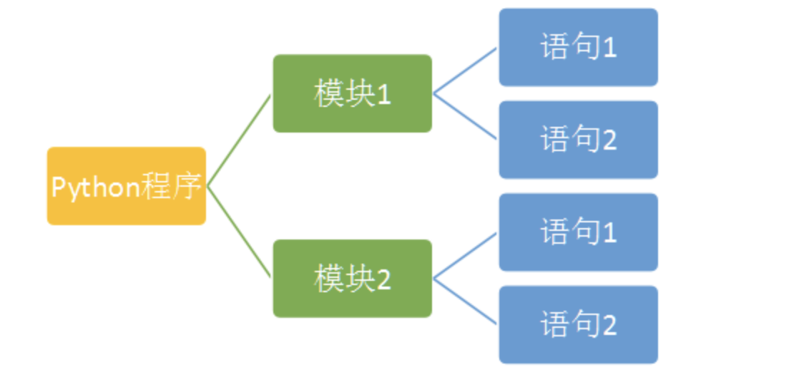
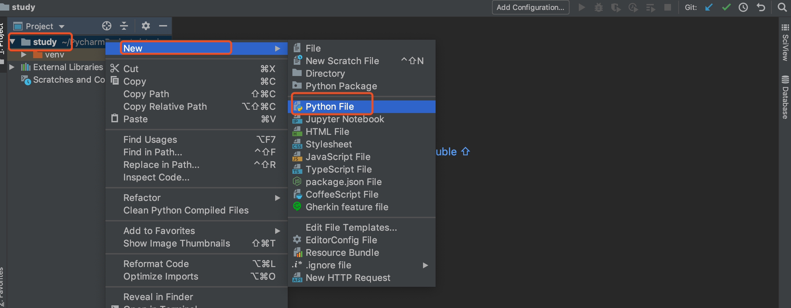

# 01-python程序的构成




- Python程序由模块组成。一个模块对应Python源文件，一般是一个py文件。后缀名是：.py
- 模块由语句组成。运行Python程序时，按照模块中语句的顺序依次执行
- 语句是Python程序的构造单元，用于创建对象、变量赋值、调用函数、控制语句等


## Python文件的创建和执行

在IDLE环境中，我们可以通过File-->new创建Python文件，并可以编辑该文件内容。我们也可以通过File-->save/save as保存文件。一般保存成扩展名为py的文件。需要执行编辑好的文件，可以用快捷键F5或者点击Run-->Run module。


也可以用记事本，编写对应的语句，后缀名保存为：.py即可，然后用python命令执行对应的py文件即可

也可以用pycharm 去创建，然后在工具run即可




## 代码的组织和缩进

python语言通过缩进来组织代码块，“缩进”成为了Python语法强制的规定。
缩进时，几个空格都是允许的，但是数目必须统一。我们通常采用“四个空格”表示一个缩进。
同时，也要避免将“tab制表符”或者tab与空格混合的缩进风格。目前，常用的编辑器一般设置成：tab制表符就是4个空格。


Python官方推荐的PEP-8代码风格详细说明，可以参考：https://www.python.org/dev/peps/pep-0008/


## 使用注释

注释是程序中会被Python解释器忽略的一段文本。程序员可以通过注释记录任意想写的内容，通常是关于代码的说明。

**单行注释**
 
 - 使用#代表单行注释

**多行注释**

- 使用''' ''' 或者 """ """ （三个单引号或三个双引号）来表示多行注释


```
# 这是单行注释
'''
这是多行注释
内容
xxx
'''
```


## 使用\行连接符

一行程序长度是没有限制的，但是为了可读性更强，通常将一行比较长的程序分为多行。这是，我们可以使用\行连接符，把它放在行结束的地方。Python解释器仍然将它们解释为同一行。


示例：

```
>>> b = 'abcdefg\
　　hijklmn\
　　bvkxnnk'
```

输出：
```
>>> b
'abcdefghijklmnbvkxnnk'
```