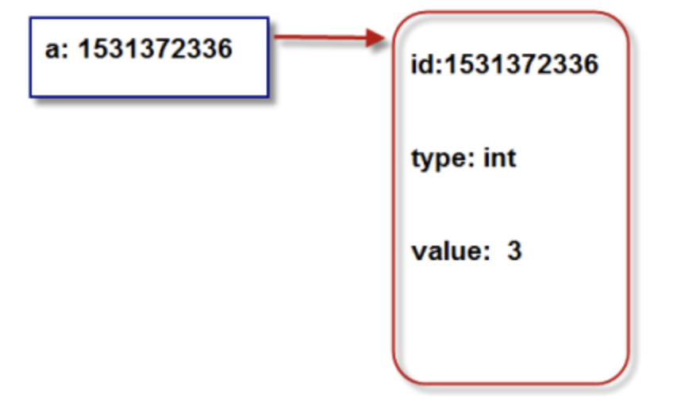

# 02-对象


**Python中，一切皆对象**。每个对象由标识(identity)、类型(type)、值(value)组成。


- 标识用于唯一标识对象，通常对应于对象在计算机中内存的地址。使用Python内置函数id(obj)可返回对象obj的标识。
- 类型用于表示对象存储的“数据”类型。类型可以限制对象的取值范围以及可执行的操作。可以用Python内置函数type(obj)获得对象的类型。
- 值表示对象所存储的数据的信息。可使用Python内置函数print(obj)直接打印出值。


**对象的本质就是：一个内存块，拥有特定的值，支持特定类型的相关操作**


源码：

```
>>> a=10
>>> a
10
>>> id(a)
4305020064
>>> id(10)
4305020064
>>> type(10)
<class 'int'>
>>> type(a)
<class 'int'>
>>> print(a)
10
>>> print(10)
10
>>> b='字符测试'
>>> id(b)
4348778128
>>> type(b)
<class 'str'>
>>> print(b)
字符测试
```

a=10 ，实际上是把a变量指向内存的地址4305020064，而这个地址代表的对象的指是10。


**示意图**

