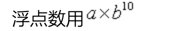

# 08-浮点数


浮点数，称为float。




形式都科学计数法表示，比如：3.14，表示成：312E-2或者314e-2。

这些数字在内存中也是按照科学计数法存储。

```
>>> 314e-2
3.14
```


## 类型转换和四舍五入


- 类似于int()，我们也可以用float()将其他类型转化成浮点数。
- 整数和浮点数混合运算时，表达式结果自动转型成浮点数。比如：2+8.0的结果是10.0。
- round(value)可以返回四舍五入的值
  - 注意：但不会改变原有值，而是产生新的值


## 增强赋值运算符


运算符+、-、*，/、//、**和%和赋值符=结合可以构成“增强型赋值运算符”。

a = a + 1         等价于： a +=1

| 运算符                      | 例子       | 等价       |
| :-------------------------- | :-------- | :--------- |
| +=                          | a += 2    | a = a + 2  |
| -=                          | a -= 2    | a = a -2   |
| *=    | a *= 2             | a = a * 2 |            |
| //=                         | a //= 2   | a = a // 2 |
| **=           |    a **= 2 | a = a**2  |            |
| %=                          | a %= 2    | a = a % 2  |


**注意：“+=、-=”等等中间不能加空格!**