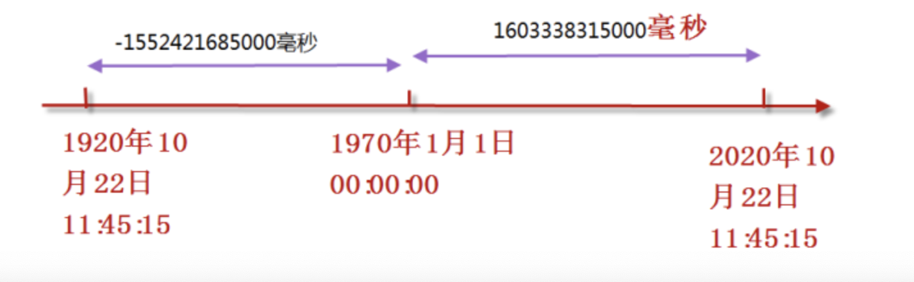

# 09-时间表示


计算机中的时间表示是从“1970年1月1日 00:00:00”开始，以毫秒（1/1000）秒进行计算。我们也把1970年这个时刻成为“unix时间点”。

这样一来，我们就把时间全部用数字来表示了。




python中可以通过time.time()获得当前时刻，返回的值是以秒为单位，带微秒（1/1000毫秒）精度的浮点值。 例如：1603530762.001568


```
>>> import time
>>> 
>>> a = time.time()
>>> a
1603530762.001568
>>> 
>>> 
>>> int(a)
1603530762
>>> totalminutes = int(a) / 60
>>> totalminutes
26725512.7
>>> totalhours = totalminutes / 60
>>> totalhours
445425.21166666667
>>> totalday = totalhours / 24
>>> totalday
18559.383819444443
>>> totalyear = totalday / 365
>>> totalyear
50.847626902587514
```

1970 + 50 = 2020年，也是当前所在的年份！