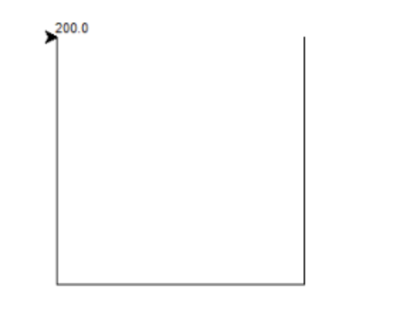

# 10-小练习


## 定义多点坐标_绘出折线_并计算起始点和终点距离


```
import math
import turtle

# 定义多点坐标_绘出折线_并计算起始点和终点距离

# 定义坐标

x1, y1 = 100, 100
x2, y2 = 100, -100
x3, y3 = -100, -100
x4, y4 = -100, 100

# 绘制折线
turtle.penup()
turtle.goto(x1, y1)
turtle.pendown()
turtle.goto(x2, y2)
turtle.goto(x3, y3)
turtle.goto(x4, y4)

# 计算起始点和终点的距离

distance = math.sqrt((x1 - x4) ** 2 + (y1 - y4) ** 2)
turtle.write(distance)

```


运行结果：

