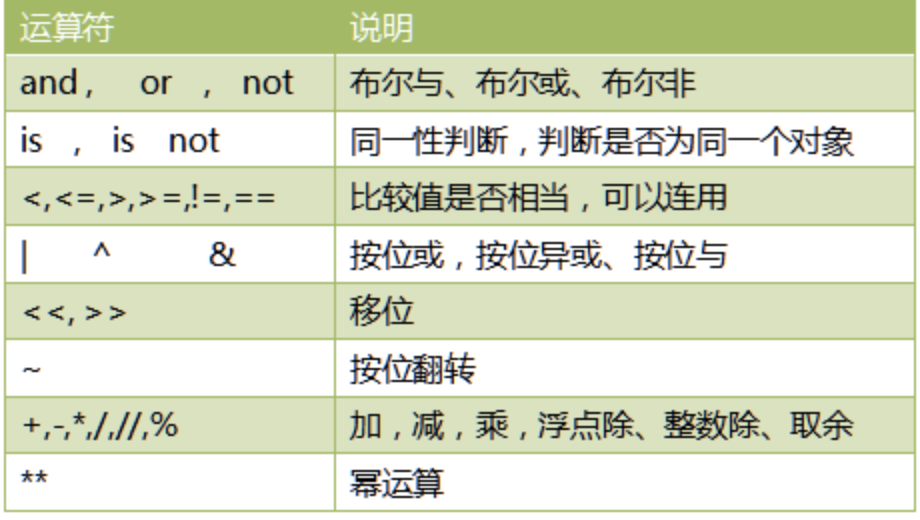
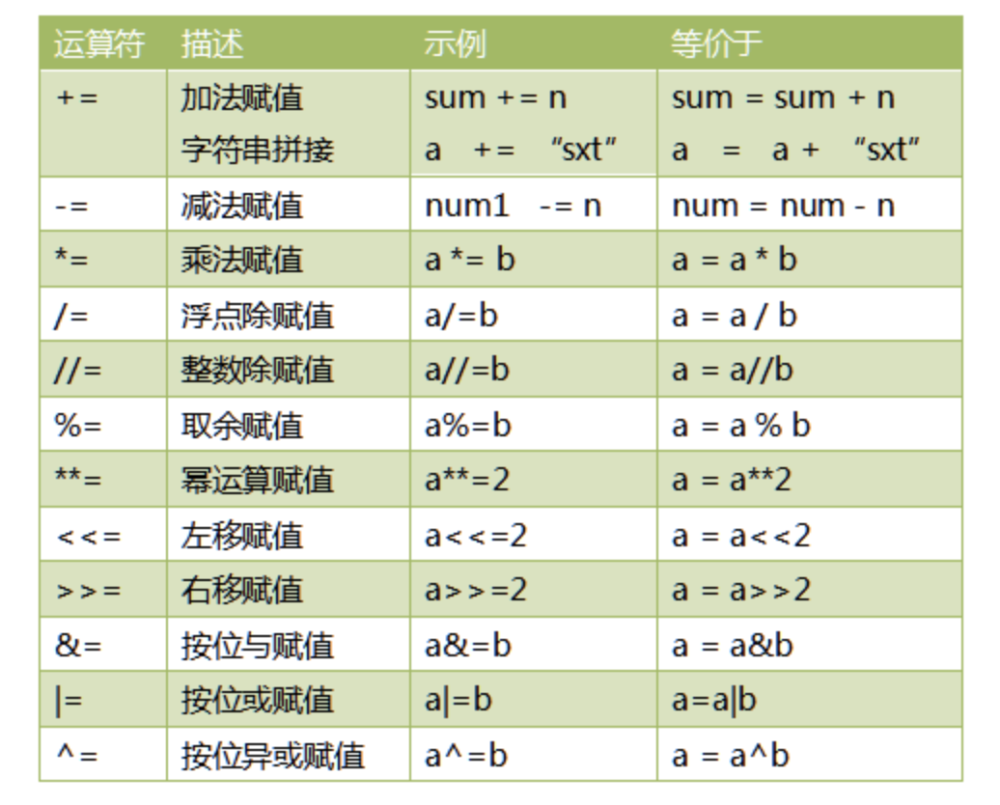
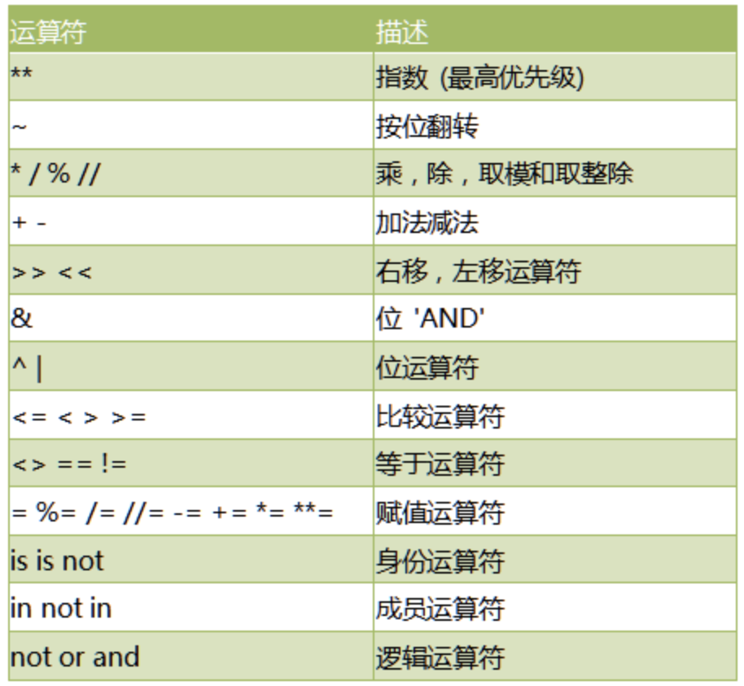

# 13-运算符总结





- 比较运算符可以连用，并且含义和我们日常使用完全一致

```
>>> a = 4
>>> 3<a<10
```

**位操作**

```
>>> a = 0b11001
>>> b = 0b01000
>>> c = a|b
>>> bin(c)   #bin()可以将数字转成二进制表示
'0b11001'
>>> bin(c&b)
'0b1000'
>>> bin(c^b)
'0b10001'
>>> 
>>> a = 2
>>> a<<2   # 左移1位相当于乘以2，左移2位，相当于乘以4
8
>>> a = 16
>>> a>>2    # 右移1位相当于除以2，右以2位相当于除以4
4

```


## 复合赋值运算符





**注意：与C和JAVA不一样，Python不支持自增（++）和（--）**


## 运算符优先级问题

如下优先级，从高到低




实际使用中，记住如下简单当规则即可，复杂的表达式一定要使用小括号组织。

- 乘法优先加减
- 位运算和算术运算 > 比较运算符 > 赋值运算符 > 逻辑运算符

