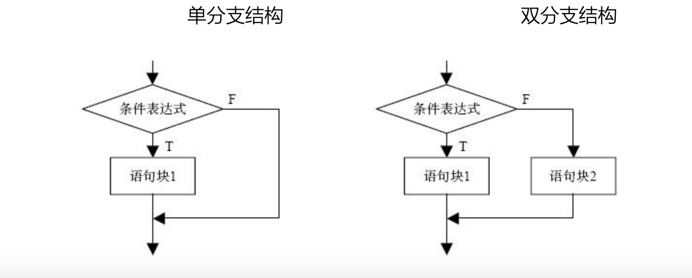
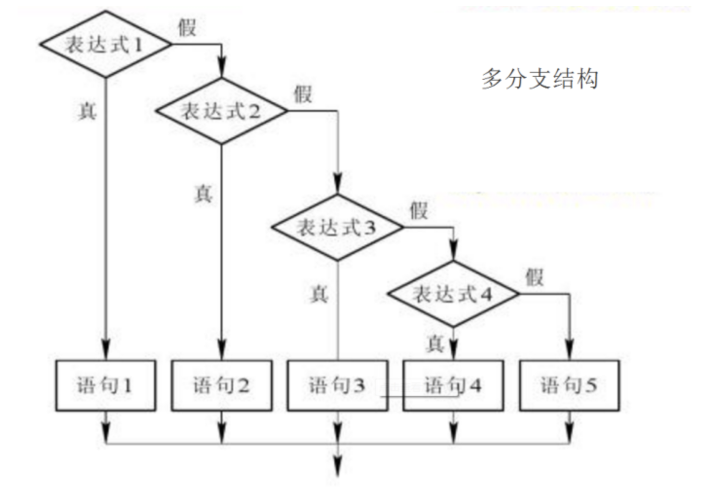

# 01-单分支结构


## 选择结构


选择结构通过判断条件是否成立，来决定执行哪个分支。选择结构有多种形式，分为：单分支、双分支、多分枝。流程图如下：






### 单分支选择结构

if语句单分支结构的语法形式如下：

if 条件表达式：
    语句/语句块

**其中**

- 条件表达式：可以是逻辑表达式、关系表达式、算术表达式等等。
- 语句/语句块：可以是一条语句，也可以是多条语句。多条语句，缩进必须对齐一致。


案例：
```
# 输入一个数字，小于10，则打印这个数字
num = input("请输入一个数字：")

if int(num) < 10:
    print(num)
```


### 条件表达式详解

在选择和循环结构中，条件表达式的值为Fasle的情况如下：

False、0、0.0、空值None、空序列对象(空列表、空元组、空集合、空字典、空字符串)、空range对象、空迭代对象。

其它情况，均为True。 这么看来，Python所有的合法表达式都可以看做条件表达式，甚至包括函数调用的表达式。


案例：测试各种条件表达式
```
if 3:  # 整数作为条件表达式
    print('ok')
a = [] # 列表作为条件表达式，由于是空列表，是False
if a:
    print("空列表", False)
s = 'False'  # 非空字符串，是True
if s:
    print("非空字符串，是True")
c = 9
if 3 < c < 20:
    print("3<c<20")
if 3 < c and c < 20:
    print("3<c and c<20")
if True:  # 布尔值
    print("True")
```

执行结果如下：
```
ok
非空字符串，是True
3<c<20
3<c and c<20
True
```

### 条件表达式，不能有赋值操作符=

在python中，条件表达式不能出现赋值操作符=，避免了其它语言中经常误将关系运算符==写作赋值运算符=带来的困扰。如下代码将会报语法错误：

```
if a = True:
    print("赋值符不能出现在条件表达式中")
```

