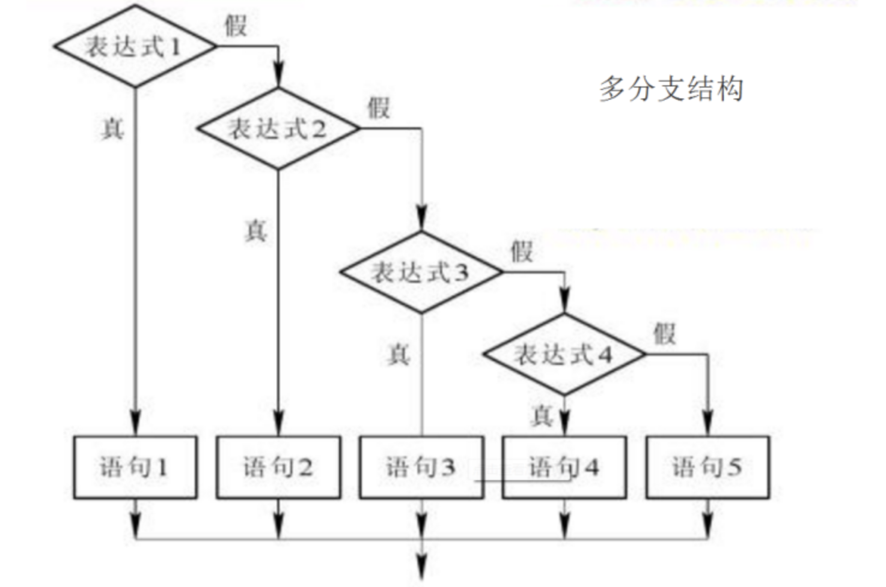

# 03-多分支选择结构


语法如下：

if 条件表达式1:
    语句1/语句块1
elif 条件表达式2:
    语句2/语句块2
.
.
.
elif 条件表达式n:
    语句n/语句块n
[else:
    语句n+1/语句块n+1]

**注：计算机行业，描述语法格式时，使用中括号[]通常表示可选，非必选**




多分支结构，几个分支之间有逻辑关系的，不能随意颠倒顺序。


案例：输入一个学生的成绩，将其转化成简单描述：不及格(小于60)、及格(60-79)、良好(80-89)、优秀(90-100)。

```
# 方法一：使用完整的条件表达
score = int(input("请输入你的成绩："))
grade = ''
if score < 60:
    grade = '不及格'
if 60 <= score < 80:
    grade = '及格'
if 80 <= score < 90:
    grade = '良好'
if 90 <= score <= 100:
    grade = '优秀'

print("你的分数是{0},等级是{1}".format(score, grade))

# 方法二：使用多分支条件结构
score = int(input("请输入你的成绩："))
grade = ''

if score<60 :
    grade = '不及格'
elif score < 80:
    grade = '及格'
elif score < 90:
    grade = '良好'
else:
    grade = '优秀'
print("你的分数是{0},等级是{1}".format(score, grade))
```

多分支结构，几个分支之间是有逻辑关系的，不能随意颠倒顺序。


案例：已知点的坐标(x,y)，判断其所在的象限

```
x = int(input("请输入x坐标："))
y = int(input("请输入y坐标："))

if x == 0 and y == 0:
    print("坐标原点")
elif x == 0:
    print("坐标y轴")
elif y == 0:
    print("坐标x轴")
elif x > 0 and y > 0:
    print("第一象限")
elif x > 0 and y < 0:
    print("第二象限")
elif x < 0 and y < 0:
    print("第三象限")
else:
    print("第四象限")

```
