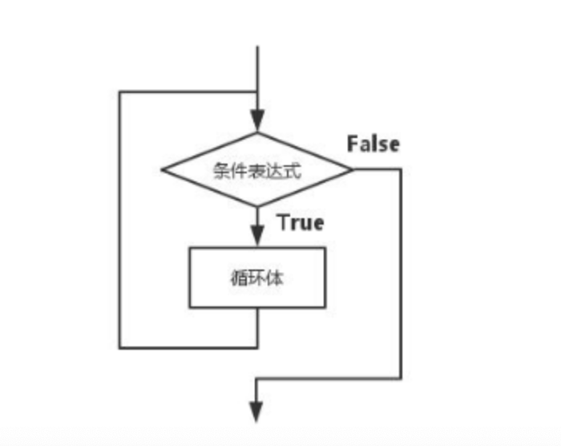

# 05-循环结构

循环用来重复执行一条或多条语句。表达这样的逻辑：如果符合条件，则反复执行循环体里的语句。在每次执行完后都会判断一次条件是否为True，如果为True则重复执行循环体里的语句。图示如下：




循环体里面的语句至少应该包含改变条件表达式的语句，以使循环趋于结束；否则就会变成一个死循环。


## while循环

while循环的语法格式如下：

while 条件表达式：
    循环体语句

我们通过一些简单的练习，来慢慢熟悉while循环。


案例：
```
# 使用while循环打印0-10的数字。
num = 0
while num < 11:
    print(num)
    num += 1

# 利用while循环，计算1-100之间数字的累加和;计算1-100之间偶数的累加和，计算1-100之间奇数的累加和。
num = 0
sum_num = 0
sum_odd = 0
sum_even = 0
while num<= 100:
    sum_num += num
    if num % 2 == 0:
        sum_even += num
    if num % 2 == 1:
        sum_odd += num
    num += 1
print("1-100之间数字的累加和是{0},奇数和是{1},偶数和是{2}".format(sum_num,sum_odd,sum_even))
```


## for循环

for循环通常用于可迭代对象的遍历。for循环的语法格式如下：

for 变量 in 可迭代对象：
    循环体语句


案例：
```
# 循环遍历元组和列表
for i in (20,30,40):
    print(i * 10)

for i in [10,30,50]:
    print(i)
```

### 可迭代对象

Python包含以下几种可迭代对象：

- 序列。包含：字符串、列表、元组
- 字典
- 迭代器对象（iterator）
- 生成器函数（generator）
- 文件对象

我们已经在前面学习了序列、字典等知识，迭代器对象和生成器函数将在后面进行详解。接下来，我们通过循环来遍历这几种类型的数据：

```
# 遍历字符串
for x in 'abcdef':
    print(x)

# 遍历字典
d = {'name': 'zhangsan', 'age': 20, 'adderess': '成都'}
for i in d:  # 遍历字典所有的key
    print(i)
for i in d.keys():  # 遍历字典所有的key
    print(i)
for i in d.values():  # 遍历字典所有的值
    print(i)
for i in d.items():  # 遍历字典所有的键值对
    print(i)
```


### range对象

range对象是一个迭代器对象，用来产生指定范围对数字序列。格式为：

range(start,end[,step])

生成对数值序列从start开始到end结束（不包含end）。若没有填写start，则默认从0开始。step是可选的步长，默认为1.如下是几种典型示例：

```
for i in range(10)        # 产生序列：0，1，2，3，4，5，6，7，8，9
for i in range(3,10)      # 产生序列：3，4，5，6，7，8，9
for i in range(3,10,2)     # 产生序列：3，5，7，9
```


案例：
```
# 利用for循环，计算1-100之间数字的累加和;计算1-100之间偶数的累加和，计算1-100之间奇数的累加和。
sum_num = 0
sum_odd = 0
sum_even = 0
num = 0

for i in range(101):
    sum_num += num
    if num % 2 == 0:
        sum_even += num
    if num % 2 == 1:
        sum_odd += num
    num += 1
print("1-100之间的数字累加和是{0},奇数和是{1},偶数和是{2}".format(sum_num, sum_odd, sum_even))
```

运行结果：
```
1-100之间的数字累加和是5050,奇数和是2500,偶数和是2550
```