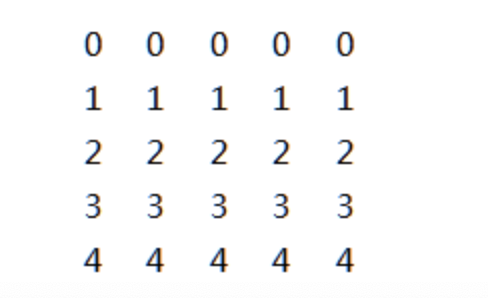
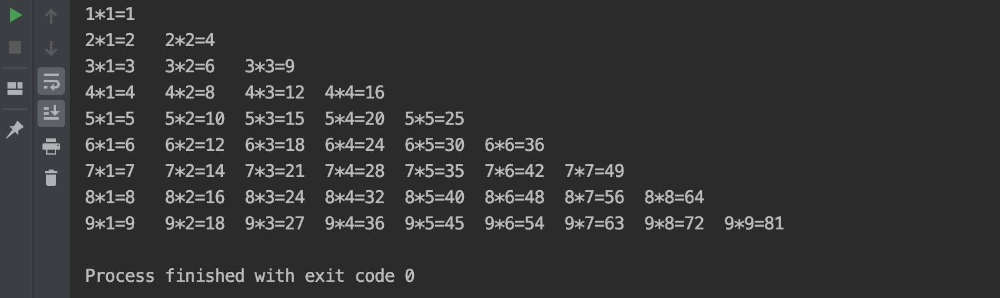
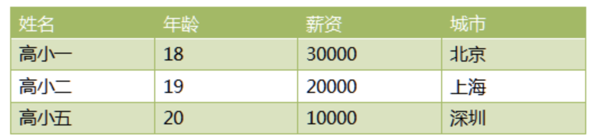

# 06-嵌套循环

一个循环体内可以嵌入另一个循环，一般称为嵌套循环，或者多重循环。


练习：打印如下图案




```
for x in range(5):
    for y in range(5):
        print(i, end='\t')
    print() # 用于换行
```


打印99乘法表：
```
for m in range(1, 10):
    for n in range(1, m + 1):
        print("{0}*{1}={2}".format(m, n, (m * n)), end='\t')
    print()

```

执行结果：



案例：用列表和字典存储下表信息，并打印出表中工资高于15000的数据


```
r1 = {"name": '高小一', 'age': 18, 'salary': 30000, 'city': "北京"}
r2 = {"name": '高小二', 'age': 19, 'salary': 20000, 'city': "上海"}
r3 = {"name": '高小五', 'age': 20, 'salary': 10000, 'city': "深圳"}
tb = [r1, r2, r3]
for i in tb:
    if i.get('salary') > 15000:
        print(i)
```
