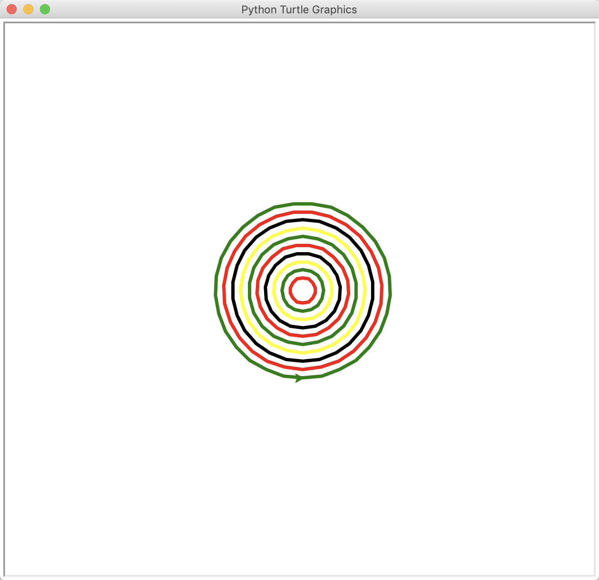
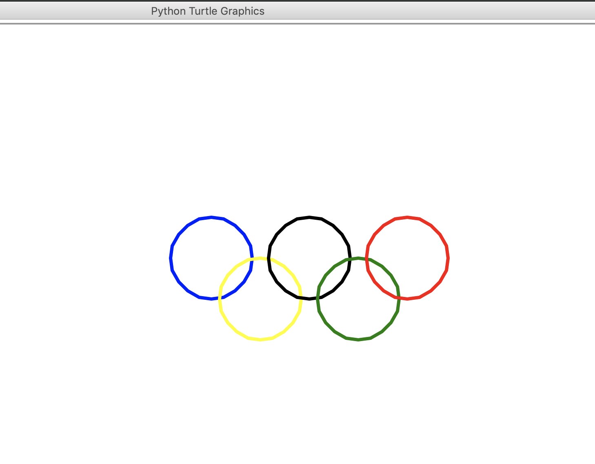
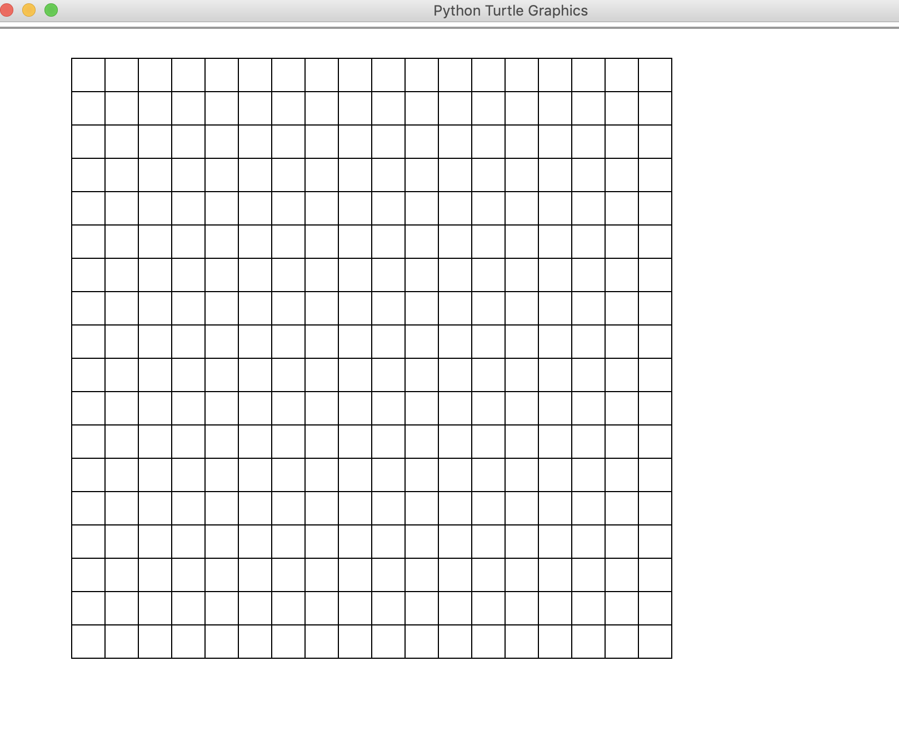

# 11-综合练习


**使用海龟图库，画同心圆**

```
import turtle

t = turtle.Pen()
my_colors = ("red", "green", "yellow", "black")
t.width(4)  # 线条粗细
t.speed(1)  # 画的速度

for i in range(10):
    t.penup()
    t.goto(0, -i * 10)
    t.pendown()
    t.color(my_colors[i % len(my_colors)])
    t.circle(15 + i * 10)
turtle.done()  # 程序执行完成，窗口仍然在
```

结果如下：



**画奥运五环**
```
import turtle
radius = 50
t = turtle.Pen()
t.width(4)
t.speed(6)
t.hideturtle()  # 隐藏画笔形状
color = ("blue", "yellow", "black", "green", "red")
for i in range(5):
    t.penup()
    t.goto(i * (radius + 10), (0 if i % 2 == 0 else -radius))
    t.down()
    t.color(color[i])
    t.circle(radius)
turtle.done()
```

结果如下：



画18*18棋盘

```
# 画18*18棋盘

import turtle

width = 30
num = 18
x1 = [(-400, 400), (-400 + width * num, 400)]
y1 = [(-400, 400), (-400, 400 - width * num)]

t = turtle.Pen()
t.speed(0)
for i in range(19):
    t.penup()
    t.goto(x1[0][0], x1[0][1] - 30 * i)
    t.pendown()
    t.goto(x1[1][0], x1[1][1] - 30 * i)

for i in range(19):
    t.penup()
    t.goto(y1[0][0]+30*i, y1[0][1])
    t.pendown()
    t.goto(y1[1][0]+30*i, y1[1][1])
t.hideturtle()
turtle.done()

```

结果如下：

