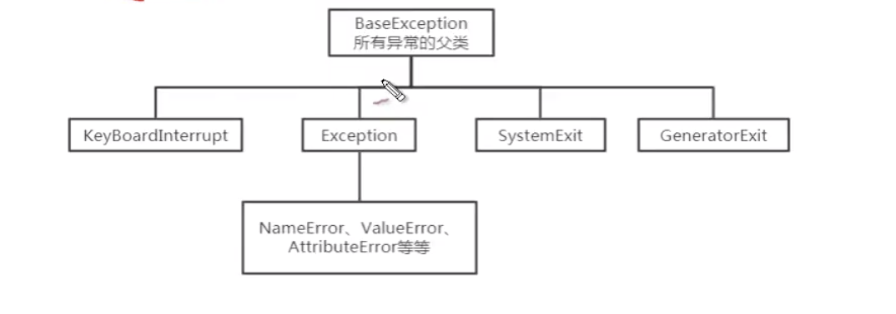

# 01-异常知识了解


## 导引问题

在实际工作中，我们遇到的情况不可能是非常完美的。比如：你写的某个模块，用户输入不一定符合你的要求，你的程序要打开某个文件，这个文件可能不存在或者文件格式不对，你要读取数据库的数据，数据可能是空的；我们程序再运行着，但是内存或硬盘满了，等等。

软件程序在运行过程中，非常可能遇到刚刚提到的这些问题，我们称之为异常。英文是：Exception，意思是例外。遇到这些情况，或者叫异常，我们怎么让写的程序做出合理的处理，而不至于程序崩溃呢？这就需要学习本章知识点异常的处理。


## 异常机制本质

异常指程序运行过程中出现的非正常现象，例如用户输入错误、除数为0，需要处理的文件不存在，数组下标越界等。

所谓异常处理，就是指程序出现问题时依然可以正确的执行剩余的程序，而不会因为异常而终止程序运行。


python中，引进了很多用来描述和处理异常的类，称为异常类。异常类定义中包含了该类异常的信息和对异常进行处理对方法。下面的图例较为完整的展示了python中内建异常类的继承层次：




案例：

```
a = 3 / 0  # 0不能被作为除数
```

执行结果如下：
```
Traceback (most recent call last):
  File "/Users/user/PycharmProjects/study/my_exception/my01.py", line 1, in <module>
    a = 3 / 0
ZeroDivisionError: division by zero

```


Python中一切都是对象，异常也采用对象的方式来处理。处理过程：

- 1、抛出异常：在执行一个方法时，如果发生异常，则这个方法生成代表该异常的一个对象，停止当前执行路径，并把对象提交给解释器。
- 2、捕获异常：解释器得到该异常后，寻找相应的代码来处理该异常。


## 解决异常问题的态度


学习完异常的相关知识点，只是开始对异常有些认识，不意外着你会调试任何异常；调试异常需要大量的经验作为基础。因此，我们不要在此停留，继续往后学习，碰到每个异常，都要花心思去解决而不要动不动就张口问人。

解决每一个遇到的异常，建议大家遵循如下三点：

- 1、不慌张，细看信息，定位错误。看清楚报的错误信息，并定位发生错误的地方。
- 2、百度或谷歌查看十个相关帖子。将异常类信息进行百度
- 3、以上两点仍无法解决，寻找同事或者老师协助解决

正常情况，自己遵循如上步骤解决30个以上的错误，就能积累初步的调试经验，以后遇到的大部分错误都能独立完成。


## 异常解决的关键


异常解决关键：定位

当发生异常时，解释器会报相关的错误信息，并会在控制台打印出相关错误信息。我们只需按照从上到下的顺序即可追溯（Traceback）错误发生的过程。


案例：追溯异常发生的过程

```
def a():
    print("run in a() start !")
    num = 10 /0


def b():
    print("run in b() start !")
    a()


def c():
    print("run in c() start !")
    b()


c()
```

执行结果如下：

```
Traceback (most recent call last):
  File "/Users/user/PycharmProjects/study/my_exception/my01.py", line 16, in <module>
    c()
  File "/Users/user/PycharmProjects/study/my_exception/my01.py", line 13, in c
    b()
  File "/Users/user/PycharmProjects/study/my_exception/my01.py", line 8, in b
run in c() start !
    a()
  File "/Users/user/PycharmProjects/study/my_exception/my01.py", line 3, in a
run in b() start !
run in a() start !
    num = 10 /0
ZeroDivisionError: division by zero
```

可以发现，解释器报错信息是从上至下，最终打出异常问题的信息。平时代码较多时，调用链路就复杂时可以一层层往下追溯问题，一般最下面打印的日志信息就是问题根源所在。