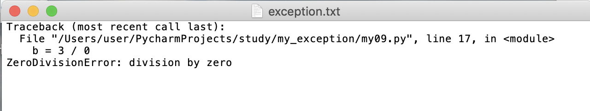

# 05-traceback模块


traceback用来打印异常信息

案例：测试trcaeback 模块的使用

```
# 测试traceback 模块的使用

import traceback

try:
    print("step1")
    b = 3 / 0

except:
    traceback.print_exc()

```

执行结果如下：
step1
Traceback (most recent call last):
  File "/Users/user/PycharmProjects/study/my_exception/my09.py", line 7, in <module>
    b = 3 / 0
ZeroDivisionError: division by zero


traceback也可以将异常日志打印至文件中。

案例如下：

```
import traceback
try:
    print("step1")
    b = 3 / 0

except:
    with open("/Users/user/desktop/exception.txt", 'a') as f:
        traceback.print_exc(file=f)
```

执行结果文件写入结果如下：

