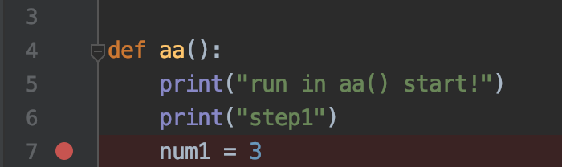
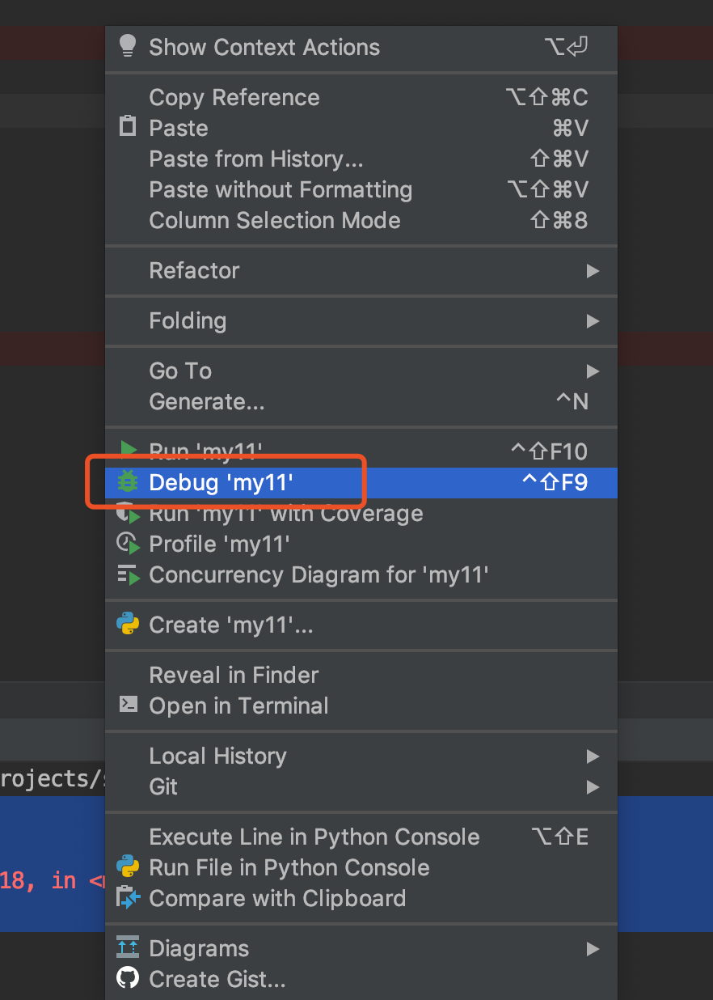
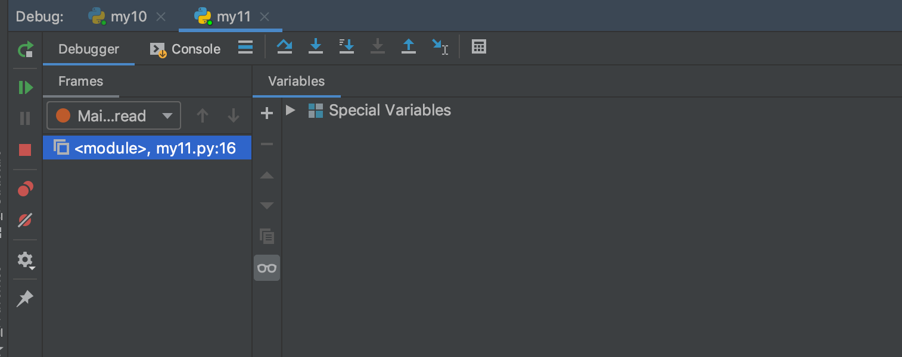
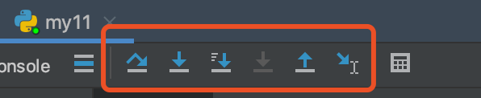
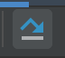
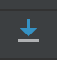
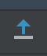
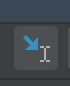
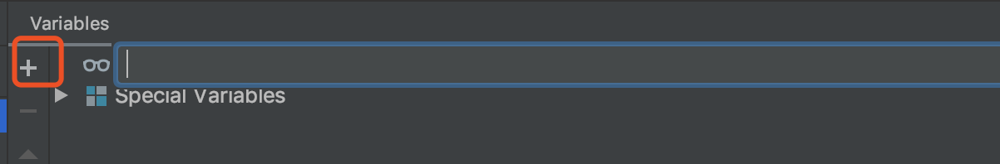
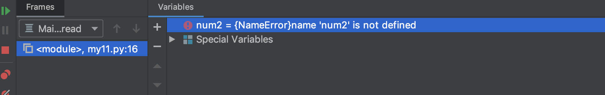

# 07-pycharm开发环境的调试

进行调试的核心是设置断点。程序执行到断点时，暂时挂起，停止执行。就像看视频按下停止一样，我们可以详细的观看停止处的每一个细节。

## 断点

程序运行到此处，暂时挂起，停止执行。我们可以详细在此时观察程序的运行情况，方便做出进一步的判断。

- 设置断点：
  - 在行号后面单击即可增加断点
  
  - 在断点上再单击即可取消断点

进入调试视图：

单击右键，点击debug对应的文件就可以进入调试模式：

进入调试后对应窗口视图：

调试区按钮如下：

**按键说明如下：**

| 中文名称             | 英文名称       | 图标                                              | 说明                                                                   |
| :------------------ | :------------ | :----------------------------------------------- | :--------------------------------------------------------------------- |
| 单步调试：遇到函数跳过 | step over     |     | 若当前执行的是一个函数，则会把这个函数当做整体一步执行完。不会进入这个函数内部    |
| 单步调试：遇到函数进入 | step into     |  | 若当前执行的是一个函数，则会进入函数内部                                     |
| 跳出函数             | step out      |   | 当单步执行到子函数内时，用step out就可以执行完子函数余下部分，并返回到上一层函数 |
| 执行的光标处          | run to custor |  | 一直执行到光标处停止，用在循环内部时，点击一次就执行一个循环                   |

可以在调试区添加想要查看的变量：

添加完成之后如下：

然后可以进行调试，查看变量的值的变化。