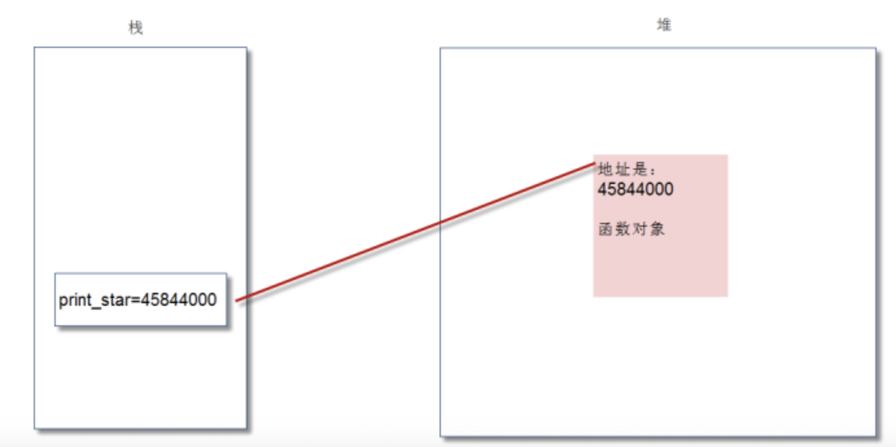
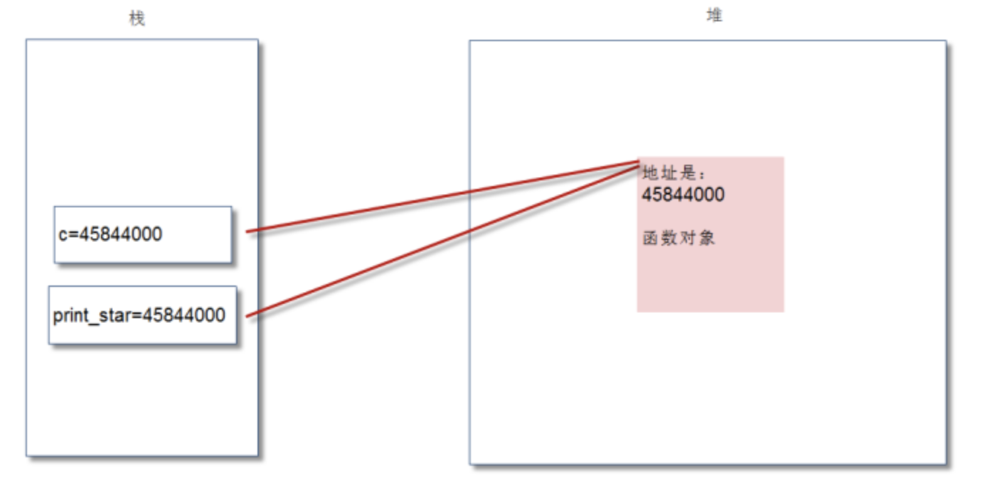

# 04-函数也是对象，底层内存分析


Python中，“一切都是对象”。实际上，执行def定义函数后，系统就创建了相应的函数对象。我们执行如下程序，然后进行解释：

```
def print_star(n):
    print("*" * n)


print(print_star)
print(id(print_star))

c = print_star
c(3)
```


执行结果如下：

```
<function print_star at 0x103306c20>
45844000
***
```

上面代码执行def时，系统中会创建函数对象，并通过print_star这个变量进行引用：


我们执行c = print_start后，显然将print_start变量的赋值给了变量c，内存图变成了：



显然，我们可以看出变量c和print_star都是指向了同一个函数。因此，执行c(3)和执行print_start(3)的效果完全是一致的。Python中，圆括号意味着调用函数。在没有圆括号的情况下，Python会把函数当作普通对象。


**与此核心原理类似，我们也可以做如下操作：**

zhengshu = int
zhegnshu("234")
显然，我们将内置函数对象int()赋值给了变量zhengshu，这样zhengshu和int都是指向了同一个内置函数。当然，此处仅限雨原理性讲解，实际开发中没必要这么做。

