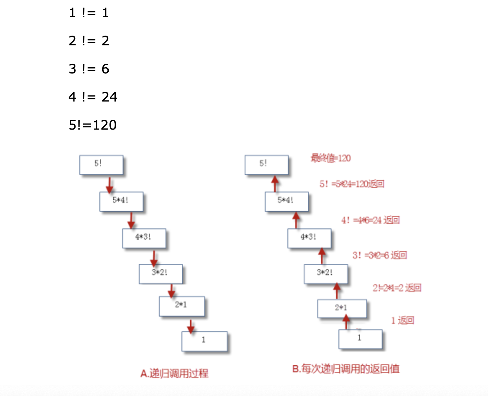

# 11-递归函数


递归函数指的是：自己调用自己的函数，在函数体内部直接或间接的自己调用自己。递归类似于大家中学学习过的数学归纳法。每个递归函数必须包含两个部分：

- 终止条件：
  - 表示递归什么时候结束。一般用于返回值，不再调用自己。
- 递归步骤：
  - 把第n步的值和n-1步相关联。


递归函数由于会创建大量函数对象、过量的消耗内存和运算能力。在处理大量数据时，谨慎使用。


案例：使用递归函数计算阶乘

```
def factorial(n):
    if n == 1:
        return 1
    else:
        return n * factorial(n - 1)


print(factorial(5))

执行结果如下：
120
```

