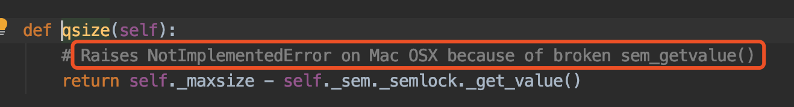

# 03-进程池


## 进程池的使用


   在利用python进行系统管理的时候，特别是同时操作多个文件目录，或者远程控制多台主机，并行操作可以节约大量的时间。当被操作对象数目不大时，可以直接利用multiprocess中的Process动态生成多个进程，十几个还好，如果是上百个，上千个目标，手动的去限制进程数量却又太过繁琐，此时可以发挥进程池的功效。

   Pool可以提供指定数量的进程，供用户调用，当有新的请求提交到pool中时，如果池还没有满，那么就会创建一个新的进程用来执行该请求；但如果池中但进程数已经达到规定最大值，那么该请求就会等待，直到池中有进程结束，才会创建新的进程。

pool的语法格式如下：
```
Pool([numprocess[,initializer[,initargs]]])
```

其中numprocess是要创建的进程数。如果省略此参数，将使用cpu_count()的值。Initializer是每个工作进程启动时要执行的可调用对象。Initargs是要传递给initializer的参数元组。Initializer默认为None。


Pool实例方法表：

| 方法                                              | 描述                                                                             |
| :----------------------------------------------- | :------------------------------------------------------------------------------- |
| apply(func[,args[,kwargs]])                     | 在一个池工作进程中执行函数（*args,**kwargs），然后返回结果                             |
| apply_async(func[,args[],kwargs[,callback]]])   | 在一个工作池中异步的执行函数，然后返回结果。                                           |
| close()                                          | 关闭进程池，防止进行进一步操作。如果还有挂起的操作，他们将在工作进程终止前完成              |
| join()                                           | 等待所有工作进程退出，此方法只能在close()或者terminate()方法之后调用                    |
| imap(func,iterable,[,chunksize])                | map()函数的版本之一，返回迭代器而非结果列表                                           |
| imap_unordered(func,iterable[,chunksize])       | 同imap函数一样，只是结果的顺序根据从工作进程接收到的时间任意确定                         |
| map(func,iterable,[,chunksize])                 | 将可调用对象func应用给iterable中的所有项，然后以列表的形式返回结果                      |
| map_async(func,iterable[,chunksize[,callback]]) | 同map函数，但结果的返回是异步的。                                                    |
| terminate()                                      | 立即终止所有工作进程，同时不执行任何清理或结束任何挂起工作，如果p被垃圾回收，将自动调用此函数 |
| wait([timeout])                                  | 等待结果变为可用，timeout是可选的超时                                                |


案例：测试进程池非阻塞状态的使用

```
# 测试进程池非阻塞状态的使用

from multiprocessing import Pool
from time import sleep


# 定义进程执行的任务函数
def func(msg):
    print('start:', msg)
    sleep(3)
    print('end:', msg)


if __name__ == '__main__':
    # 创建初始化3的进程池
    pool = Pool(3)
    # 添加任务
    for i in range(1, 6):
        msg = '任务{}'.format(i)
        pool.apply_async(func, (msg,))

    # 如果进程池不再接受新的请求，调用close
    pool.close()
    pool.join()

```
运行结果如下：

start: 任务1
start: 任务2
start: 任务3
end:end: 任务1 
任务2
end: 任务3
start: 任务4
start: 任务5
end:end: 任务4 
任务5

可以发现，如果进程的数量和进程池中数量一致时，那么只要等待进程结束，才会创建新的进程。


案例：测试进程池阻塞状态的使用
```
# 测试进程池阻塞状态的使用

from multiprocessing import Pool
from time import sleep


# 定义进程执行的任务函数
def func(msg):
    print('start:', msg)
    sleep(1)
    print('end:', msg)


if __name__ == '__main__':
    # 创建初始化3的进程池
    pool = Pool(3)
    # 添加任务
    for i in range(1, 6):
        msg = '任务{}'.format(i)
        pool.apply(func, (msg,))

    # 如果进程池不再接受新的请求，调用close
    pool.close()
    pool.join()

```

运行结果如下：

start: 任务2
end: 任务2
start: 任务3
end: 任务3
start: 任务4
end: 任务4
start: 任务5
end: 任务5

从结果中可以看出，进程是单个执行完成之后才会启动新的进程。其实就是一个单进程，这种方式很少使用。


## 多个进程之间数据不共享


在多进程之间，数据是不共享的，我们来进行以下测试

案例：测试多进程之间数据是否共享

```
# 测试多个进程之间数据是否共享

from multiprocessing import Process
from time import sleep

num = 10


def work1():
    global num
    num += 5
    print('子进程1运行后：num的值', num)


def work2():
    global num
    num += 10
    print('子进程2运行后：num的值', num)


if __name__ == '__main__':
    print('主进程开始运行')
    # 创建子进程
    p1 = Process(target=work1)
    p2 = Process(target=work2)
    # 启动子进程
    p1.start()
    p2.start()
    # 主进程等待子进程结束
    p1.join()
    p2.join()
    print('主进程结束')
    print("全局变量：num的值", num)
```

运行结果如下：

主进程开始运行
子进程1运行后：num的值 15
子进程2运行后：num的值 20
主进程结束
全局变量：num的值 10


可以从结果中发现，每个进程之间的数据是独立的。并不会共享全局变量。


## 队列方法的使用


   Queue是多进程安全的队列，可以使用Queue实现多进程之间的数据传递。put方法用以插入数据队列中，put方法还有两个可选参数：blocked和timeout。如果blocked为True（默认值），并且timeout为正值，该方法会阻塞timeout指定的时间,直到该队列有剩余的空间。如果超时，会抛出Queue.full异常。如果blocked为False，但该Queue已满，会立即抛出Queue.full异常。

   get方法可以从队列读取并且删除一个元素。同样，get有两个可选参数：blocked和timeout。如果blocked为True（默认值），并且timeout为正值，那么在等待时间内没有取到任何元素，会抛出Queue.Empty异常。如果blocked为False，有两种情况存在，如果Queue有一个值可用，则立即返回该值，否则，如果队列为空，则立即抛出Queue.Empty异常。


案例：测试队列的常用方法使用
```
# 测试队列的常见方法使用

from multiprocessing import Queue

# 创建一个队列
q = Queue(3)  # 可以指定队列的大小，如果不写默认的队列是无限
# 向队列中插入元素
q.put('消息1')
q.put('消息2')
q.put('消息3')
# put方法中可选参数,block=True,timeout=1,队列已经满了，等地1s，如果队列还是没有剩余的空间，则抛队列已满异常queue.Full

# 判断当前队列是否已满
print('判断当前队列是否已满：', q.full())

if not q.full():
    q.put('消息4', block=True, timeout=1)

# 读取并删除元素get
# print(q.get())
# print(q.get())
# print(q.get())
# if not q.empty():
#     print(q.get(block=True, timeout=1))

# 查看队列的大小
print('队列的大小：{}'.format(q.qsize()))
for i in range(q.qsize()):
    print(q.get())
```

执行结果如下：
```
判断当前队列是否已满： True
Traceback (most recent call last):
  File "/Users/user/PycharmProjects/study/并发编程/my12.py", line 27, in <module>
    print('队列的大小：{}'.format(q.qsize()))
  File "/Library/Frameworks/Python.framework/Versions/3.7/lib/python3.7/multiprocessing/queues.py", line 117, in qsize
    return self._maxsize - self._sem._semlock._get_value()
NotImplementedError
```

可以发现报错，结果一段百度之后发现是MacOS平台无法执行qsize这个函数。从代码中可以看出：



## 队列实现进程之间通信


案例：测试多进程之间数据通信

```
# 测试多进程之间的通信

from multiprocessing import Process, Queue
from time import sleep


# 定义写入的函数
def write(q):
    a = ['a', 'b', 'c', 'd']
    for i in a:
        print("开始写入的值：{}".format(i))
        q.put(i)
        sleep(1)


def reader(q):
    for i in range(q.qsize()):
        print('读取到的值：{}'.format(q.get()))
        sleep(1)


if __name__ == '__main__':
    # 创建队列
    q = Queue()
    # 创建进程
    pw = Process(target=write, args=(q,))
    pr = Process(target=reader, args=(q,))
    pw.start()
    pw.join()
    pr.start()
    pr.join()

```

运行结果如下：

开始写入的值：a
开始写入的值：b
开始写入的值：c
开始写入的值：d
读取到的值：a
读取到的值：b
读取到的值：c
读取到的值：d


如果使用Pool创建进程，就需要使用multiprocessing.Manager()中的Queue来完成进程之间的通信，而不是mulitiprocessing.Queue(),否则会抛出如下异常：
```
RuntimeError: Queue objects should only be shared between processes through inheritance
```


案例：测试进程池创建进程完成进程之间的通信
```
# 测试进程池创建进程之间的通信

from multiprocessing import Pool, Manager
from time import sleep


# 定义写入的函数
def write(q):
    a = ['a', 'b', 'c', 'd']
    for i in a:
        print("开始写入的值：{}".format(i))
        q.put(i)
        sleep(1)


def reader(q):
    for i in range(q.qsize()):
        print('读取到的值：{}'.format(q.get()))
        sleep(1)


if __name__ == '__main__':
    # 创建队列
    q = Manager().Queue()
    # 创建进程
    pool = Pool(3)
    pool.apply(write, (q,))
    pool.apply(reader, (q,))
    pool.close()
    pool.join()

```

运行结果如下：

开始写入的值：a
开始写入的值：b
开始写入的值：c
开始写入的值：d
读取到的值：a
读取到的值：b
读取到的值：c
读取到的值：d

