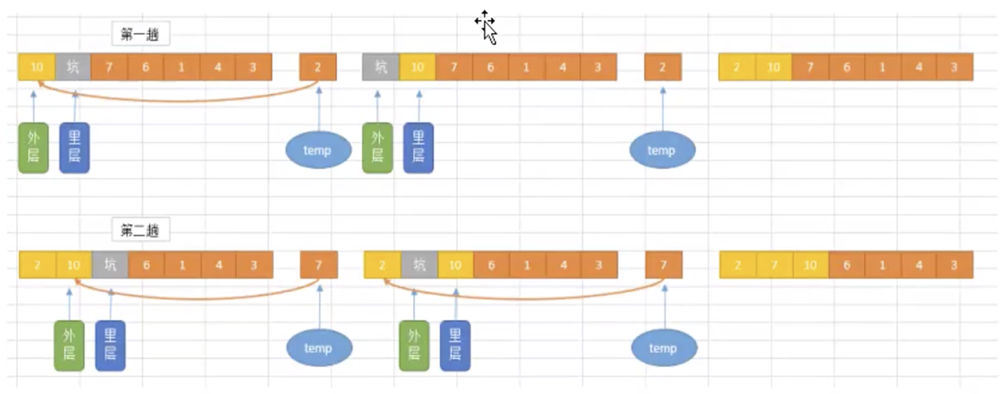

# 07-插入排序


插入排序（英语：Insertion Sort）是一种简单直观的排序算法。它的工作原理是通过构建有序序列，对于未排序数据，在已排序序列中从后向前扫描，找到相应位置并插入。插入排序在实现上，在从后向前扫描过程中，需要反复把已排序元素逐步向后挪位，为最新元素提供插入空间。




```
"""
插入排序是将一个无序列表分隔成2部分。前面的是有序列表，后面的是需要排序的元素。
每次取出第二部分的一个元素和有序列表中的元素进行比较，如果小于有序列表中的元素就进行交换，直到将有序列表中的所有元素比较完
从有序列表中最后一个元素开始比较
"""

a = [1, 4, 2, 100, 66, 5, 0]


def insert_sort(arr: list):
    n = len(arr)
    for i in range(1, n):
        j = i
        while j > 0:
            if arr[j] < arr[j - 1]:
                arr[j], arr[j - 1] = arr[j - 1], arr[j]
            else:
                break
            j -= 1


print("原列表：", a)
insert_sort(a)
print("插入排序后列表：", a)

```

运行结果：

原列表： [1, 4, 2, 100, 66, 5, 0]
插入排序后列表： [0, 1, 2, 4, 5, 66, 100]


**时间复复杂度：**


最优时间复杂度：O(n) 升序排列已经处于升序状态
最坏时间复杂度：O(n2)
稳定性：稳定