# 05-mysql下载安装


## 下载


1、首先进入mysql官网，地址：https://www.mysql.com/

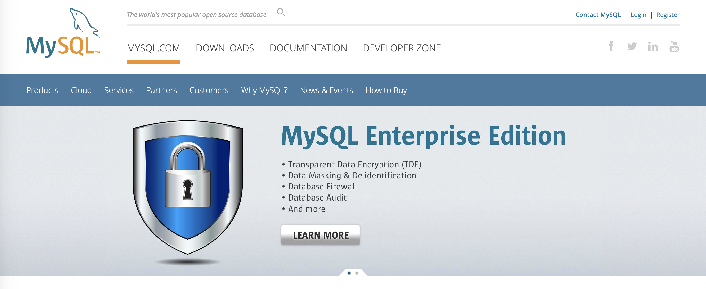


2、然后进入下载页面，点击Downloads.

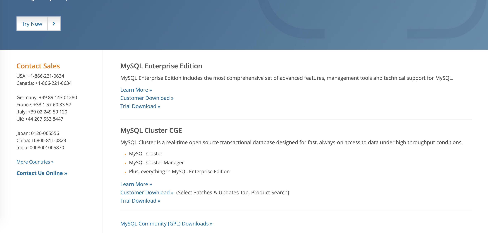


3、由于测试使用，可以选择社区版本，MySQL Community Downloads

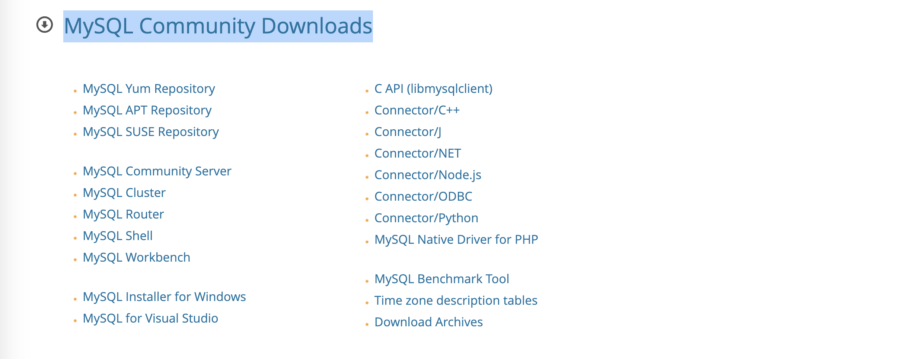


4、 选择MySQL Community Server，进行下载

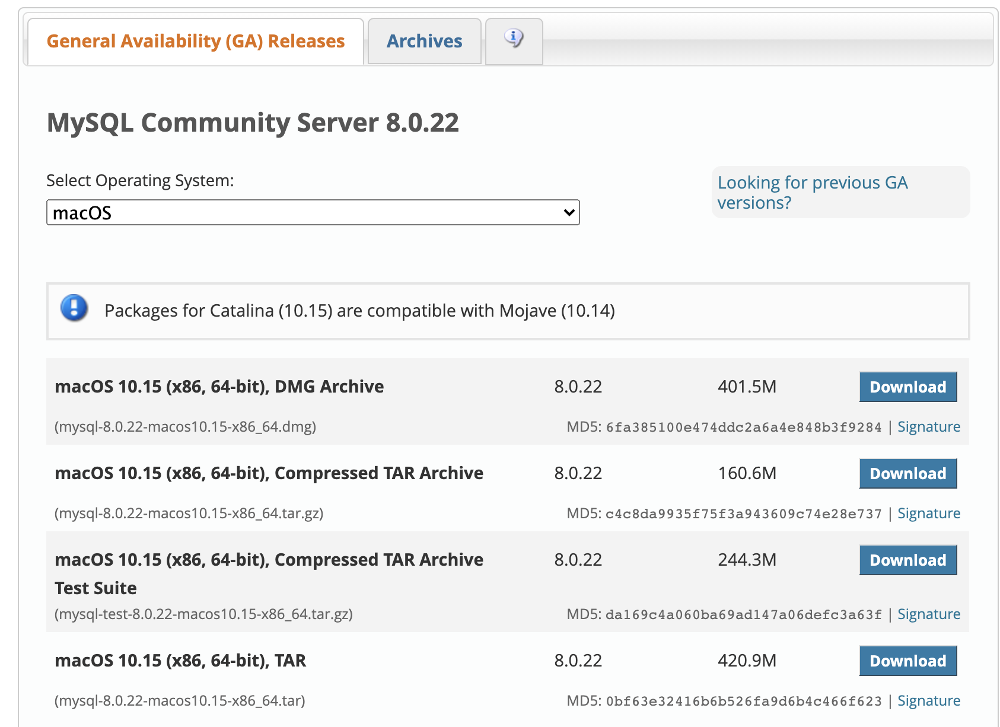


5、下载时，选择No，thanks。

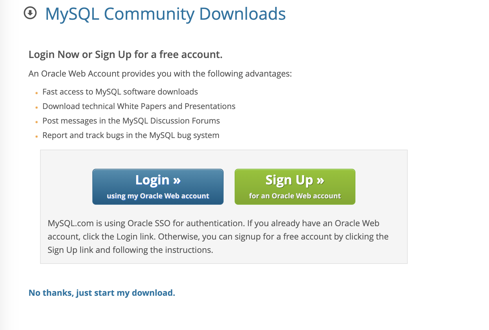


## 安装


mac版本：首先打开安装包、进行安装

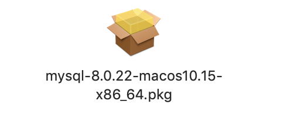


进入安装页面，点击继续

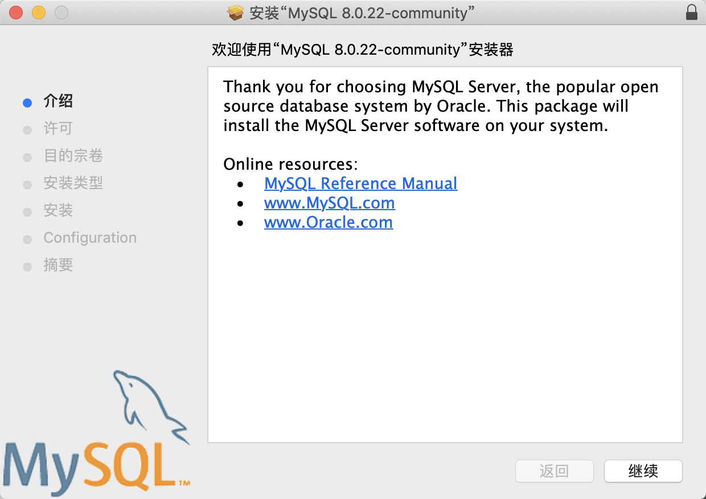


点击继续，同意协议：

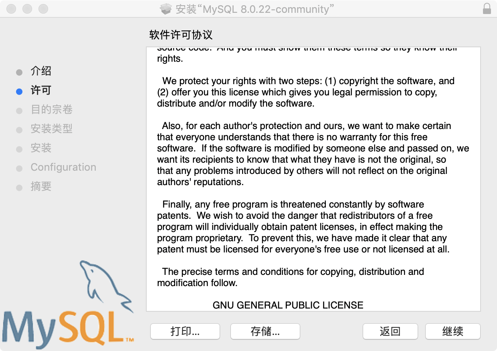


点击安装：

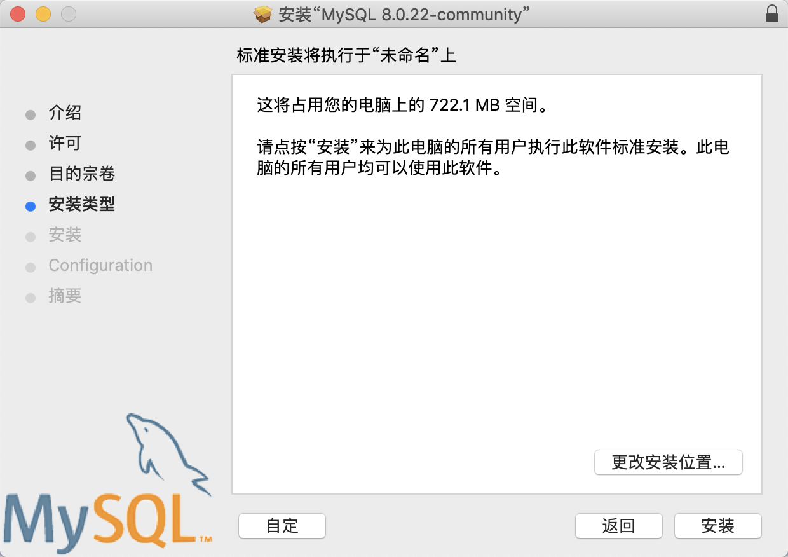


默认，选择下一步

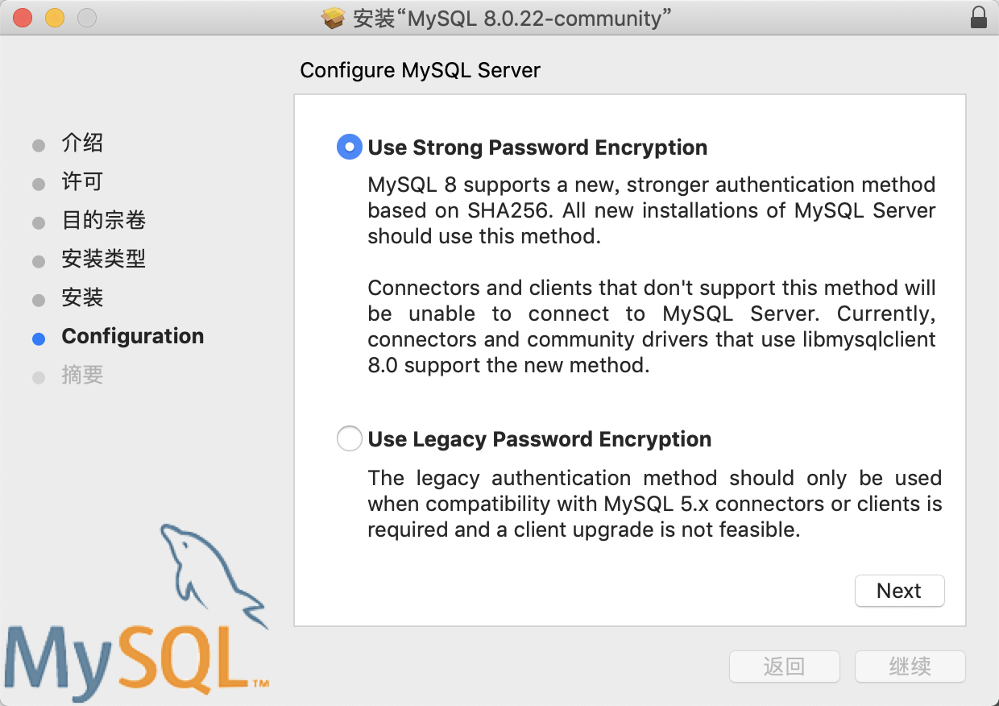


设置root用户密码，点击finish即可

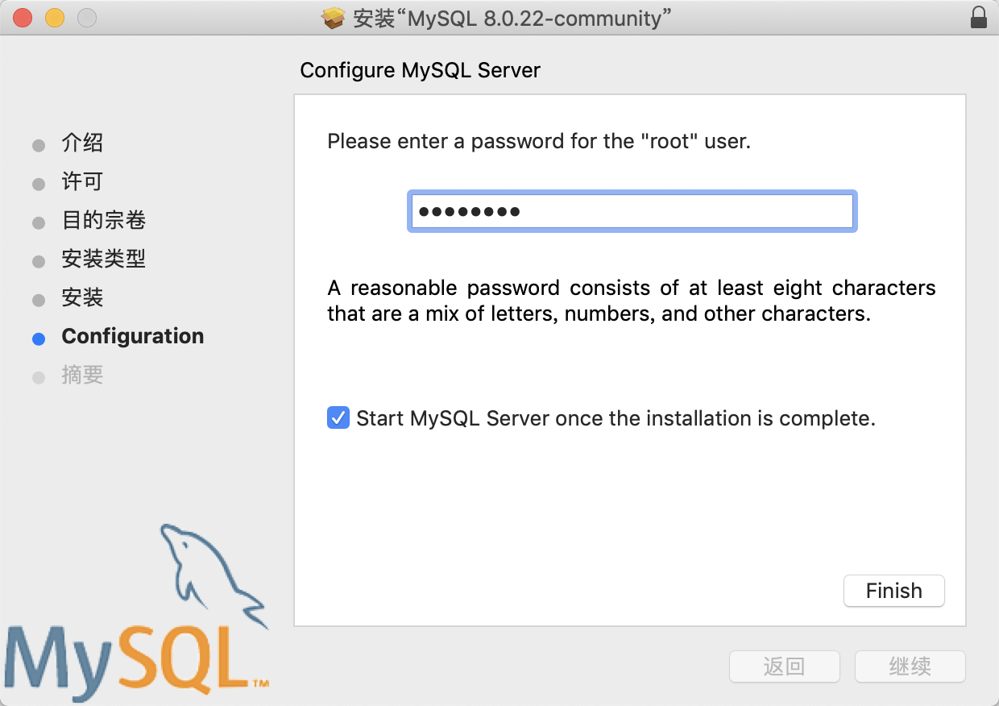


安装完成后，可以使用mysql连接工具，进行连接测试。


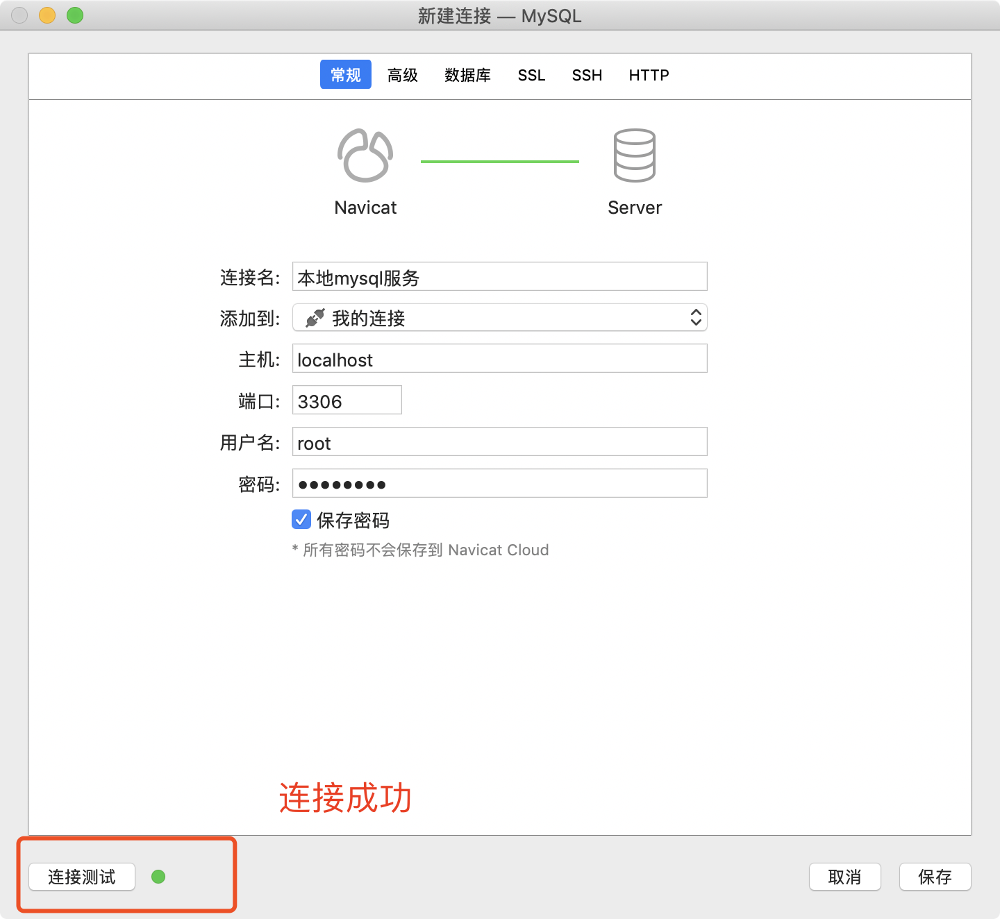


可以看见有如下默认数据库：

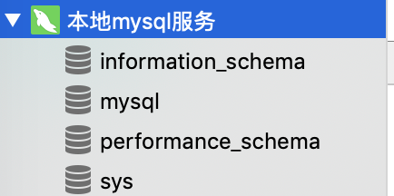


## mysql服务设置


打开系统偏好设置，会发现多了一个MySQL图标，点击它，会进入MySQL的设置界面：

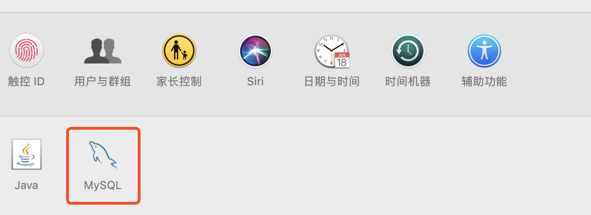


点击mysql图标，可以进入详细页面进行服务启动和关闭。

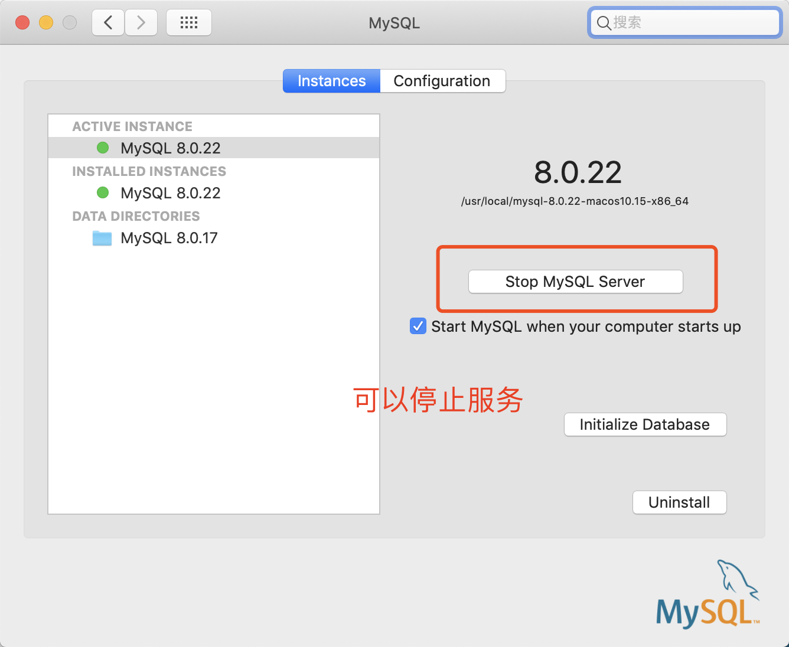


下方还有一个复选框按钮，可以设置是否在系统启动的时候自动启动MySQL，默认是勾选的，建议取消，节省开机时间。


## 终端连接mysql


打开终端，为Path路径附加MySQL的bin目录

```
PATH="$PATH":/usr/local/mysql/bin
```

然后通过以下命令登陆MySQL（密码就是前面自动生成的临时密码）
```
mysql -u root -p
```

```
Enter password: 
Welcome to the MySQL monitor.  Commands end with ; or \g.
Your MySQL connection id is 13
Server version: 8.0.22 MySQL Community Server - GPL

Copyright (c) 2000, 2020, Oracle and/or its affiliates. All rights reserved.

Oracle is a registered trademark of Oracle Corporation and/or its
affiliates. Other names may be trademarks of their respective
owners.

Type 'help;' or '\h' for help. Type '\c' to clear the current input statement.

mysql> 

```

安装后可以配置mac环境变量，就可以直接在终端使用mysql命令了。


```
vi ~/.bash_profile
export PATH=$PATH:/usr/local/mysql/bin
# 保存退出后
source ~/.bash_profile
```


然后终端可以输入mysql命令，输入密码后即可进入mysql控制台：

```
:~ user$ mysql -u root -p
Enter password: 
Welcome to the MySQL monitor.  Commands end with ; or \g.
Your MySQL connection id is 19
Server version: 8.0.22 MySQL Community Server - GPL

Copyright (c) 2000, 2020, Oracle and/or its affiliates. All rights reserved.

Oracle is a registered trademark of Oracle Corporation and/or its
affiliates. Other names may be trademarks of their respective
owners.

Type 'help;' or '\h' for help. Type '\c' to clear the current input statement.

mysql> show databases;
+--------------------+
| Database           |
+--------------------+
| information_schema |
| mysql              |
| performance_schema |
| sys                |
+--------------------+
4 rows in set (0.00 sec)

```