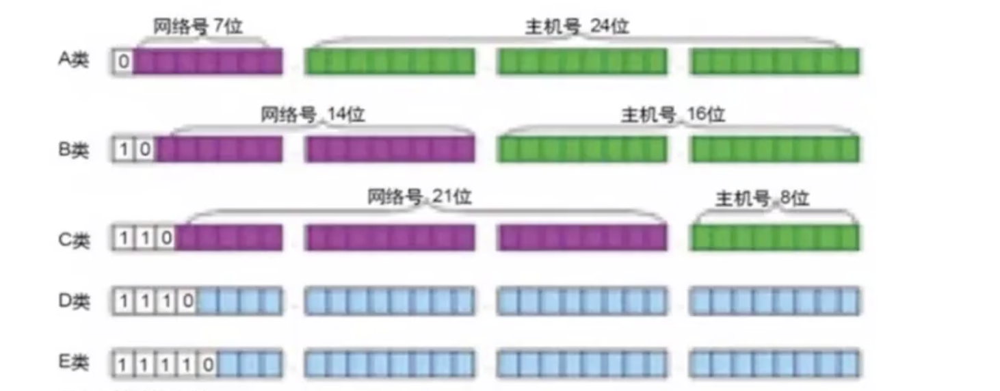
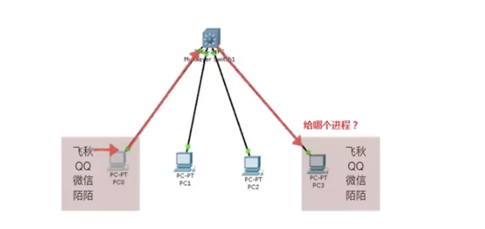

# 01-IP地址和端口

   自从互联网诞生以来，现在基本上所有的程序都是互联网程序，很少有单机版的程序了。计算机网络就是把各个计算机连接到一起，让网络的计算机可以互相通信。网络编程就是如何在程序中实现两台计算机的通信。

   网络编程对所有开发语言都是一样的，python也不例外。网络是一个互联网应用的重要组成部分，在python语言中提供了大量的内置模块和第三方模块用于支持各种网络访问，而且python语言在网络通信方面优点特别突出，远远领先其它语言。

本章将学习了解：

- 了解TCP和UDP
- 掌握编写UDP Soket客服端应用
- 掌握编写UDP Soket服务器端应用
- 掌握编写TCP Socket客户端应用
- 掌握编写TCP Socket服务器端应用
- 掌握使用socketserver模块中的API编写TCP服务端应用

## IP地址和端口

### IP地址

   用来标识网络中的一个通信实体的地址。通信实体可以是计算机、路由器等。比如互联网的每个服务器都要有自己的IP地址，而每个局域网的计算机要通信也要配置IP地址。路由器是连接两个或多个网络的网络设备。

   目前主流使用的IP地址是IPV4，但是随着网络规模的不断扩大，IPV4面临枯竭的危险，所以推出了IPV6.

   IP地址实际上是一个32位整数（称为IPV4），以字符串表示的IP地址如192.168.0.1实际上上是把32位整数按8位分组后的数字表示，目的是便于阅读。

   IPV6地址实际上是一个128位整数，它是目前使用的IPV4的升级版，以字符串表示类似于：fe80::c49:ecf1:949c:5b20

注意事项：

- 127.0.0.1 本机地址
- 192.168.0.0---192.168.255.255为私有地址，属于非注册地址，专门为组织结构内部使用。

### 端口

   IP地址用来标识一台计算机，但是一台计算机上可能提供多种网络应用程序，如何来区分这些不同的程序呢？这就要用到端口。

   端口是虚拟的概念，并不是说在主机上真的有若干个端口。通过端口，可以在一个主机上运行多个网络应用程序。端口的标示是一个16位的二进制整数，对应的十进制的0-65535.

Mysql、Tomcat、QQ、微信、360等网络程序都有自己的端口。（0-1023端口被保留，已经被操作系统使用，应用程序不能绑定使用）

总结：

- IP地址好比每个人的地址（门牌号），端口好比是房间号。必须同时指定IP地址和端口号才能够正确的发送数据。
- IP地址好比为电话号码，而端口号就好比分机号

