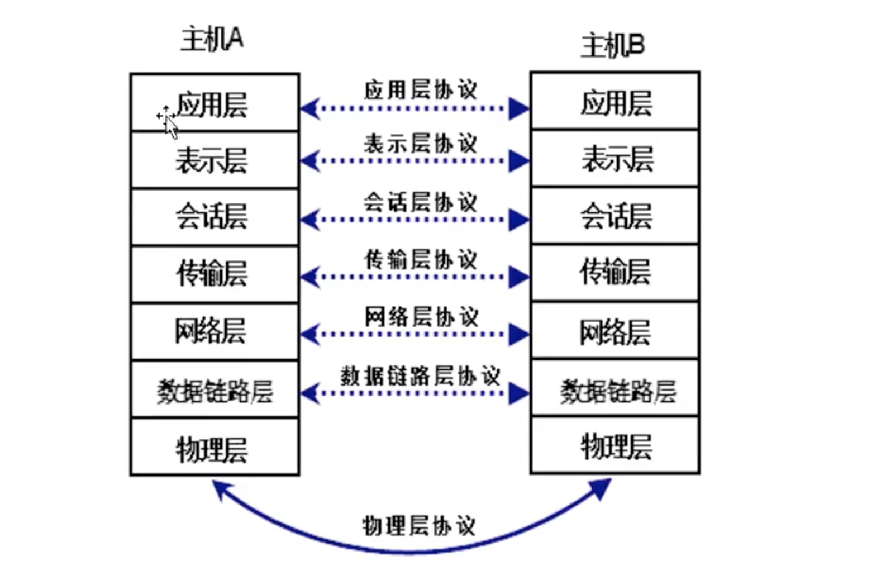
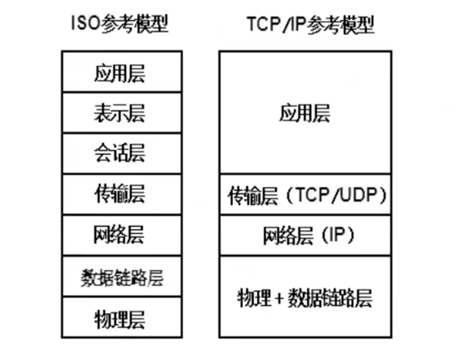

# 02-网络通信协议

  通过计算机网络可以实现不同计算机之间的连接与通信，但是计算机网络中实现通信必须有一些约定即通信协议，对速率、传输代码、代码结构、传输控制步骤、出错控制等制定标准。就像两个人想要顺利沟通就必须使用同一种语言一样，如果一个人只懂英语而另外一个人只懂中文，这样就会造成没有共同语言而无法沟通。

  国际化标准组织（ISO）定义了网络通信协议的基本框架，被称为OSI（Open System Interconnect即开放系统互联）模型。要制定通讯规则，内容会很多，比如要考虑A电脑如何找到B电脑，A电脑在发送信息给B电脑时是否需要B电脑进行反馈，A电脑传送给B电脑的数据格式又是怎样的？内容太多太杂，所以OSI模型将这些通讯标准进行层次划分，每一层解决一个类别的问题，这样就使得标准的制定没有那么复杂。

OSI模型制定的七层标准模型，分别是：应用层、表示层、会话层、传输层、网络层、数据链路层、物理层。

OSI七层协议模型如下图所示：

  虽然国际标准化组织制定了这样一个网络通信协议的模型，但是实际上互联网通讯使用最多的网络通信协议是TCP/IP网络通信协议。

  TCP/IP协议是一个协议族，也是按照层次划分，公分为四层：应用层、传输层、网络层、网络接口层（物理+数据链路层）。

   那么TCP/IP协议和OSI模型有什么区别呢？OSI网络通信协议模型，是一个参考模型，而TCP/IP协议是事实上的标准。TCP/IP协议参考了OSI模型，但是并没有严格按照OSI规定的七层标准去划分，而只划分了四层。这样会更简单点。当层次划分太多时，你很难区分某个协议是属于那个层次的。TCP/IP协议和OSI模型并不冲突，TCP/IP协议中的应用层协议，就对应于OSI模型中的应用层、表示层、会话层。就像以前有工业部和信息产业部，现在实现大部制后只有工业和信息化部一个部门，但是这个部门还是要做以前两个部门一样多的事情，本质上没有多大的区别。

  TCP/IP中有两个重要的协议，传输层的TCP协议和互联网络层的IP协议，因此就拿这两个协议做代表，来命名整个协议族了，再说TCP/IP协议时，是指整个协议族。

**网络协议的分层**

   由于网络结点之间联系很复杂，在制定协议时，把复杂成份分解成一些简单的成份，再将它们复合起来。最常用的复合方式是层次方式，即同层之间可以通信，上一层可以调用下一层，而与再下一层不发生关系。

   把用户应用程序作为最高层，把物理通信线路作为最低层，将其间的协议处理分若干层，规定每层处理的任务，也规定每层的接口标准。

ISO模型与TCP/IP模型的对应关系图如下：

