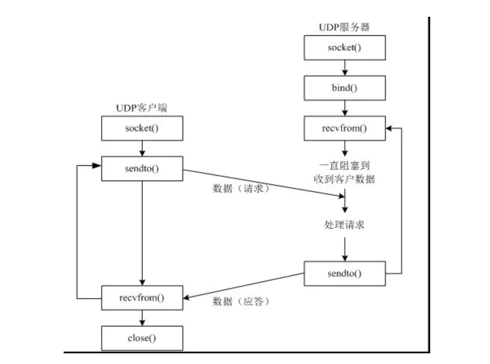

# 04-UDP编程


## UDP编程


   TCP是建立可靠连接，并且通信双方都可以以流的形式发送数据。相对TCP，UDP则是面向无连接的协议。使用UDP协议时，不需要建立连接，只需要知道对方的IP地址和端口号就可以直接发送数据包。但是，能不能到达就不知道了。虽然用UDP传输数据不可靠，但它的优点是和TCP对比，速度快，对于不要求可靠到达的数据，就可以使用UDP协议。

   创建socket是，SOCK_DGRAM指定了socket的类型是UDP。绑定端口和TCP一样，但是不需要调用listen()方法，而是直接接收来自任何客户端的数据。recvfrom()方法返回数据和客户端的地址与端口，这样服务器接收到数据后，直接调用sendto()就可以把数据用UDP发给客户端。

   UDP通信模型：

   
   
   
   
   发送数据：为看到效果借助“网络调试助手-sokit”软件来测试效果。

mac上可以使用brew进行安装：

```
# 安装安装saka仓库
brew tap rangaofei/saka
# 安装sokit
brew install sokit
# 启动
sokit
```

软件界面如下图所示：


## UDP发送数据

```
from socket import socket, AF_INET, SOCK_DGRAM
# 创建UDP套接字
udp_socket = socket(AF_INET, SOCK_DGRAM)
# 创建接收信息的地址
addr = ('10.250.116.151', 8080)
# 键盘接收发送的消息
data = input("请输入要发送的信息：")
# 调用send_to 发送消息
udp_socket.sendto(data.encode(), addr)
# 关闭套接字
udp_socket.close()
```


在看下sokit服务器收到的数据：


## UDP发送和接收数据


```
# 测试UDP发送_接收数据
from socket import *

# 创建udp套接字
udp_soket = socket(AF_INET, SOCK_DGRAM)
# 绑定一个端口
udp_soket.bind(('', 8998))
data = input("请输入发送的信息:")
addr = ('10.250.116.151', 8080)
# 发送数据
udp_soket.sendto(data.encode('utf-8'), addr)
recv_data = udp_soket.recvfrom(1024)  # 表示本次接收的最大字节数1024
print("接收到{0}的消息是：{1}".format(recv_data[1], recv_data[0].decode('utf-8')))
# 关闭套接字
udp_soket.close()
```

使用sokit工具作为服务器进行测试，发送数据和接收。


## UDP使用多线程


案例：使用多线程实现聊天

```
# 测试UDP使用多线程实现聊天

from socket import *
from threading import Thread

# 创建UDP套接字对象
udp_socket = socket(AF_INET, SOCK_DGRAM)
# 绑定本机和端口
udp_socket.bind(('', 8998))


# 接收任务
def recv_fun():
    while True:
        recv_data = udp_socket.recvfrom(1024)
        print("接收到{0}的消息是：{1}".format(recv_data[1], recv_data[0].decode()))


# 发送任务
def send_fun():
    while True:
        addr = ('10.250.116.151', 8080)
        data = input("请输入消息：")
        udp_socket.sendto(data.encode(), addr)


if __name__ == '__main__':
    # 创建两个线程
    t1 = Thread(target=send_fun)
    t2 = Thread(target=recv_fun)
    t1.start()
    t2.start()
    t1.join()
    t2.join()
```