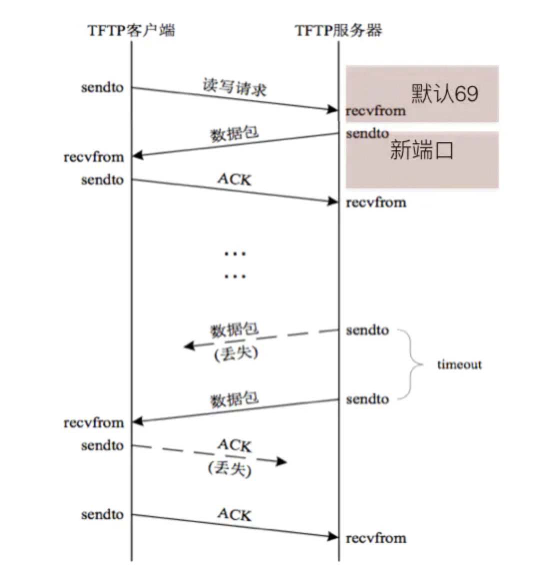
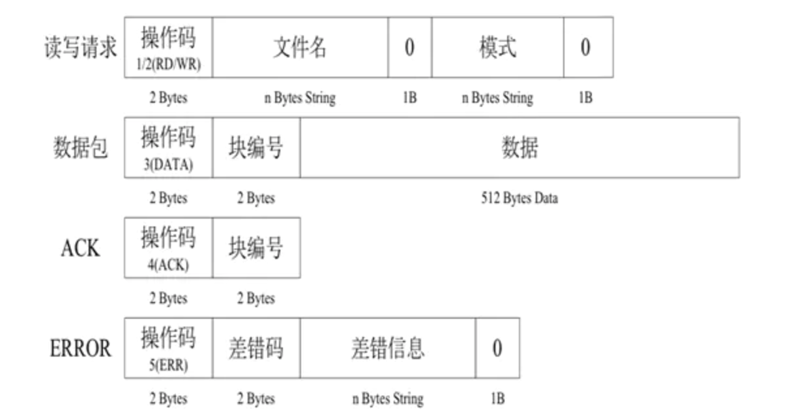

# 05-TFTP文件下载器


TFTP（Trivial File Transfer protocol,简单文件传输协议）使用这个协议，就可以实现简单文件的下载，tftp端口号为69。

实现FTP下载器：

下载：从服务器上将一个文件复制到本机上
下载的过程：
在本地创建一个空文件（与要下载的文件同名）
向里面写数据（接收到一点就向空文件里写一点）
关闭（接收完所有数据关闭文件）


**TFTP下载过程：**

   TFTP服务器默认监听69号端口，当客户端发送“下载”请求（即读请求）时，需要向服务器的69端口发送服务器若批准此请求,则使用一个新的、临时的 端口进行数据传输。当服务器找到需要现在的文件后，会立刻打开文件，把文件中的数据通过TFTP协议发送给客户端。



TFTP数据包格式：

   如果文件的总大小较大（比如3M），那么服务器分多次发送，每次会从文件中读取512个字节的数据发送过来。因为发送的次数有可能会很多，所以为了让客户端对接收到的数据进行排序，所以在服务器发送那512个字节数据的时候，会多发2个字节的数据，用来存放序号，并且放在512个字节数据的前面，序号是从1开始的。因为需要从服务器上下载文件时，文件可能不存在，那么此时服务器就会发送一个错误的信息过来，为了区分服务发送的是文件内容还是错误的提示信息，所以又用了2个字节 来表示这个数据包的功能（称为操作码），并且在序号的前面。





  
  
  
   因为udp的数据包不安全，即发送方发送是否成功不能确定，所以TFTP协议中规定，为了让服务器知道客户端已经接收到了刚刚发送的那个数据包，所以当客户端接收到一个数据包的时候需要向服务器进行发送确认信息，即发送收到了，这样的包成为ACK(应答包)为了标记数据已经发送完毕，所以规定，当客户端接收到的数据小于516（2字节操作码+2个字节的序号+512字节数据）时，就意味着服务器发送完毕了。


struct模块可以按照指定格式将Python数据转换为字符串，该字符串为字节流。struct模块中最重要的三个函数是pack(),unpak(),calcsize()。

| 函数名              | 描述                                            |
| :----------------- | :---------------------------------------------- |
| pack(fmt,v1,v2)    | 按照指定的格式fmt,把数据封装成字符串                |
| unpack(fmt,string) | 按照给定的格式fmt解析字节流string，返回解析出来的元组 |
| calcsize(fmt)      | 计算给定的格式fmt，占用多少个字节的内存              |


案例：构造下载请求数据“1a.jpeg0octet0”

```
import struct
cmb_buf = struct.pack("!H6sb5sb",1,b"a.jpeg",0,b"octet",0)
如何保证操作码（1/2/3/4/5）占两个字节？如何保证0占一个字节？
#  !H6sb5sb  表示按照网络传输数据要求的形式来组织数据（占位的格式）
6s相当于6个s，占6个字节，b占一个字节
```


案例：TFTP文件下载客户端

```
# 测试TFTP下载客户端

from socket import *
import struct

filename = 'a.jpeg'
server_ip = '127.0.0.1'
# 封装读的请求
send_data = struct.pack('!H%dsb5sb' % len(filename), 1, filename.encode(), 0, 'octet'.encode(), 0)
# 创建udp socket 套接字
udp_socket = socket(AF_INET, SOCK_DGRAM)
udp_socket.sendto(send_data, (server_ip, 69))  # 读写端口默认是69
# 本地创建一个文件
f = open(filename, 'ab')  # a追加模式，b代表二进制
while True:
    recv_data = udp_socket.recvfrom(1024)
    # print(recv_data) (7\x18\x19\x1a&\'()*56789:CDEFGHI', ('127.0.0.1', 52596))
    # 获取操作码及数据块编号
    caozuoma, ack_num = struct.unpack('!HH', recv_data[0][:4])
    # 判断操作码是否是5，如果是5则是错误信息
    if caozuoma == 5:
        print("文件信息不存在")
        break
    # 将接收到的数据写入到文件中
    f.write(recv_data[0][4:])
    if len(recv_data[0]) < 516:  # 小于516表示读取完
        break
    # 发送确认包
    ack_data = struct.pack("!HH", 4, ack_num)
    rand_port = recv_data[1][1]  # 获取服务器发送数据的随机端口
    udp_socket.sendto(ack_data, (server_ip, rand_port))

```