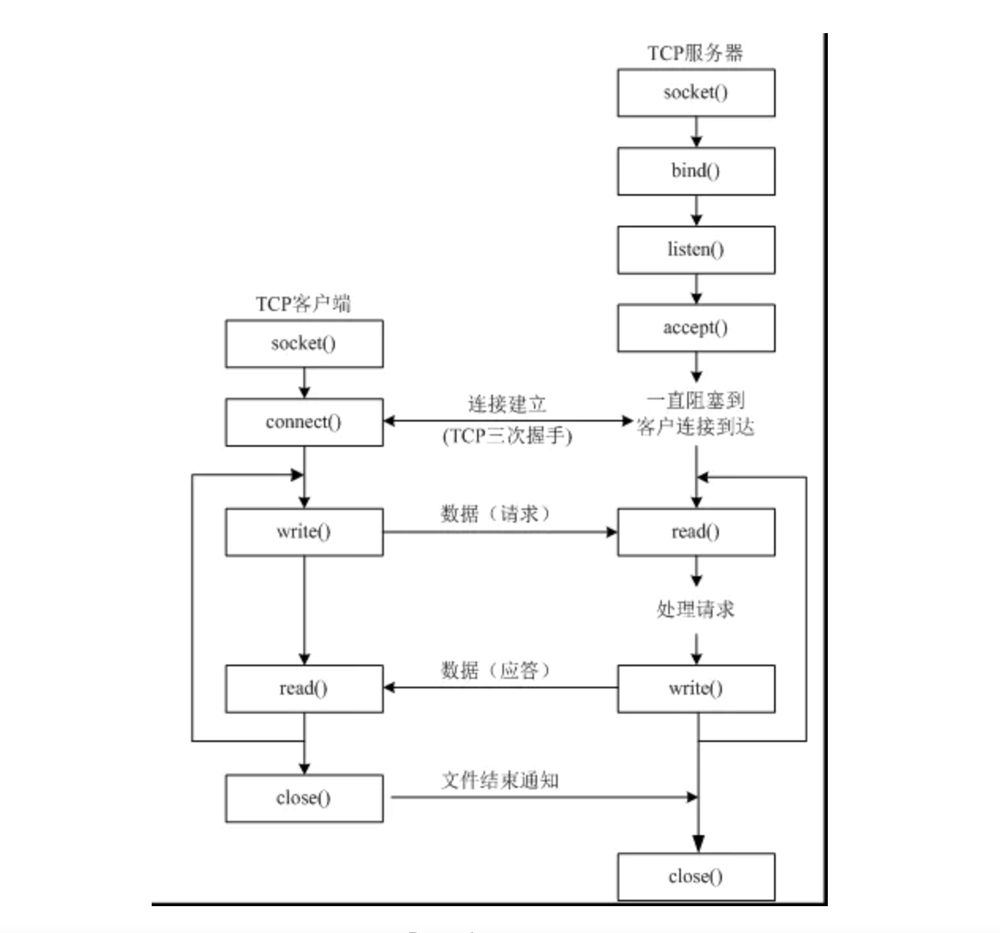
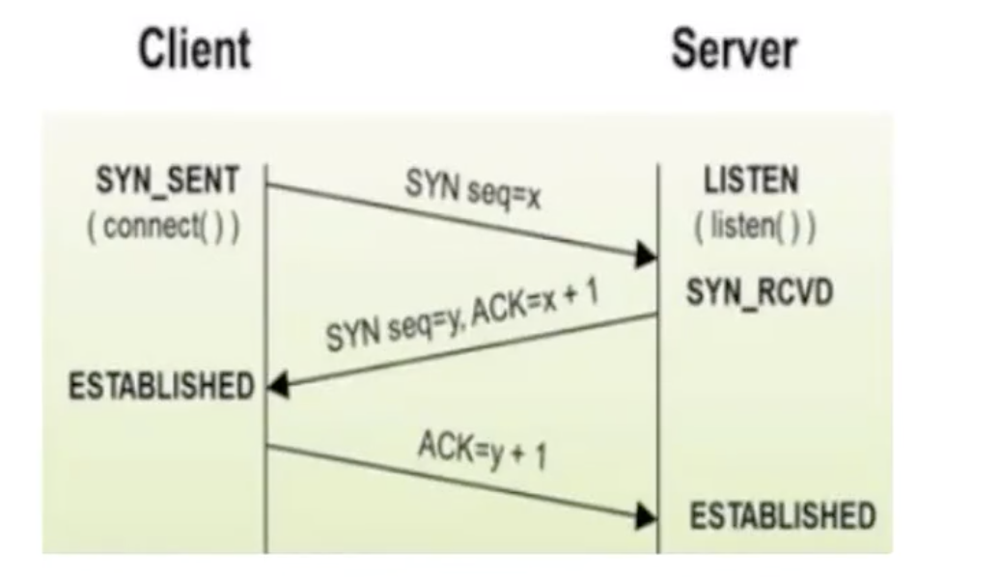

# 06-TCP编程


   面向连接的socket使用的主要协议是传输控制协议，也就是常说的TCP，TCP的Socket名称是SOCK_STREAM。创建套接字TCP/IP套接字，可以调用socket.socket()。示例代码如下：

```
tcp_socket = socket.socket(AF_INET,SOCK_STREAM)
```


**tcp通信模型**

   
   tcp通信模型中，在通信开始之前，一定要先建立相关的链接，才能发送数据，类似于生活中“打电话”。
   



**tcp服务器：**

- 1、socket创建一个套接字
- 2、bind绑定ip和port
- 3、listen使套接字变为可以被动连接
- 4、accept等待客户端的连接
- 5、recv/send接收发送数据


## 三次握手


- 第一步，客户端发送一个包含SYN即同步（Synchonize）标志的TCP报文，SYN同步报文会指明客户端使用的端口以及TCP连接的初始序号。
- 第二步，服务器收到客户端的SYN报文后，将返回一个SYN+ACK的报文，表示客户端的请求被接收，同时TCP序号被加一，ACK即确认（Acknowledgement）。
- 第三步，客户端也会返回一个确认报文ACK给服务端，同样TCP序列号被加一，到此一个TCP连接完成。然后才开始通信的第二步：数据处理。





## TCP服务端接收数据


案例：模拟TCP服务器接收数据

```
from socket import *
# 创建tcp socket连接套接字对象
socket_server = socket(AF_INET, SOCK_STREAM)
# 绑定端口
socket_server.bind(('', 8998))
# 监听
socket_server.listen()
# 接收客户端的连接
print(socket_server.accept())
# (<socket.socket fd=4, family=AddressFamily.AF_INET, type=SocketKind.SOCK_STREAM, proto=0, laddr=('127.0.0.1', 8998), raddr=('127.0.0.1', 58042)>, ('127.0.0.1', 58042))
client_socket, client_info = socket_server.accept()
# 接收客户端发送的信息
recv_data = client_socket.recv(1024)
print("接收到{0}的消息是：{1}".format(client_info, recv_data.decode()))
# 关闭连接
client_socket.close()  # 关闭客户端连接
socket_server.close()  # 关闭服务端连接

```


练习：使用TCP模拟聊天客户端和服务端

客户端代码：
```
# 测试TCP模拟qq客户端

from socket import *
# 创建客户端套接字对象
client_socket = socket(AF_INET,SOCK_STREAM)
# 调用connet方法与服务器建立连接
client_socket.connect(('', 8998))
while True:
    # 客户端发送消息
    msg = input(">")
    client_socket.send(msg.encode('utf-8'))
    if msg == 'bye':
        break
    # 客户端接收消息
    recv_data = client_socket.recv(1024)
    print("服务器端说：", recv_data.decode('utf-8'))
client_socket.close()

```

服务端代码：
```
# 测试TCP模拟qq服务端

from socket import *
# 创建tcp sockt 套接字对象
socket_server = socket(AF_INET, SOCK_STREAM)
# 绑定端口
socket_server.bind(('', 8998))
# 监听
socket_server.listen()
# 等待客户端连接
client_socket, client_info = socket_server.accept()
while True:
    # 接收客户端的消息
    recv_data = client_socket.recv(1024)
    print("客户端说：", recv_data.decode('utf-8'))
    if recv_data.decode('utf-8') == 'bye':
        break
    # 发送消息
    msg = input(">")
    client_socket.send(msg.encode('utf-8'))
client_socket.close()
socket_server.close()
```


案例 ： 使用多线程模拟TCP客户端和服务端

服务端：

```
from socket import *
from threading import Thread
sockets = []


def main():
    # 创建server socket套接字对象
    server_socket = socket(AF_INET, SOCK_STREAM)
    # 绑定端口
    server_socket.bind(('', 8888))
    # 监听
    server_socket.listen()
    # 接收客户端请求
    while True:
        client_socket, client_info = server_socket.accept()
        sockets.append(client_socket)  # 添加所有客户端连接至列表
        # 开启线程处理当前客户端端请求
        t = Thread(target=read_msg, args=(client_socket,))
        t.start()


def read_msg(client_socket):
    # 读取客户端发送的消息
    while True:
        recv_data = client_socket.recv(1024)
        # 如果服务器接收到的消息是bye，则在线客户列表移除该客户端
        if recv_data.decode('utf-8').endswith('bye'):
            sockets.remove(client_socket)
            client_socket.close()
            break
        if len(recv_data) > 0:
            # 将消息发送给所有在线的客户端,遍历所有在线客户端
            for socket in sockets:
                socket.send(recv_data)


if __name__ == '__main__':
    main()
```

客户端：

```
# 测试TCP通信模式多线程客户端

from socket import *
from threading import Thread

# 创建客户端套接字对象
client_socket = socket(AF_INET, SOCK_STREAM)
# 调用connect连接服务器
client_socket.connect(('', 8888))
flag = True


def read_msg(client_socket):
    global flag
    while flag:
        recv_data = client_socket.recv(1024)
        print("收到：", recv_data.decode('utf-8'))


def write_msg(client_socket):
    global flag
    while flag:
        msg = input(">")
        msg = user_name + '说：' + msg
        client_socket.send(msg.encode('utf-8'))
        # 如果输入bye则下线
        if msg.endswith('bye'):
            flag = False


user_name = input(">请输入你的名字：")

# 开启一个线程处理客户端的读取消息
t1 = Thread(target=read_msg, args=(client_socket,))
t1.start()

# 开启一个线程处理客户端的发送消息
t2 = Thread(target=write_msg, args=(client_socket,))
t2.start()
t1.join()
t2.join()
client_socket.close()
```