# 01-python日志标准库logging


## 一、logging库函数使用

###  日志的处理方式


在日常工作中，我们常常需要对一些变量，结果进行输出，常见对就是print语句，但是一些复杂对项目，print就不满足需求了。这里python语言提供了一个标准库，logging满足日志的功能，十分强大。


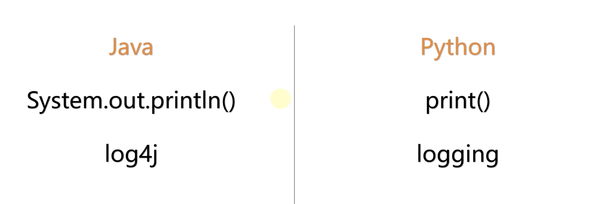


### logging库日志级别

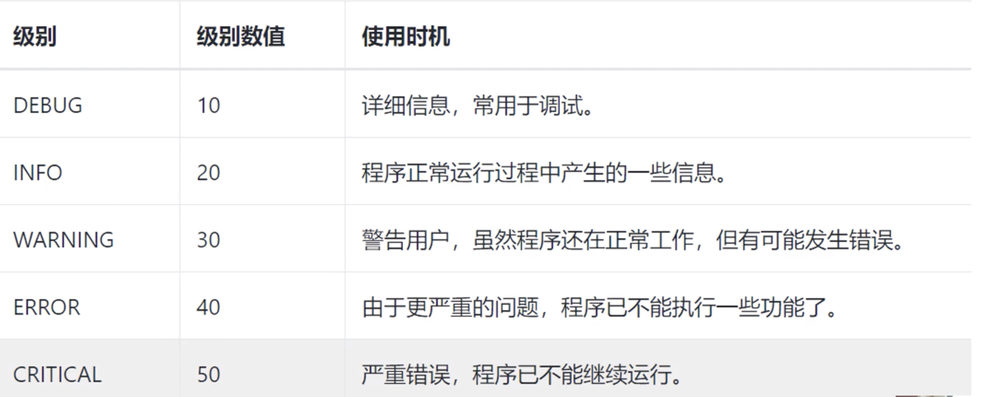


**默认的日志级别是：warning。**


案例：

```
import logging

logging.debug("测试 debug 日志输出")
logging.info("测试 info 日志输出")
logging.warning("测试 warning 日志输出")
logging.error("测试 error 日志输出")
logging.critical("测试 critical 日志输出")

```

结果输出：

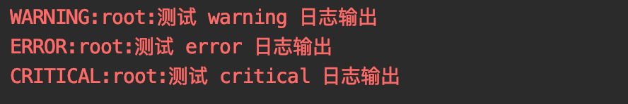


可以发现，debug和info的日志并没有输出，因为默认级别是warning。因此我们需要使用到另一个方法。logging.basicConfig(level=logging.DEBUG)，level可以设置不同的日志输出级别！

如下：

```
import logging
logging.basicConfig(level=logging.DEBUG)  # 设置日志默认级别为Debug
logging.debug("测试 debug 日志输出")
logging.info("测试 info 日志输出")
logging.warning("测试 warning 日志输出")
logging.error("测试 error 日志输出")
logging.critical("测试 critical 日志输出")
```

输出如下：

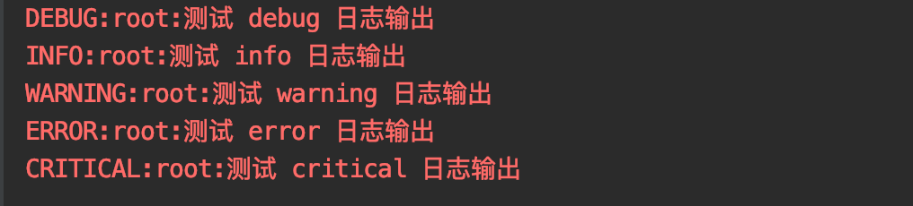


没有指定输出的位置，默认是向控制台输出。


注意： 不要print和logging混合使用，因为logging支持多并发采用多线程的模式，混合使用日志输出先后顺序就会产生问题。如下：

```
import logging
logging.basicConfig(level=logging.DEBUG)  # 设置日志默认级别为Debug
print("打印日志输出")
logging.debug("测试 debug 日志输出")
logging.info("测试 info 日志输出")
logging.warning("测试 warning 日志输出")
logging.error("测试 error 日志输出")
logging.critical("测试 critical 日志输出")
```

结果如下：

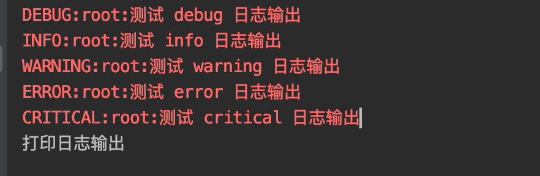


可以发现print先被执行，却在最后输出，这是因为logging底层是支持多线程模式的。


从上面的内容可以发现，logging日志输出，除了输出指定的信息以外，还输出了日志级别，和root（记录器，相当于一支笔，笔的名字叫root）。所以logging支持输出额外的一些配置信息。


### 向文件输出日志信息


要向文件里输出信息，需要在basicConfig添加参数filename即可指定输出文件的名字。如下：

```
import logging

logging.basicConfig(filename='log.txt', level=logging.DEBUG)  # 设置日志默认级别为Debug
print("打印日志输出")
logging.debug("测试 debug 日志输出")
logging.info("测试 info 日志输出")
logging.warning("测试 warning 日志输出")
logging.error("测试 error 日志输出")
logging.critical("测试 critical 日志输出")
```

执行发现，在py文件的同级目录下，生成了一个文件，并把内容写入成功。

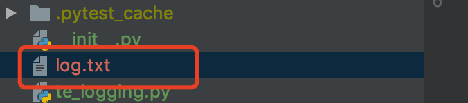


执行多次，日志文件结果如下：

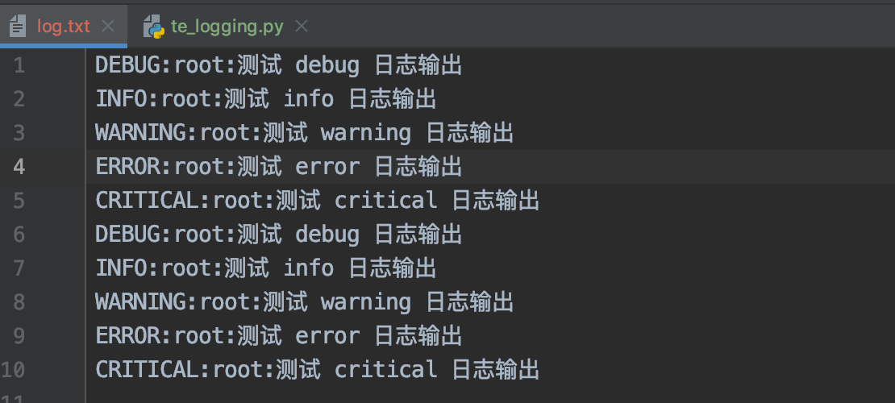


可以发现是追加的模式，如果想每次覆盖，需要追加参数filemode='w' 即可。a是追加模式（默认方式）！


**向日志输出添加一些公共信息：**

经常我们需要对日志输出：时间、文件名、第几行 等等。这些可以使用一些参数进行配置，使用format参数进行配置，如下：


- 只输入信息，不展示其它额外信息，格式：%(message)s ，这个是固定的。

```
logging.basicConfig(format='%(message)s', level=logging.DEBUG)
```

执行结果如下：

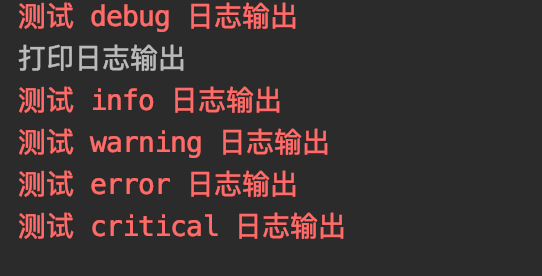


- 添加时间： %(asctime)s

```
logging.basicConfig(format='%(asctime)s|%(message)s', level=logging.DEBUG) 
```
结果如下：

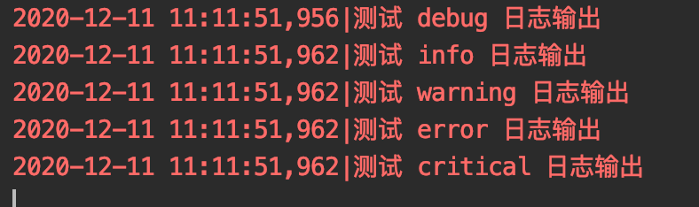


- 添加级别：%(levelname)s

```
logging.basicConfig(format='%(asctime)s|%(levelname)s|%(message)s', level=logging.DEBUG)  
```

结果如下：

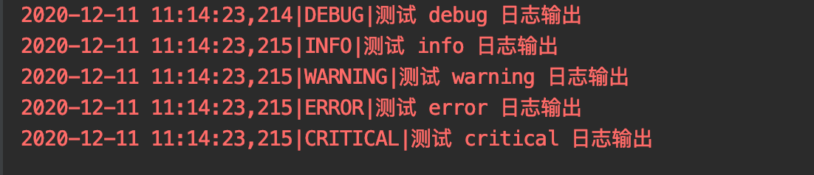

- 文件名，行号 ：%(filename)s %(lineno)s

```
logging.basicConfig(format='%(asctime)s|%(levelname)s|%(filename)s|%(lineno)s|%(message)s', level=logging.DEBUG)
```

结果如下：

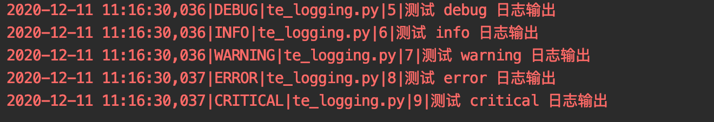


- 时间格式化：datefmt='%Y-%m-%d %H:%M:%S'

```
logging.basicConfig(format='%(asctime)s|%(levelname)s|%(filename)s|%(lineno)s|%(message)s',
                    level=logging.DEBUG, datefmt='%Y-%m-%d %H:%M:%S')
```

运行结果如下：

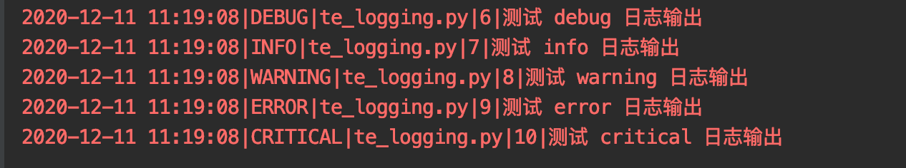


这些都是常用的，还有一些其它的配置，可以参考官方文档：


## 二、logging高级用法


logging模块采用了模块化设计，主要包含四种组件。

- Loggers：记录器，提供应用程序代码直接使用的接口；
- Handlers：处理器，将记录器产生的日志发送至目的地；
- Filters：过滤器，提供更好的粒度控制，决定哪些日志会被输出；
- Formatters：格式化器，设置日志内容的组成结构和消息字段。


常规流程：


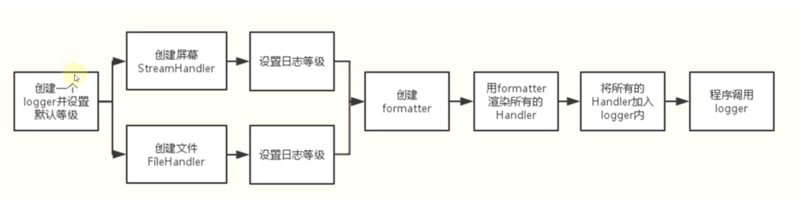


### loggers记录器


- 1、提供应用程序的调用接口

```
logger = logging.getLogger(__name__)
logger是单例的
```

- 2、决定日志记录的级别

```
logger.setLevel()
```

- 3、将日志内容传递到相关联的handlers中

```
logger.addHangler()和logger.removeHandler()
```


### Handlers 处理器

它们将日志分发到不同的目的地。可以是文件、标准输出、邮件、或者通过socke、http等协议发送到任何地方。

- StreamHandler

标准输出stdout（如显示器）分发器
创建方法：
```
sh = logging.StreamHandler(stream=None)
```

- FIleHandler

将日志保存到磁盘文件的处理器

创建方法：
```
fh = logging.FileHandler(filename,mode='a',encoding=None,delay=False)
```
setFormatter():    设置当前Handler对象使用的消息格式。


Handlers处理器：

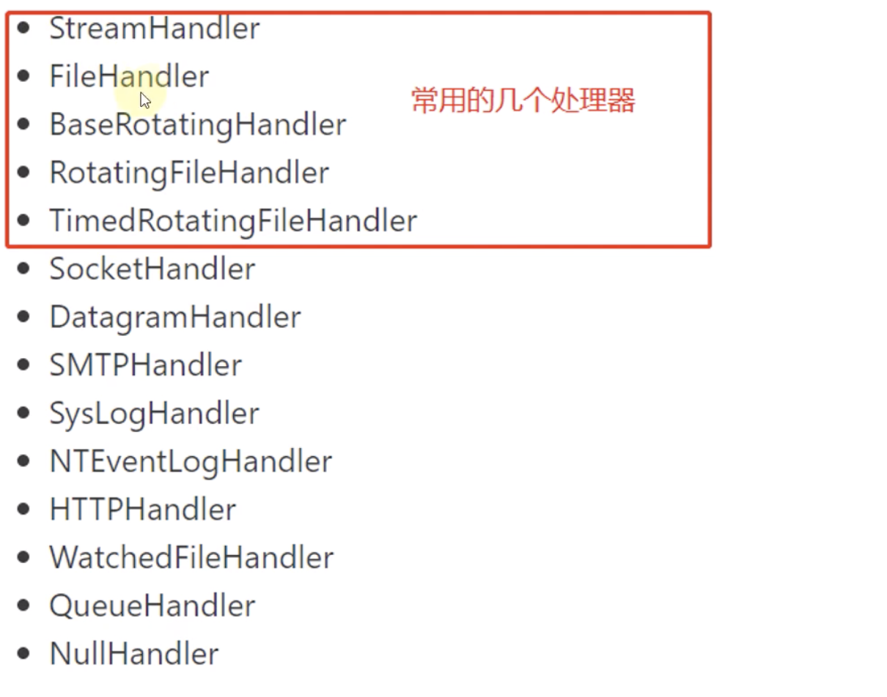


### Formatters 格式


Formatter对象用来最终设置日志信息的顺序、结构和内容。

其构造方法为：
```
ft = logging.Formatter.__init__(fmt=None,datefmt=None,style='%')
```
datefmt默认是%Y-%m-%d %H:%M:%S样式的，style参数默认为百分符%，这表示%（\<dictinary key>）s格式的字。


可选格式项

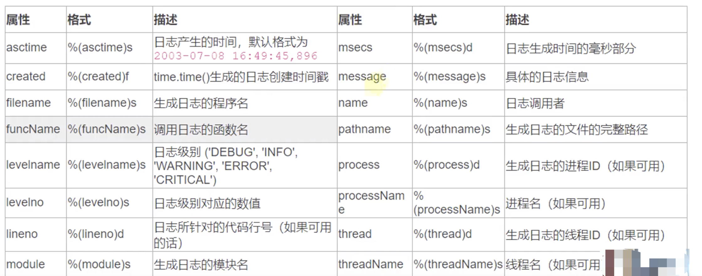


### 代码案例


首先创建一个记录器对象：

```
# 记录器
logger = logging.getLogger()
print(logger)
print(type(logger))
```

输出结果：

<RootLogger root (WARNING)>
<class 'logging.RootLogger'>

可以发现生成的是RootLogger对象，默认日志级别是WARRING，默认记录器的名字叫root。当然可以自己指定名字。


例如：我们设置记录器名称为applog，默认等级为Debug。

```
logger = logging.getLogger('applog')
logger.setLevel(logging.DEBUG)
print(logger)
print(type(logger))
```

输出结果如下：

<Logger applog (DEBUG)>
<class 'logging.Logger'>


完整示例如下：

```
import logging

# 记录器
logger = logging.getLogger('applog')
logger.setLevel(logging.INFO)  # 最高优先级

# 处理器handler
console_handler = logging.StreamHandler()  # 控制台
console_handler.setLevel(logging.DEBUG)

# 没有给handler指定日志级别，将使用logger的级别
file_handler = logging.FileHandler(filename='demo.log')  # 文件输出
file_handler.setLevel(logging.INFO)

# formatter 格式，格式可以创建多个
formatter = logging.Formatter('%(asctime)s|%(levelname)s|%(filename)s|%(lineno)s|%(message)s')

# 给处理器设置格式
console_handler.setFormatter(formatter)
file_handler.setFormatter(formatter)

# 记录器设置处理器
logger.addHandler(console_handler)
logger.addHandler(file_handler)

# 打印日志的代码
logger.debug("输出 debug 日志信息")
logger.info("输出 debug 日志信息")
logger.warning("输出 debug 日志信息")
logger.error("输出 debug 日志信息")
logger.critical("输出 debug 日志信息")
```

输出结果：

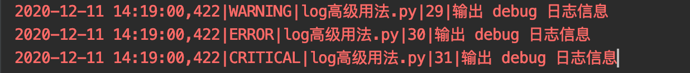

可以发现，输出的日志信息，是warning级别的，而我们在处理器中定义了debug级别，但并没有输出debug级别和INFO级别的日志。


**这里日志级别有个重要关系：**

- 记录器和处理器都设置了日志级别，等级不一致时，日志的优先级以记录器为准。
- 如果记录器不设置，默认就是WARNING。
- 如果多个处理器需要输出不同级别的日志信息，则需要设置记录器的日志等级要低于各个处理器的最小级别，比如各个处理器最低等级是INFO，那么记录器则需要设置为DEBUG。


调整代码，结果如下：

```
import logging

# 记录器
logger = logging.getLogger('applog')
logger.setLevel(logging.DEBUG)  # 最高优先级

# 处理器handler
console_handler = logging.StreamHandler()  # 控制台
console_handler.setLevel(logging.DEBUG)

# 没有给handler指定日志级别，将使用logger的级别
file_handler = logging.FileHandler(filename='demo.log')  # 文件输出
file_handler.setLevel(logging.INFO)

# formatter 格式，格式可以创建多个
formatter = logging.Formatter('%(asctime)s|%(levelname)8s|%(filename)s|%(lineno)s|%(message)s')

# 给处理器设置格式
console_handler.setFormatter(formatter)
file_handler.setFormatter(formatter)

# 记录器设置处理器
logger.addHandler(console_handler)
logger.addHandler(file_handler)

# 打印日志的代码
logger.debug("输出 debug 日志信息")
logger.info("输出 debug 日志信息")
logger.warning("输出 debug 日志信息")
logger.error("输出 debug 日志信息")
logger.critical("输出 debug 日志信息")
```
结果：
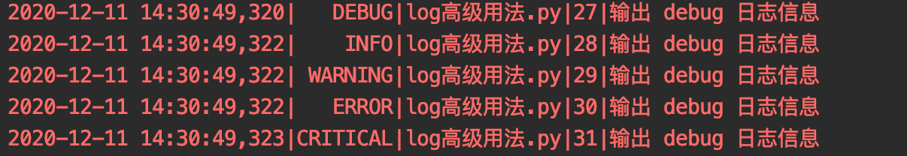

日志文件：
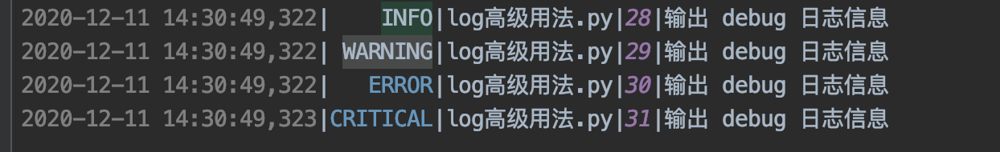


可以发现这就是想要的输出结果了。


完整代码示例：

```
import logging

# 记录器
logger = logging.getLogger('applog')
logger.setLevel(logging.DEBUG)  # 最高优先级

# 处理器handler
console_handler = logging.StreamHandler()  # 控制台
console_handler.setLevel(logging.DEBUG)

# 没有给handler指定日志级别，将使用logger的级别
file_handler = logging.FileHandler(filename='demo.log')  # 文件输出
file_handler.setLevel(logging.INFO)

# formatter 格式，格式可以创建多个
formatter = logging.Formatter('%(asctime)s|%(levelname)8s|%(filename)s|%(lineno)s|%(message)s')

# 给处理器设置格式
console_handler.setFormatter(formatter)
file_handler.setFormatter(formatter)

# 记录器设置处理器
logger.addHandler(console_handler)
logger.addHandler(file_handler)

# 定义一个过滤器
flt = logging.Filter('applog')  # 匹配命名一样的记录器，匹配才能输出
# 关联过滤器，方式一
# logger.addFilter(flt)

# 关联过滤器，方式二
console_handler.addFilter(flt)


# 打印日志的代码
logger.debug("输出 debug 日志信息")
logger.info("输出 debug 日志信息")
logger.warning("输出 debug 日志信息")
logger.error("输出 debug 日志信息")
logger.critical("输出 debug 日志信息")
```


### 配置文件方式 （推荐）


