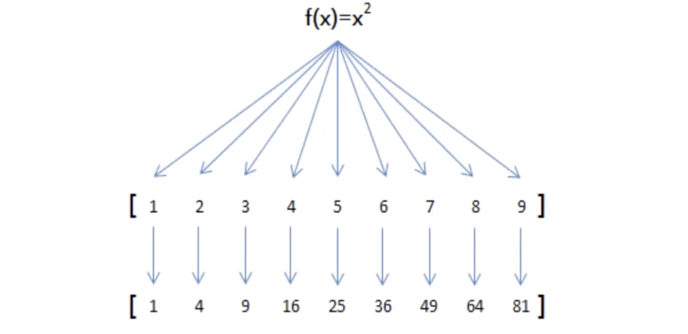

# 02-高阶函数map的使用


   map()函数接收两个参数，一个是函数，一个是序列，map将传入的函数依此作用到序列的每个元素，并把结果作为新的list返回。


   比如我们有一个函数范f(x)=x*x, 要把这个函数作用在一个list[1,2,3,4,5,6,7,8,9]上，就可以用map()实现如下：




案例：把一个函数f(x)=x*x 要把这个函数作用在一个list[1，2，3，4，5，6，7，8，9]

```
# 一个函数f(x)=x*x 要把这个函数作用在一个list[1，2，3，4，5，6，7，8，9]


# 普通方式实现
a = [1, 2, 3, 4, 5, 6, 7, 8, 9]
a_list = []


def f(x):
    return x * x


for i in a:
    a_list.append(f(i))
print(a_list)


# 使用map高阶函数实现
it = map(f, a)
print(it)  # 返回的是map对象<map object at 0x103aa5650> 是一个可迭代的对象

# 判断是否是可迭代的对象

from collections.abc import Iterator

print("判断是否是可迭代：", isinstance(it, Iterator))
print(list(it))  # 输出结果：[1, 4, 9, 16, 25, 36, 49, 64, 81]


```

运行结果：

[1, 4, 9, 16, 25, 36, 49, 64, 81]
<map object at 0x1032a57d0>
判断是否是可迭代： True
[1, 4, 9, 16, 25, 36, 49, 64, 81]


案例二： a = [1, 2, 3, 4, 5, 6, 7, 8, 9]  # 将列表中每个元素转换为字符串


```
a = [1, 2, 3, 4, 5, 6, 7, 8, 9]  # 将列表中每个元素转换为字符串

l = map(str, a)
print(list(l))
```

运行结果：

['1', '2', '3', '4', '5', '6', '7', '8', '9']


案例三：高阶函数map传递两个列表

```
a = [1, 2, 3, 4]
b = [10, 20, 30]


def f(x, y):
    return x + y


l = map(f, a, b)  # 传递多个列表时，如果元素不一致时，会以少的元素为主
print(list(l))
```

运行结果：

[11, 22, 33]