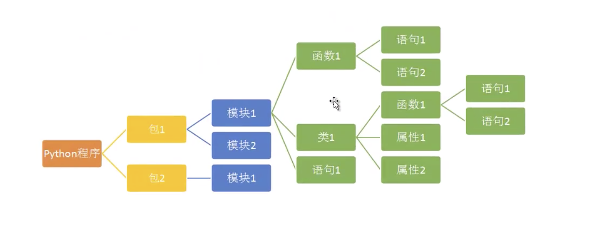

# 01-模块化程序设计理念


## 模块和包的进化史


“量变引起质变”是哲学中一个重要的理论。量变为什么引起质变呢？本质上理解，随着数量的增加，管理方式会发生本质的变化；旧的管理方式完全不适合，必须采用新的管理方式。

程序越来越复杂，语句多了，怎么管理？很自然的，我们将会实现同一个功能的语句封装到函数中，统一管理和调用，于是函数诞生了。


程序更加复杂，函数和变量多了，怎么管理？同样的思路，物以类聚，我们将同一类型的对象的数据和行为，也就是变量和函数，放到一起统一管理和调用，于是类和对象“诞生了”。


程序继续复杂，函数和类更加多了，怎么办？我们将是实现类似功能的函数和类统一放到一个模块中，于是模块诞生了。


程序还要复杂，模块多了，怎么办？于是，我们将实现类似功能的模块放到一起，于是包就诞生了。


大家可以清晰的看到这发展的流程，核心的哲学思想就是“量变引起质变”、物以类聚。同样的思路，在企业管理，人的管理中思路完全一致。大家可以举一反三！





- Python程序由模块组成。一个模块对应python源文件，一般后缀名是：.py.
- 模块由语句组成。运行python程序时，按照模块中语句的顺序一次执行。
- 语句是python程序的构造单元，用于创建对象、变量赋值、调用函数、控制语句等。


## 标准库模块（standard library）


与函数类似，模块也分为标准库模块和用户自定义模块。

Python标准库提供了操作系统功能、网络通信、文本处理、数学运算等基本的功能。比如random（随机数）、math（数学运算）、time（时间处理）、file（文件处理）、os（和操作系统交互）、
sys（和解释器交互）等。

另外，python还提供了海量的第三方模块，使用方式和标准库类似。功能覆盖了我们能想象到的所以领域。比如：科学计算、WEB开发、大数据、人工智能、图形系统等。


## 为什么需要模块化编程


模块（moudule）对应于python源代码文件（.py文件）。模块中可以定义变量、函数、类、普通语句。这样我们可以将一个python程序分解成多个模块，便于后期的重复应用。

模块化编程（Moudular Programming）将一个任务分解成多个模块，每个模块就像一个积木一样，便于后期的反复使用、反复搭建。


模块化编程有如下几个优势：

- 便于将一个任务分解成多个模块，实现团队协同开发，完成大规模程序。
- 实现代码复用，一个模块实现后，可以被反复调用
- 可维护性增强


## 模块化编程的流程


模块化编程的一般流程：
  
- 1、设计API，进行功能描述
- 2、编码实现API中描述的功能
- 3、在模块中编写测试代码，并消除全局代码
- 4、使用私有函数实现不被外部客户端调用的模块函数


## 模块API和功能描述要点


API（Application Programming Interface 应用程序编程接口）是用于描述模块中提供的函数和类的功能描述和使用方式描述。

模块化编程中，首先设计的就是模块的API（即要实现的功能描述），然后开始编码实现API中描述的功能。最后，在其它模块中导入本模块进行调用。

我们可以通过helo(模块名）产看模块的API。一般使用的先导入模块，然后通过help函数查看。


案例：导入math模块，并通过help()查看math模块的API：

```
import math

help(math)
```

也可以在官方文档中查看：https://docs.python.org/zh-cn/3.7/library/math.html


案例：设计计算薪水模块的API
```
# 设计计算薪水模块的API

"""
本模块用于计算公司员工的薪资
"""

company = 'HCB'


def year_salary(month_salary):
    """根据传入的月薪，计算出年薪，月薪*12"""
    pass


def day_salary(month_salary):
    """根据传入的月薪，计算出每天的薪资，根据国家规定，月薪/22.5"""
    pass

```


如上模块只有功能描述和规范，需要编码人员按照要求实现编码。我们可以通过__doc__可以获得模块的文档字符串的内容。


测试代码：
```
# 测试调用my02模块

from moudle import my02

print(my02.__doc__)
print(my02.year_salary.__doc__)


```

执行结果如下：

本模块用于计算公司员工的薪资
根据传入的月薪，计算出年薪，月薪*12


## 模块的创建和测试代码


每个模块都有一个名称，通过特殊变量__name__可以获得模块的名称。在正常情况下，模块名字对应源文件名。仅有一个例外，就是当一个模块被作为程序入口时（主程序，交互式提示符下），它的__name__的值为__main__。我们可以根据这个特点，将模块源代码文件中的测试代码进行独立的处理。

例如：
```
# 设计计算薪水模块的API

"""
本模块用于计算公司员工的薪资
"""

company = 'HCB'


def year_salary(month_salary):
    """根据传入的月薪，计算出年薪，月薪*12"""
    return month_salary * 12


def day_salary(month_salary):
    """根据传入的月薪，计算出每天的薪资，根据国家规定，月薪/22.5"""
    return month_salary / 22.5


if __name__ == '__main__':   # 测试代码
    print(year_salary(10000))
    print(day_salary(20000))
```


解读：通过模块导入时，如果模块存在if __name__ == '__main__'，那么下面的代码将不会执行。


