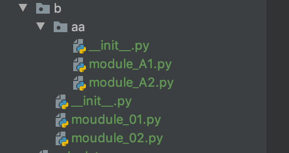
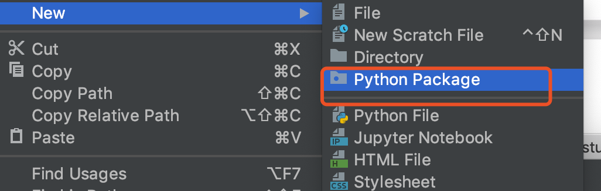

# 03-包(package)的概念和结构


当一个项目中有很多个模块时，需要再进行组织。我们将功能类似的模块放到一起，形成了“包”。本质上，“包”就是一个必须有__init__.py的文件夹。 典型结构如下：




包下面可以包含“模块”，也可以再包含子包。就像文件夹下面可以有文件，也可以有子文件一样。


## pycharm中创建包


在pycharm开发环境中创建包，非常简单。在要创建包的地方单击右键：New-->Python package即可。pycharm会自动帮助我们生成带有__init__文件的包。




## 导入包操作和本质


上一节的包结构，我们需要导入module_A1.py方式如下：

1、 import moudle.b.aa.module_A1

在使用时，必须加完整名称来引用。比如：moudle.b.aa.module_A1.fun_AA()

2、from moudle.b.aa import module_A1

在使用时，直接可以使用模块名。比如：module_A1.fun_AA()

3、from moudle.b.aa.module_A1  import fun_AA() 直接导入函数

在使用时，直接可以使用函数名 比如：fun_AA()


注意：

- from package import item 这种语法中，item可以是包、模块、也可以是函数、类、变量
- import item1.item2 这种语法中，item必须是包或模块，不能是其它。

导入包的本质其实是，导入了包的__init__.py文件。也就是说，import pack1 意味着执行了包pack1下面的__init__.py文件。这样，可以在__init__.py中批量导入我们需要的模块，而不再需要一个个导入。


**__init__.py的三个核心作用：**

- 作为包的标识，不能删除
- 用来实现模糊导入
- 导入包实质上是执行__init__.py文件，可以在__init__.py文件中做这个包的初始化、以及需要统一执行的代码。


## 用*导入包


import * 这样的语句理论上是希望文件系统找出包中所有的子模块，然后导入他们。这可能会花长时间等。Python解决方案是提供一个明确的包索引。

这个索引由__init__.py 中可定义 __all__ = ['moduleA','moduleB'] 这意味着，from sound.effects import * 会从对应的包中导入以上两个子模块； 


## 包内引用

如果是子包内的引用，可以按相对位置引入子模块 

```
from .. import module_A   # ..表示上级目录  .表示同级目录
from . import module_B    # .表示同级目录
```


## sys.path和模块搜索路径


当我们导入某个模块文件时，python解释器去哪里着这个文件呢？只有找到这个文件才能读取、装载运行该模块文件。他一般按照如下路径寻找模块文件（按照顺序寻找，找到即停下不继续往下寻找）


- 1、内置模块
- 2、当前目录
- 3、程序的主目录
- 4、pythonpath目录（如果已经设置了）
- 5、标准链接库目录
- 6、第三方库目录（site-packages目录）
- 7、.pth文件的内容（如果存在的话）
- 8、sys.path.append() 临时添加的目录

当任何一个python程序启动是，就将上面这些搜索路径（除内置模块以为的路径）进行搜集，放到sys模块的path属性中（sys.path).


案例：
```
# 测试sys.path的用法。测试模块搜索路径

import sys

print(sys.path)

```

测试结果如下：

```
['/Users/user/PycharmProjects/study/moudle', '/Users/user/PycharmProjects/study', '/Applications/PyCharm.app/Contents/helpers/pycharm_display', '/Library/Frameworks/Python.framework/Versions/3.7/lib/python37.zip', '/Library/Frameworks/Python.framework/Versions/3.7/lib/python3.7', '/Library/Frameworks/Python.framework/Versions/3.7/lib/python3.7/lib-dynload', '/Users/user/PycharmProjects/study/venv/lib/python3.7/site-packages', '/Users/user/PycharmProjects/study/venv/lib/python3.7/site-packages/setuptools-40.8.0-py3.7.egg', '/Users/user/PycharmProjects/study/venv/lib/python3.7/site-packages/pip-19.0.3-py3.7.egg', '/Applications/PyCharm.app/Contents/helpers/pycharm_matplotlib_backend']
```
