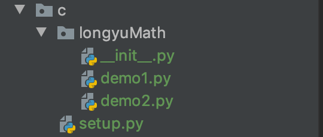
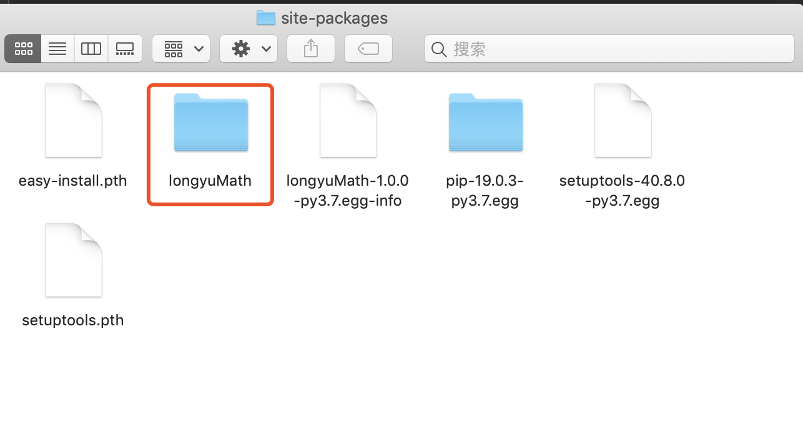
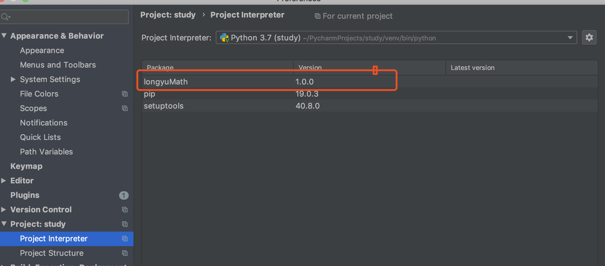
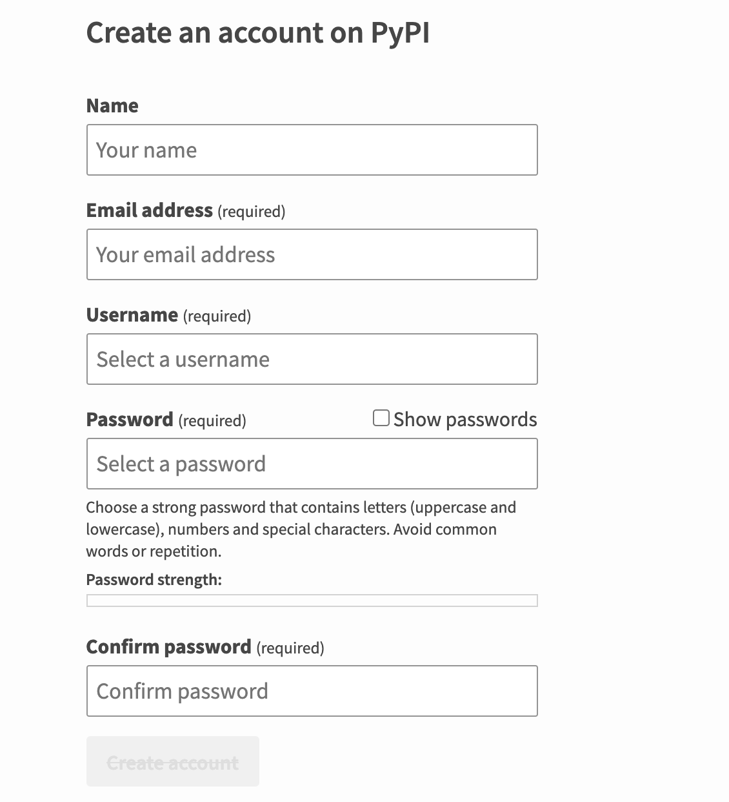

# 04-模块的发布和安装


## 一、模块的本地发布


当我们完成了某个模块开发后，可以将他对外发布，其他开发者也可以以“第三方扩展库”的方式使用我们的模块。我们按照如下步骤即可实现模块的发布：


1、为模块文件创建如下结构的文件夹（一般，文件夹的名字和模块的名字一样）



首先创建一个文件夹，然后在该文件下创建一个包，包名是对外发布的包名。然后将要发布的文件拷贝到此包下面。然后在包名的同级目录下创建setup.py文件。


2、在文件夹中创建一个【setup.py】的文件, 内容如下：

```
from distutils.core import setup

setup(
    name='longyuMath',  # 对外发布的模块名字
    version='1.0.0',     # 版本号
    description='这是第一个对外发布的模块，测试',  # 描述
    author='xxxxx',  # 作者
    author_email='xxxxxxxxx',
    py_modules=['longyuMath.demo1', 'longyuMath.demo2']  # 要发布的模块
)
```

3、构建一个发布文件。通过终端，cd到模块文件夹下面，再建入命令：

```
python setup.py sdist
```

执行完命令结果如下：
```
running sdist
running check
warning: check: missing required meta-data: url

warning: sdist: manifest template 'MANIFEST.in' does not exist (using default file list)

warning: sdist: standard file not found: should have one of README, README.txt, README.rst

writing manifest file 'MANIFEST'
creating longyuMath-1.0.0
creating longyuMath-1.0.0/longyuMath
making hard links in longyuMath-1.0.0...
hard linking setup.py -> longyuMath-1.0.0
hard linking longyuMath/__init__.py -> longyuMath-1.0.0/longyuMath
hard linking longyuMath/demo1.py -> longyuMath-1.0.0/longyuMath
hard linking longyuMath/demo2.py -> longyuMath-1.0.0/longyuMath
creating dist
Creating tar archive
removing 'longyuMath-1.0.0' (and everything under it)

```

会在dist目录下生成一个压缩文件：


4、本地安装模块


将发布安装到本机到计算机上，仍在命令行模式下操作，进setup.py所在目录，键入命令：

```
python setup.py install
```

安装成功后，我们进入python目录/lib/sit-packages目录（第三方模块都安装在这里，python解释器执行的时候也会搜索这个路径）

```
running install_egg_info
Writing /Users/user/PycharmProjects/study/venv/lib/python3.7/site-packages/longyuMath-1.0.0-py3.7.egg-info

```

本地库已经安装成功如下：



再pycharm可以查看：



然后本地建立个测试文件调用测试下：
```
import longyuMath.demo1

print(longyuMath.demo1.add())
```

执行结果如下：
add
None


## 二、上传模块到PyPI


将自己开发好的模块上传到PyPI网站上，将成为公开的资源，可以让全球用户自由使用。按照如下步骤做，很容易就实现上传模块操作。


- 注册PyPI网站

地址：https://pypi.org/account/register/




注意：会发送一份邮件到你到邮箱，请点击验证后继续下面到步骤。

- 创建用户信息文件.pypirc

方式一：使用如下命令：（适用于linux）

```
输入并执行后，python setup.py register ，然后输入用户名和密码即可
```

方式二：使用文件（适用windows、Linux）

在用户的加目录里创建一个.pypirc 文件内容为：

```
[distutils]
index-servers=pypi

[pypi]
repository = https://uplod.pypi.org/legacy/
username = 账户名
passward = 你自己的密码

```

mac下可以直接使用vim命令然后进行文件编辑保存：
```
vim ~/.pypirc 
```


- 上传并远程发布

进入setup.py文件所在目录，使用命令“python setup.py sdist upload”,就可以将模块代码上传并发布：

```
 python setup.py sdist upload 
```

