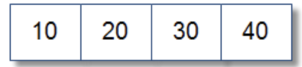
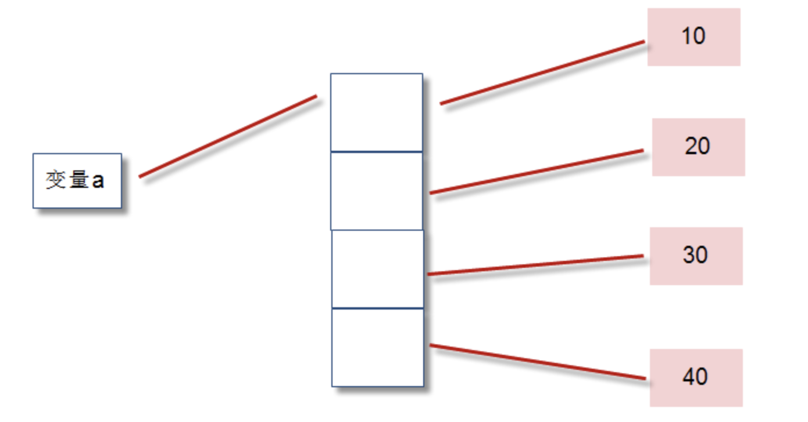
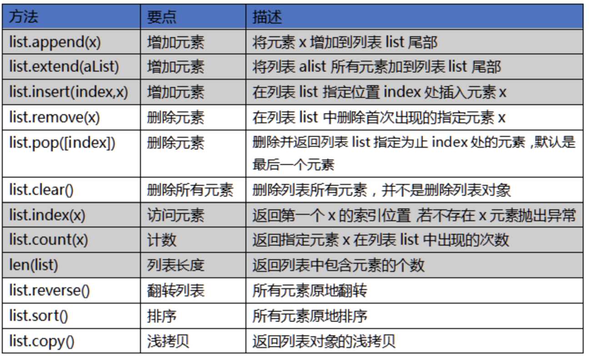

# 01-序列

序列是一种数据存储方式，用来存储一系列的数据。在内存中，序列就是一块用来存放多个值的连续的内存空间。

比如一个整数序列[10,20,30,40],可以这样示意表示：

由于Python3中一切皆对象，在内存中实际是按照如下方式存储的 ：

a = [10,20,30,40]

从图示中，我们可以看出序列中存储的是整数对象的地址，而不是整数对象的值。

Python中常用的序列结构有：

- 字符串、列表、元祖、字典、集合

序列本章内容，我们必须非常熟悉。无论是在学习中还是工作中，序列都是每天都会用到的技术，可以非常方便的帮助我们进行数据存储的操作。

## 列表简介

- 列表：列表用于存储任意数目、任意类型的数据集合。

列表是内置可变序列，是包含多个元素的有序连续的内存空间。

列表的常用方法汇总如下：

Python的列表大小可变，根据需要随时增加或缩小。

字符串和列表都是序列类型，一个字符串是字符序列，一个列表是任何元素的序列。前面学习的字符串很多方法，在列表中也有类似的用法，几乎一模一样。

