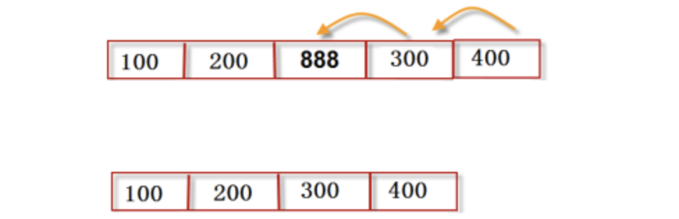

# 03-列表元素的增加和删除


当列表增加和删除元素时，列表会自动进行内存管理，大大减少了程序员的负担。但这个特点涉及列表元素的大量移动，效率极低。除非必要，我们一般只在列表的尾部添加或删除元素，这会大大提高列表的操作效率。

## 列表元素的增加

### append方法

- 原地修改列表对象，是真正的列表尾部添加新的元素，速度最快，推荐使用。

```
>>> a = [20,30]
>>> a
[20, 30]
>>> id(a)
4340426544
>>> a.append(90)
>>> a
[20, 30, 90]
>>> id(a)
4340426544

```

可以发现，通过append方法添加元素，对象未发生改变，因此未创建新的对象。


### +运算符操作


并不是真正的尾部添加元素，而是创建新的列表对象；将原列表的元素和新列表的元素依次复制到新的列表对象中，这样会涉及大量的复制操作，对于操作大量元素不建议使用。

```
>>> a = [20,30]
>>> id(a)
4342182608
>>> a = a + [50]
>>> a
[20, 30, 50]
>>> id(a)
4342097392

```
通过如上测试，我们发现变量a的地址发生了变化，也就是创建了新的列表对象。


### extend方法 

将目标列表的所有元素添加到本列表的尾部，属于原地操作，不创建新的列表对象。

```
>>> a = [20,30]
>>> id(a)
4342182608
>>> a.extend([50,60])
>>> a
[20, 30, 50, 60]
>>> id(a)
4342182608

```

### insert方法插入元素

使用insert()方法可以将指定的元素插入到列表对象到任意指定位置。这样会让插入位置后面所有的元素进行移动，会影响处理速度。涉及大量元素时，尽量避免使用。 类似发生这种移动的函数有：remove() 、 pop() 、 del(), 它们在删除非尾部元素时也会发生操作位置后面元素的移动。


```
>>> a = [30,40]
>>> id(a)
4340426544
>>> a.insert(1,90)
>>> a
[30, 90, 40]
>>> id(a)
4340426544
```

### 乘法扩展

使用乘法扩展列表，生成一个新列表，新列表元素时原列表元素的多次重复。

```
>>> a = ['sxt',100]
>>> b = a * 3
>>> a
['sxt', 100]
>>> b
['sxt', 100, 'sxt', 100, 'sxt', 100]
```


## 列表元素的删除


### del删除

删除列表指定位置的元素。

```
>>> a = [100,200,888,300,400]
>>> del a[2]
>>> a
[100, 200, 300, 400]
```



删除的本质是将后面的元素移动至前面元素的位置。


### pop方法

pop()删除并返回指定位置元素，如果未指定位置则默认操作列表最后一个元素。

```
>>> a = [10,20,30,40,50]
>>> a.pop()
50
>>> a
[10, 20, 30, 40]
>>> a.pop(1)
20
>>> a
[10, 30, 40]

```

### remove方法

删除首次出现的指定元素，若不存在该元素则抛出异常。

```
>>> a = [10,20,30,40,50,20,30,20,30]
>>> a.remove(20)
>>> a
[10, 30, 40, 50, 20, 30, 20, 30]
>>> a.remove(100)
Traceback (most recent call last):
  File "<stdin>", line 1, in <module>
ValueError: list.remove(x): x not in list
```
